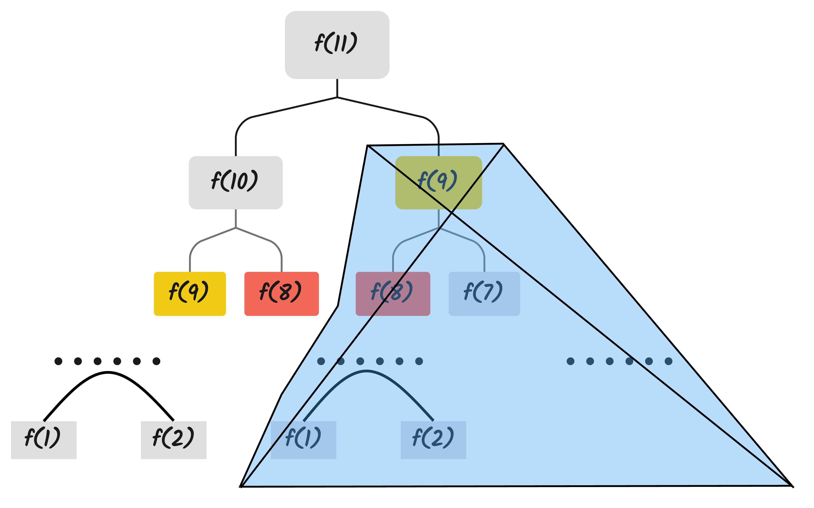

# 动态规划

看了2篇动态规划的文章，感觉他们写的非常好

阮行止大佬：知乎 https://www.zhihu.com/question/23995189/answer/613096905

Laboladong的算法小抄：https://labuladong.gitee.io/algo/di-er-zhan-a01c6/dong-tai-g-a223e/dong-tai-g-1e688/

我相信彻底了解一种算法一个非常好的方法是，自己一步一步“重新发明”这个算法。

## 1、从一个问题开始

在现金支付的年代，假设你身上带了足够多1、5、10、20、50、100的纸币，现在你的目的要用这些纸币凑出某一个金额==W==，**并且需要用到尽量少的钞票。**

有一种方法是我们尽量先用面额大的，能用100就用100，否则就尽量用50······以此类推，使用这种方法，当==W=666==时，我们只需要

```latex
666 = (100 * 6) + (50 * 1) + (10 * 1) + (5 * 1) + (1 * 1)
```

共计10张钞票即可。

这种方法称为贪心，因为它总是尽快的让==W==变的更小，能少100就绝不少50。长期的生活经验表明，这种方法在很多情况下都很有效。

但是当我们换一组钞票的面额时，贪心或许就不能很好发挥作用了，比如说有一个奇葩国家的纸币面额是1、5、11，那么当==W=15==的时候，贪心方法会选择

```latex
15 = (11 * 1) + (1 * 4)
```

共计5张钞票，然而很明显有一个更好的选择

```latex
15 = (5 * 3)
```

共计3张钞票。为什么会这样，贪心方法错在哪里？

它没有考虑其他的情况。因为贪心方法的纲领是“尽量使得接下来的==W==更小”。所以贪心方法会使用11将15下降到4，但是在当前情况下，4的代价是很高的，必须使用4*1。如果一开始使用了5，虽然还剩下10，但是只需要2张5便可以凑出。我们发现贪心方法是一种只考虑眼下情况的策略。

那我们应该如何避免这样的鼠目寸光呢？答案很简单，我们将所有可能的情况全部考虑一遍，那么就能找到最好的方法了。

## 2、穷举的奥妙

如果我们使用一个函数`f(n)`表示<u>凑出n的最少所需要的钞票数</u>，那么则有`f(15) = f(4) + 1`，意思是：当你一开始使用11来凑出15，付出的代价为f(4)加上自己的这一张钞票

那么回到上面的那个问题，采用穷举的思想，我们只需要找出所有方案中花费最低的那一个即可

$$
f(15)=min\begin{cases} f(15-1)+1 \\ f(15-5)+1\\f(15-11)+1 \end{cases}
$$
将公式通项化，则有
$$
f(n)=min\left\{f(n-1),f(n-5),f(n-11)\right\}+1
$$
那么如果要求我们需要求出f(n)只需求出所有的f(1)~f(n-1)即可，python代码如下

```python
money = int(input("输入需要凑出的金额"))
# 0元的面额直接为0张钞票
record = [0]
for i in range(1, money+1):
    # 全部使用1的面额 并且添加到列表中
    if i - 1 >= 0:
        record.append(int(i/1))
    # 与全部方案一比较哪个更好
    if i - 5 >= 0:
        record[i] = min(record[i], record[i-5] + 1)
    # 与方案二比较哪个更好
    if i - 11 >= 0:
        record[i] = min(record[i], record[i-11] + 1)
    # print(record[i])
print("凑出这个金额最小需要的钞票数是：",record[money])
```

分析其时间复杂度和空间复杂度均为O(n)，回过头看这两条关键的规则：

- f(n)只与f(n-1)、f(n-5)、f(n-11)有关
- 我们只关心f(n)的值，不关心如何凑出w

我们能这样做，取决于问题的性质：**求出f(n)，只需要知道几个更小的f(c)。我们将求解f(c)成为求解f(n)的子问题**


或许到这里有人感觉怪怪的，但是又不知道哪里奇怪。确实这个流程到这里有点奇怪。

“你这个是穷举吗？很明显没有将所有的情况全部列举处理啊，忽略了一些东西吧，比如说完全没有考虑使用1来凑出金额15这种必定会淘汰的方案”

“虽然没有穷举出所有的情况，但是我觉得这个过程推理出的答案应该是对的，没有问题。但是总感觉少了一些东西”

没错，各位同学。在刚才的案例中，有一个非常重要的东西没有讲，但是确实DP的精华所在，接下来我将用斐波那契数列和递归来讲清楚这点

## 3、隐藏在问题中的问题：以斐波那契数列为例

### 3.1 暴力递归

有同学可能会觉得区区斐波那契数列，我信手拈来啊。随手写下如下暴力递归的Python代码

```python
# 暴力递归求斐波那契
number = int(input("你想求第几个斐波那契数:"))


def Calculate_Fibonacci(number):
    if number == 1 or number == 2:
        return 1
    return Calculate_Fibonacci(number - 1) + Calculate_Fibonacci(number - 2)

print("答案是:", Calculate_Fibonacci(number))
```

这个不用多说，学校里面老师似乎都是那这个例子来讲递归的。虽然这样子的代码简洁易懂，但是也十分的低效，我们画出当number=11时，算法的递归树


分析其空间复杂度为O($$2^n$$)其时间复杂度为可从递归树的增长规律中得出为O($$2^n$$)，为何会如此低效。

观察递归树可知，存在大量的重复计算，比如说f(9)、f(8)等，而且以f(9)为根的递归树体量巨大，每算一遍都会耗费大量时间，在加上其他被重复的节点，使得这个算法效率低下。

那有没有什么办法可以使得这个暴力递归的求解斐波那契数列的算法

这是可以应用动态规划算法的问题的第一个性质：**重叠子问题**

### 3.2 备忘录递归

有同学说，既然我们已经分析除了这个算法效率低下的原因，也就是存在大量的重复计算，那么我们可以将计算好节点给记录下来，如果将来每次计算的时候先去记录里面找一下，如果没有那么再计算。该同学于是给出了如下Python代码

```python
# 备忘录递归求斐波那契
number = int(input("你想求第几个斐波那契数:"))
# 初始化备忘录
memory_table = [1, 1]

def Calculate_Fibonacci(number):
    if number == 1 or number == 2:
        return 1
    # 自底向上生成备忘录
    for i in range(2,number):
        memory_table.append(memory_table[i - 1] + memory_table[i - 2])
    
    return memory_table[number - 1]

print("答案是:", Calculate_Fibonacci(number))
```

现在我们在画出递归树，就能明白备忘录做了什么



实际上，带备忘录的递归算法将递归树的冗余部分给**剪枝**了，极大减少了子问题的个数。

分析其时间复杂和空间复杂度均为O(n)

### 3.3 状态转移方程

如果将求第几个斐波那契数列的方法公式化则有
$$
f(n)=\begin{cases} 1, n=1,2\\ f(n-1)+f(n-2),n>2 \end{cases}
$$
而我们最开始的问题则也有公式：
$$
f(15)=min\begin{cases} f(15-1)+1 \\ f(15-5)+1\\f(15-11)+1 \end{cases}
$$
我们代码的关键部分，几乎就是对这两个数学公式的翻译，这个将问题的核心暴露出来的公式，有个很好听的名字叫做：**状态转移方程**。一旦我们能写出某个问题的状态转移方程，那么这个问题就几乎迎刃而解，不再有奥秘可言。

## 4、回到最初的问题：凑零钱

大问题的最优解可以由小问题的最优解推导出，这个性质称为**最优子结构**

要符合最优子结构，子问题之间必须相互独立，如果你学习过《概率论与数理统计》，那么对相互独立这个词应该并不陌生，简单来说就是这些子问题之间不会相互影响。例如：


