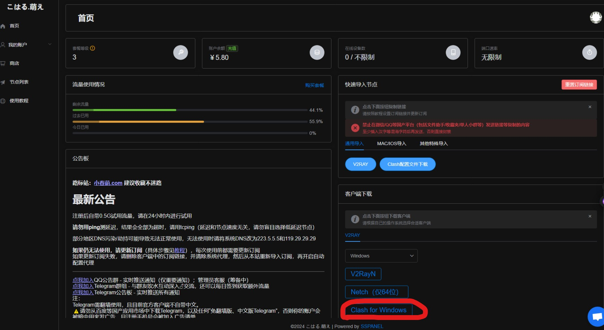

# Downlaod

首先下载clash

进入：[こはる.萌え](https://vvv.什麼laji机場2.com/auth/register?code=CYhf) 注册一个用户

然后在首页找到客户端下载，选择`clash for windows`

当然最保险的其实是去github下载

# Buy traffic

新用户有1G的使用流量，可以拿来测试使用

进入商店购买流量，大约1 CNY 4GB左右

# Import node

找到快速导入节点-->通用导入-->Clash配置文件下载

然后打开clash， 找到import profile，然后复制即可
