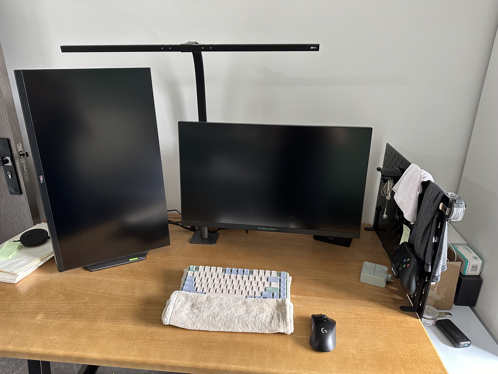
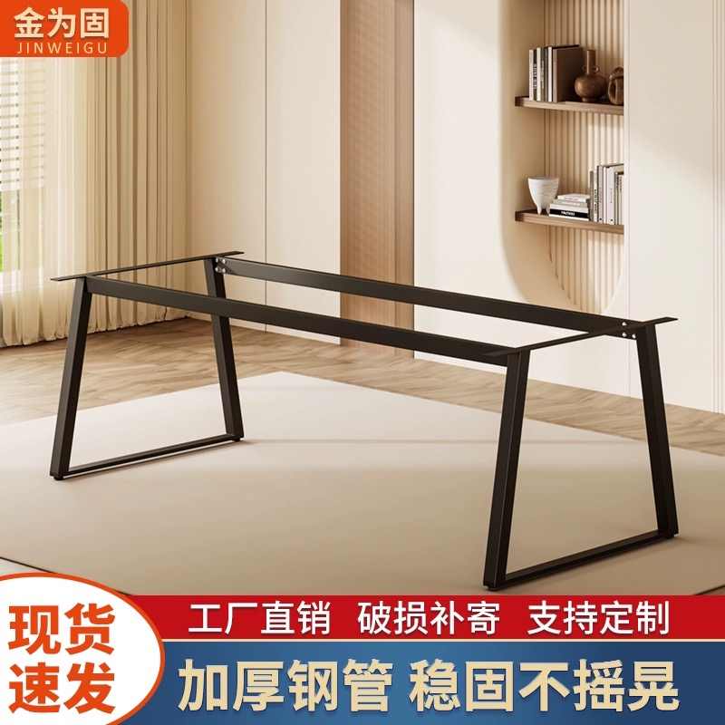
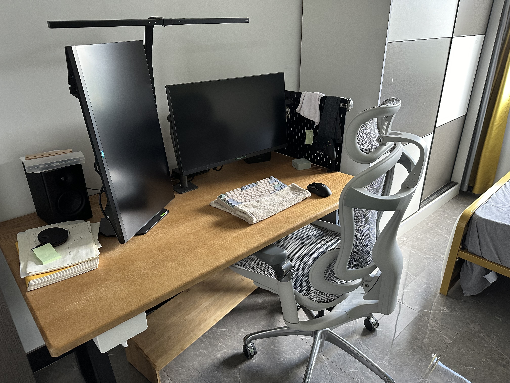
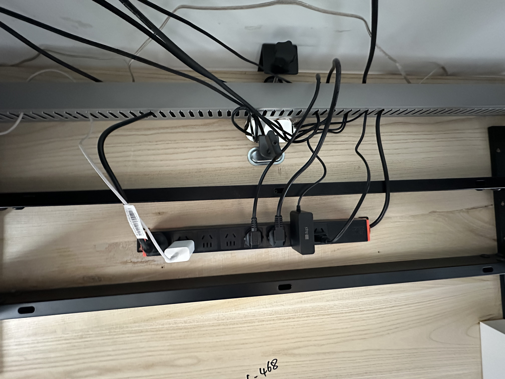

# 电脑桌面定制指南 V2

2024-09-21 更新

更换了工作之后我重新定制了一张桌子。

如下图所示

其侧面结构为

其设计结构图如下所示

结果发现留下10cm的空隙好像不够显示器支架旋转会卡到台灯。

目前解决方案有

- 加大这个空隙，
- 或者将台灯卡到天花板上

不让其占用后面的空间。

## 桌腿的选择

如下图所示，选择小了一号，然后让桌腿中间的横梁靠近桌面后半部分靠墙的地方。这样子就不会卡到大腿

就像这样子可以把椅子的扶手给很贴紧的方式给推入：

# 桌下理线器

关于桌面下面的理线部分，我参考这个视频：

[不到百元的完美桌面理线方案，你不来了解下？_哔哩哔哩_bilibili](https://www.bilibili.com/video/BV1zP4y1T7RS/?spm_id_from=333.999.0.0&vd_source=617c4a2b4e326fc6b6269aada0d25986)

效果还不错，这样子脚无论怎么踢都不会提到线

# 关于键盘上的毛巾

这个是我用来作为键盘垫子使用的，之前本来打算买一个腕托，但是发现都不喜欢

后来看到这个：

买机械键盘需要配腕托么？键盘腕托能起到保护手腕的作用吗？ - 苗小轩的回答 - 知乎
https://www.zhihu.com/question/25091751/answer/1960670128

用毛巾的话，不仅柔软，还能擦汗，而且高度可以通过折叠的次数来控制，nice

（PS：毛巾我买的是三利的）
