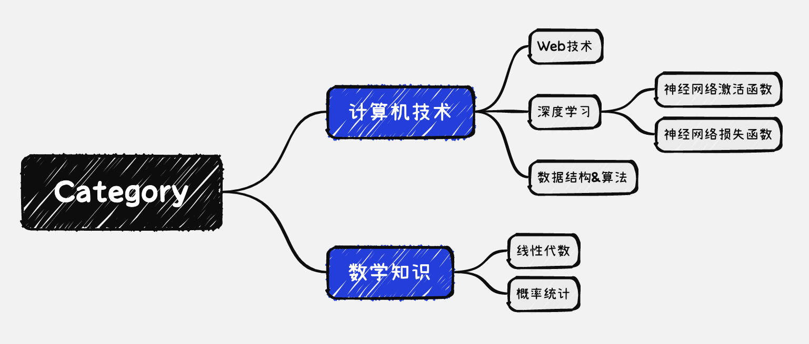
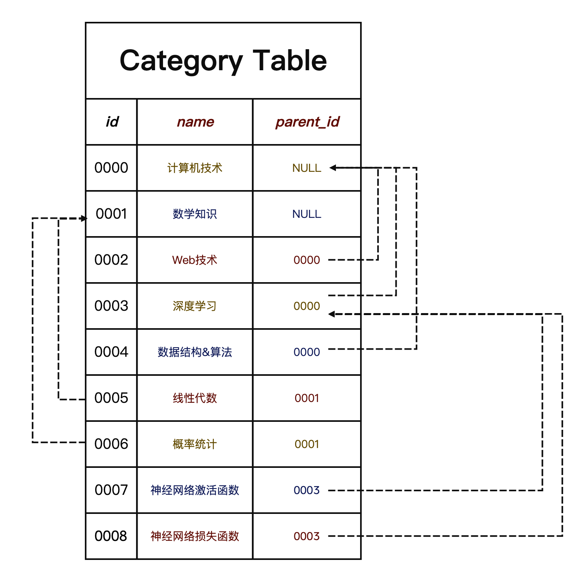
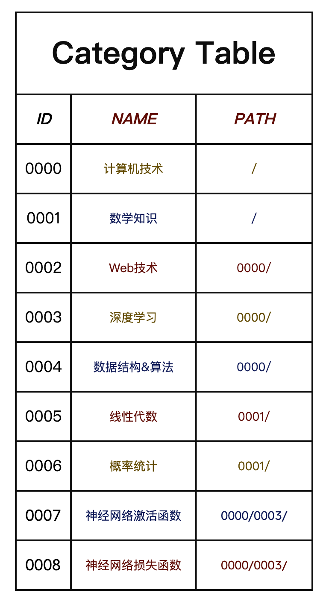
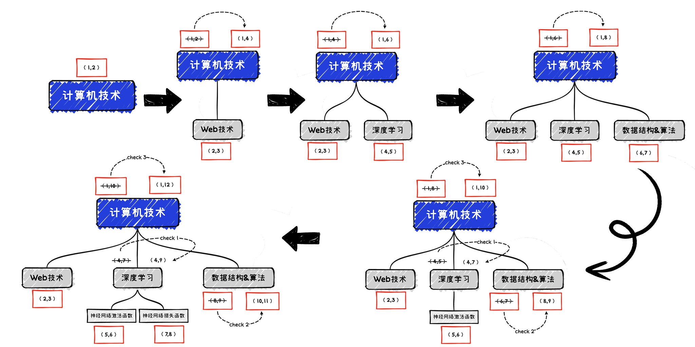
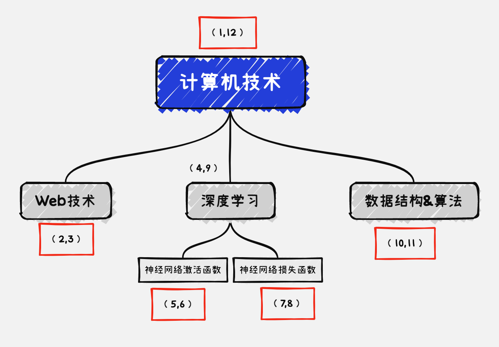
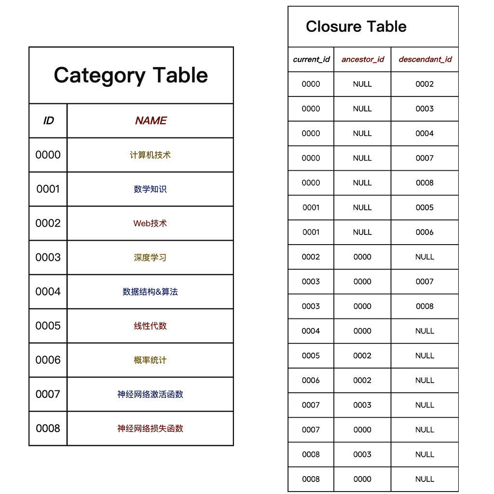

```
BriefIntroduction: 
在建立个人网站的过程，发现了不少问题。本文记录了其中一个问题：如何通过关系数据库实现树形结构。作者在思考如何给文章分类的时候，最终决定将其设置为树形结构。但作者使用的数据库SQLite是关系型数据库，实现这种结构并不容易。在chatGPT3.5的帮助下，和一些网络上的资料，作者最终弄明白了如何在关系数据库中实现树形结构，因此写出这篇文章。
```

<!-- split -->


# 写在前面/Before we beginning

最近在写一个个人网站，类似于个人博客的那种，反正用来记录自己写的文章。这里稍微透露一下用python Flask框架搭建自己的个人网站，其中数据库决定采用轻量级的关系型数据库SQLite，并且使用SQLAlchemy和Flask-SQLAlchemy来操作数据库。


# 标题：关系数据库存储树形结构

## 背景介绍：

### 为什么使用树形结构

在思考如何给文章分类的时候，我最终决定将其设置为树形结构，这样子就可以只需要一个category标签就可以了，通过category的路径`计算机技术 -> Web技术 -> 数据库`，读者可以明白这篇文章的的技术路线。

想要实现这样子的树形结构，可能图形数据库是最合适的，因为它有专门的边缘和节点来实现表示树形结构，可以非常高效的遍历树状结构。

但是专门为了一个category属性设置一个图形数据库太不划算，于是我打算在已经选择的SQLite数据库上实现这个结构。

### 存储树形结构的可行性

我的文章暂时划分为5大类

- 人生思考类文章
- 计算机技术类文章
- 个人生活类文章
- 数学知识类文章
- 无法分类文章

其中无法分类文章用于暂存一时想不到这篇文章是什么分类。然后对这个5大类将来还会划分更加细的类型，比如说计算机技术分为Web技术、深度学习、算法，数学类的分支线性代数。

也就是按照我的规划文章分类这个树形结构，存在6个根结点。其中未分类和无法分类甚至没有孩子分支，也就其他几个根结点特别是计算机技术、数学知识有可能存在比较深的结构。

## 实现树形结构的4种方法

根据chatGPT 3.5的提示和我检索到的资料显示，存在4种方法在关系数据库中实现树形结构，为了更好的说明这四种方法，接下来我会使用这些方法实现如下图所示的树形结构，这个结构在接下来的内容中称之为example



### 方法一：邻接表模型（Adjacency List Model）

这种方法实现比较简单，我们只需要在Category的模型类的添加一个`parent_id`字段即可，使用这个字来表明这条记录的父节点是哪一个。如果我们写出代码，那么大致如下所示

```python
# 这里我使用了Flask-SQLAlchemy和SQLAlchemy的包
# 这使得我可以通过python代码的方式来定义数据库模型
class Category(db.Model):
    id = db.Column(db.Integer, primary_key=True)
    name = db.Column(db.String(100), nullable=False)
    parent_id = db.Column(db.Integer, db.ForeignKey('category.id'))
```

如果我们使用example实例化这个模型（往这张表中添加数据）那么我们将会得到这样子的一张表



如果一个节点的`parent_id`为NULL说明其为根节点，想要添加一个节点的话只需要知道这个节点的父节点id即可。修改也很简单，无论是修改`parent_id`还是`name`

但是如果要删除一个节点的话，就需要同时删除以这个节点为父节点的所有节点，这就需要遍历整个数据表了

对于查询一个节点的子节点或者查询一棵树就比较麻烦了，因为需要递归查询，首先查询该节点的孩子，接着查询孩子的孩子。

### 方法二：物化路径模型（Materialized Path Model）

这个实现方法也不难，同样只需要在模型中增加一个字段`path`即可，这个字段用来表明当前节点在整个树形结构的路径，类似于文件夹路径。如果我们写出代码，那么大致如下所示

```python
class Category(db.Model):
    id = db.Column(db.Integer, primary_key=True)
    name = db.Column(db.String(50), nullable=False)
    path = db.Column(db.String(256), nullable=False)
```

如果我们example实例化这个模型，那么将会如下图所示



对于这种方法，如果我们需要增加一个节点，比较简单，只要找到其需要加到哪一个结点之下，然后获取这个节点的`path`并且稍作修改即可得到这个节点的`path`

如果需要删除一个节点分两种情况，如果是最小的孩子节点可以直接删除，如果是一个中间节点，那么需要删除其路径之下的所有节点，也并不复杂，只要遍历整个数据表，检查每个节点的`path`路径即可。

如果需要修改一个节点的位置，也为分为两种情况，如果是最小的孩子节点，直接修改`path`即可。如果是一个中间节点，需要遍历整个表修改这个节点的所有孩子，即修改每一个完整包含这个`path`的节点。

### 方法三：嵌套集合模型（Nested Set Model）

这个方法并没有前面两者直观，它需要在模型中增加2个字段`left_value` &`right_value`接下来我将称之为左值和右值，如果我们写出代码，大致如下所示

```python
class Category(db.Model):
    id = db.Column(db.Integer, primary_key=True)
    name = db.Column(db.String(50), nullable=False)
    left = db.Column(db.Integer, nullable=False)
    right = db.Column(db.Integer, nullable=False)
```

在这里没有看懂的话没关系，按照下面的例子多推演几遍就能理解了，因为一开始这个模型也迷惑了我好几天的时间。

这个模型的本质是对树的前序遍历。

我们首先需要知道添加一个节点左值和右值的计算规则。

> 1. 添加根节点的左值为 1，右值为 2。
> 2. 添加新节点时，将新节点左值设为其父节点的右值，新节点右值为其左值加 1。
> 3. 检查这棵树其他所有的节点左右值，如果其中存在大于等于新节点左值的，那么将其+2（这条规则隐含了这一条`对于每个新节点，将其父节点的右值加 2`）

接下来我将运用这个规则一步一步的实现example中的计算机技术这棵树，详细的过程请看下图



当插入完毕之后，我们得到这棵树的所有节点的左右值是这个样子的



各位有没有发现什么，如果我们的手指按照数字的大小在这棵树上面移动，那么我们将会发现，手指移动的路径是这棵树的前序遍历！

没错，左右值的本质展现了树的前序遍历。

### 方法四：闭包表模型（Closure Table Model）

这个模型使用一个独立的表来记录节点之间的所有祖先关系。闭包表模型的基本思想是为每个节点创建一条记录，然后再为每个节点的祖先关系创建一条记录，从而形成一个闭合的表结构。

也就是说我们需要有2个模型，其中的分类表大致如下

```python
class Category(db.Model):
    id = db.Column(db.Integer, primary_key=True)
    name = db.Column(db.String(100), nullable=False)
```

还有闭包表用来存储节点的祖先后代关系，这个模型需要包含三列，表明了当前节点及其祖先和后代

```python
class CategoryClosure(db.Model):
    id = db.Column(db.Integer, primary_key=True)
    # 祖先节点id
    ancestor_id = db.Column(db.Integer, db.ForeignKey('category.id'))
    # 当前节点id
    current_id = db.Colmun(db.Integer, db.ForeignKey('category.id'))
    # 后代节点id
    descendant_id = db.Column(db.Integer, db.ForeignKey('category.id'))
```

其中分类表非常简单，只需要单纯的存储分类名称就好，但是闭包表就非常的庞大了，如果我们使用example实例化这个模型，那么我们会得2张表



可以看到Closure Table为每一对祖先关系都设置了一个表项，这会让我们的查询速度提高不少，但是对存储空间的占用会非常大，典型的空间换时间。

### 我的选择

经过仔细考虑，我打算按照自己的情况，参考Nested Set Model实现一种自己的方式

## 我的模型

在flask-sqlalchemy中使用嵌套集合模型其实已经有人实现了Python包，叫做 sqlalchemy-mptt 但是不知道为什么，当我使用这个模型包的时候，发生了报错，而且无论如何都不知道错误在哪里。于是在github上面提了issue，在stack overflow上面提了问题，但是都没有人理我。

于是最终我决定自己实现这个算法，但是在实现的过程中我发现我对Python的理解，特别是Python类、还有其他的Python包，SQLAlchemy和Flask-SQLAlchemy的理解和使用太糟糕了，我需要一些时间来阅读这些文档的使用。目前来说这个模型的进展如下图所示

```python
# 文章类型
# 采用嵌套集合模型 [Nested Set Model] 来实现树形结构
class Article_Category(db.Model):
    __tablename__ = 'article_category'
    id = db.Column(db.Integer, primary_key=True)
    name = db.Column(db.String(50), nullable=False)
    parent_name = db.Column(db.String(50), nullable=True)
    # 已下均为私有变量 只能模型内部访问
    # 父结点id 方便找到完整路径
    __parent_id = db.Column(db.Integer, nullable=True)
    # 节点属于那一棵树
    __tree_id = db.Column(db.Integer, nullable=False)
    # 节点左右值
    __left_value = db.Column(db.Integer, nullable=False)
    __right_value = db.Column(db.Integer, nullable=False)
    # 节点深度
    __node_depth = db.Column(db.Integer, nullable=False)
```

其中，还需要定义一些函数和触发器来自动计算这些私有的变量，同时为了完成这个算法，我还需要借鉴sqlalchemy-mptt的源代码。

目前的进度就是卡在这里了。

# 参考文献

通过这篇wiki[Nested set model - Wikipedia](https://en.wikipedia.org/wiki/Nested_set_model)可以初步的知道

在这片论文中[Managing Hierarchical Data in MySQL — Mike Hillyer's Personal Webspace](https://mikehillyer.com/articles/managing-hierarchical-data-in-mysql/)

在 Joe Celko 写的书中[SQL Solutions for Trees and Hierarchies）by Joe Celko](https://github.com/media-lib/sql_lib/blob/master/[Joe_Celko]_Joe_Celko's_Trees_and_Hierarchies_in_S(BookFi).pdf)

在这个网页[Storing Hierarchical Data in a Database | Gijs van Tulder](https://www.vantulder.net/old-articles/storing-hierarchical-data-in-a-database)中，有Gijs van Tulder写的相关内容（顺带一提，这个网站F12查看源代码有彩蛋哦）