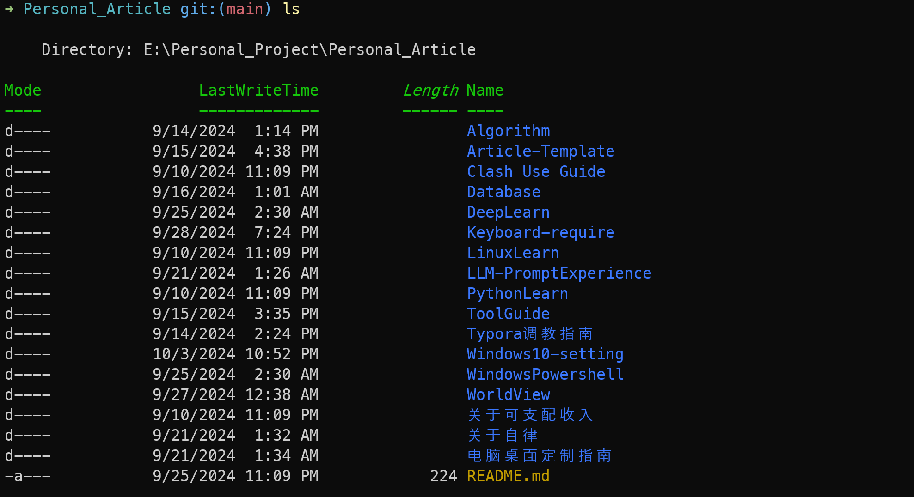

# Powershell 7 file color settings

here is my scheme for the differnet kinds of files and directory:
```powershell
$PSStyle.FileInfo.Directory = "`e[34;1m"  # bule bold for directory
$PSStyle.FileInfo.SymbolicLink = "`e[36;1m" 
$PSStyle.FileInfo.Executable = "`e[32;1m"  # green boldfor exe file

# seeting color for differnet file
$colors = @{
    ".txt" = "`e[33m"  # yellow
    ".log" = "`e[31m"  # red
    ".ps1" = "`e[36m"  
    ".exe" = "`e[32m"  # green
    ".json" = "`e[35m"  
    ".yml" = "`e[35m"  
    ".md" = "`e[33m"   # yellow
}
# apply it to color
foreach ($extension in $colors.Keys) {
    $PSStyle.FileInfo.Extension[$extension] = $colors[$extension]
}
```

looks like following:



how I find it, because the github have the same issue: https://github.com/PowerShell/PowerShell/issues/18550


