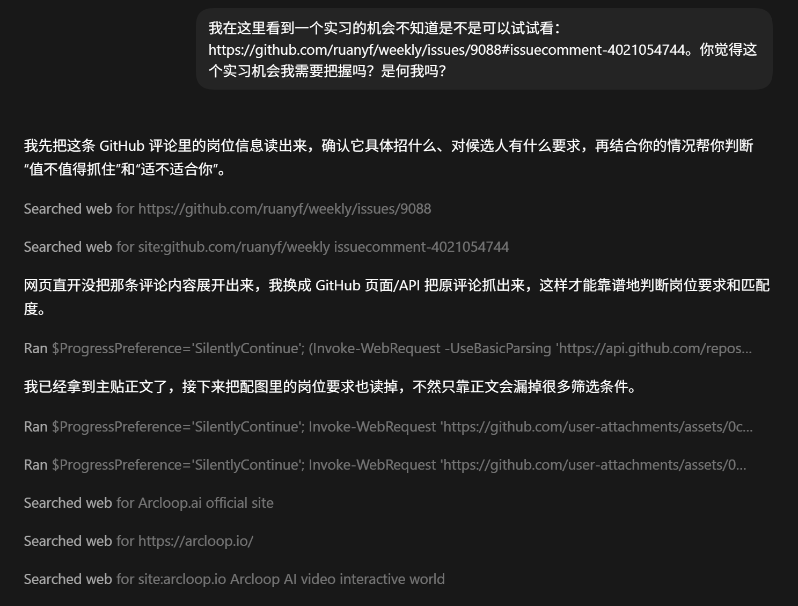

# 问题1

codex 拿到一个 url 第一反应是 search web, 而不是直接提取这个 url



解决方案，在 global AGENTS.md 中加入

```md
## Explicit URLs
Apply this only when the user explicitly provides a URL.
Do not start with web search.
Retrieve the exact URL first.
For GitHub URLs, prefer page/raw/API before generic search.
Do not search by title, keyword, or site name before exact retrieval is exhausted.
Use web search only if direct retrieval failed, the exact target content is inaccessible, or broader background is explicitly requested.
Before fallback search, state what direct retrieval was attempted, what failed or was missing, and why search is necessary.
Finish phase 1 before expanding scope.
Phase 1 = retrieve the exact URL, extract directly supported information, answer the core question if possible.
Do not inspect local files, resumes, or unrelated workspace content unless explicitly requested or clearly required.
Avoid speculative tool calls.
If an exact-URL retrieval tool is labeled as "search", that is acceptable only when no keyword expansion or related-page exploration is performed.
```

但是似乎效果甚微，反正我在 codex app 中没看到它变化

# 问题 2

gpt 5.4 总是想要从头开始实现一个功能，而不是使用已经存在的 skill 等，

于是添加了如下内容

```md
## Skills Workflow

When the user asks about skills, distinguish three states explicitly: already installed locally, installable from the official skill source, and usable in the current session.
Do not stop after checking only local skills if the user asked whether a skill exists or can be used.
Before creating a new local skill, check the official installable skill source if a built-in or official skill could plausibly cover the task.
If an official skill is installed mid-session, state clearly whether it is usable immediately or requires a restart / feature flag / new session.
If a failed install or init leaves partial local artifacts behind, disclose that immediately and either clean them up or explain why they are being left in place.

## One-Time Submission Safety

For forms, applications, payments, account changes, or other one-time or irreversible actions, prefer stopping at a fully prepared draft or confirmation screen before the final submit.
If the user asked to "fill" a form, treat that as permission to prefill; do not assume it is permission to complete an irreversible final submission without a brief confirmation checkpoint when one is available.
If the site introduces a login wall, one-time submission warning, or final confirmation modal, surface that transition immediately before proceeding.

## Scope Discipline

Do not pivot from a skills/tooling question into local implementation or dependency installation until the skill lookup path has been completed or ruled out.
When changing approach mid-task, explain the pivot and the reason before continuing.
```

