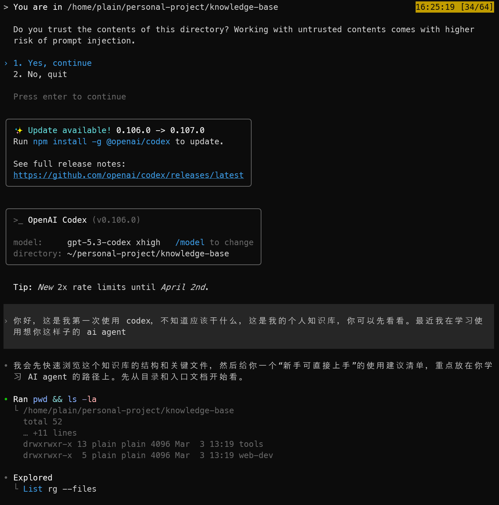
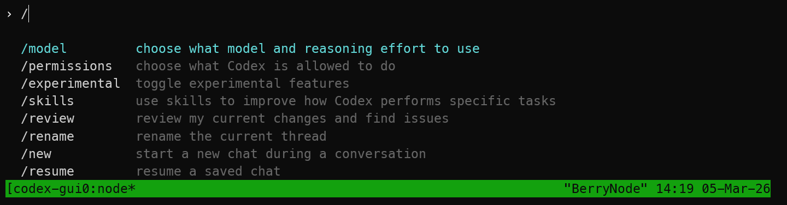

# codex 使用指南

下载 codex cli

```shell
npm i -g @openai/codex
# macos download
brew install codex
```

> [!note]
>
> 在用 npm 命令安装时需要注意全局 prefix 最好放到用户目下，而不是系统目录下，详见 [npm-guide](../npm/npm.md)

验证

```shell
which codex
codex --version
```

登录

```shell
# 查看登录状态
codex login status
# 打开网页登录
codex login
```

## AGENTS.md

Codex 会在每次启动时自动读取并合并一条“指令链”：

- 全局：`~/.codex/AGENTS.md`
- 项目：从 repo root（通常是 Git root）一路走到当前工作目录，每层目录最多取一个 `AGENTS.md`，并按“root → leaf”顺序依次注入。 

作用：把你每次都要重复说的“工作协议/目录说明/输出格式”固化下来。

## interactive mode

使用命令 `codex` 直接进入交互模式



使用 `/` 可以使用一些内置的命令



实际上的命令不仅仅是上线显示的这些，比较常用的命令有

status


如果我们需要开启一段新对话，那么我们可以使用

- `/clear`：清屏 + 开新对话（从头开始聊）。

## plan mode

Plan mode 会先让 Codex 做“方案设计 / 执行分解”，再进入真正的修改与实现，而不是一上来就直接改代码。

更适合复杂任务。比如重构、迁移、跨多个文件的大改动、需要分阶段验证的任务。因为它会更强调“步骤、里程碑、顺序、边界”，降低一上来改偏的概率。

可能会先问你问题，如果还需要补充信息，Codex 会先问你，而不是直接动手。

区分：

- 普通 Agent/直接实现模式：你说做什么，它尽快开始看文件、跑命令、改代码”。
- Plan mode：先出施工方案、拆步骤、确认方向，再继续”。

## subagent

subagent 需要指定开启，codex 无法自己判断子否开启

# codex exec

codex exec 命令是 Codex CLI 的非交互模式。

适合脚本化的运行：给它一个 prompt，它执行任务并结束，而不是像直接运行 `codex` 那样进入一个持续对话的终端界面。

也就是说：

- `codex` = 交互式会话/TUI。
- `codex exec "任务"` = 一次性 agent 任务。跑完就退出

而且可以把多个 `codex exec` 当成多个独立任务去启动。 

每次 `codex exec` 都是一个独立的非交互 session：它可以持久化 session，支持 `codex exec resume [SESSION_ID]` 继续某个 exec 会话；
