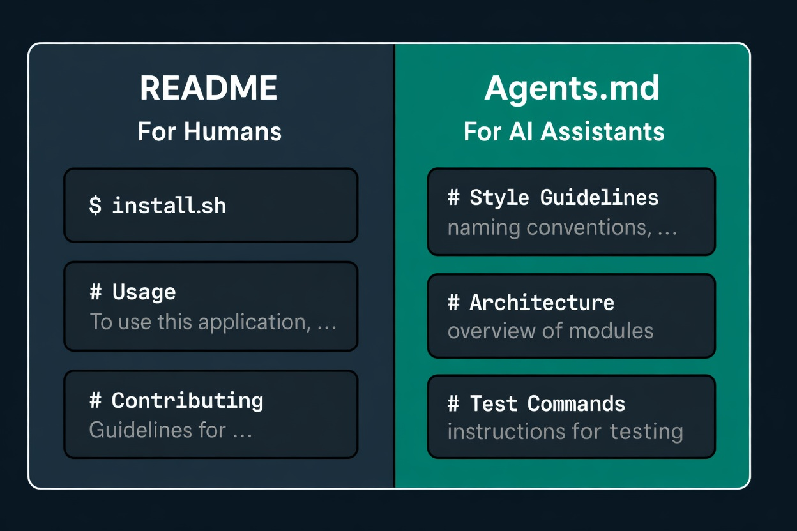

```
BriefIntroduction: 
一些关于 AI agent 辅助编程的个人经验
```

<!-- split -->



在我们使用 coding agent(claude code, codex) 的时候，常常遇到这样子一个问题：如何让 AI 快速读懂一个比较复杂的 project，然后上手修改？

其实问题可以分成两部分：

1. 让 AI 读懂项目
2. 让 AI 知道如何修改

# Understand the project

为了让 AI 更快读懂项目，我目前觉得最有效的方法，是把文档分成三个层次：

- project root README.md
- sub-folder README.md
- project root docs/

## project root README.md

根目录下的 README.md 应该作为整个仓库的入口页，内容可以包括：

- 项目简介
- 总体架构图 / 主链路
- 仓库结构
- 最常用命令
- 指向更详细文档的索引

这份 README.md 同时是给人和 AI 看的，所以可以根据团队或者个人习惯，我一般选择中英文混合。

## sub-folder README.md

对于那些本身拥有独立子系统逻辑的目录，我们可以在目录下单独放一份 README.md，用来解释：

- 这个子系统的职责是什么
- 入口文件在哪里
- 关键文件分别做什么
- 常见改动通常落在哪些文件上

如果把这些内容都堆到 project root README.md 里，根 README 很快就会膨胀；把说明下沉到各自目录，可以让根 README 保持轻量。

代价也很明显：当目录结构或子系统逻辑变化时，对应的 sub-folder README.md 也要一起维护。

同时这里的 README.md 主要是给 ai 读和维护的，所以最好和代码对齐使用纯英文。

## project root docs/

当一份文档同时跨越多个目录，或者本身就是较长的专题说明时，更适合放到 docs/ 目录里。

比如：

1. 跨多个子系统的架构文档
2. 线上故障排查 runbook
3. 设计决策记录（ADR）

# Modify the project

当我们解决了“让 AI 读懂 project”这个问题之后，下一步就是让 AI 知道该如何安全地修改它。

这时就需要另一类文档：agent instruction file，比如 Codex 使用 AGENTS.md，Claude Code 使用 CLAUDE.md。接下来我们以 AGENTS.md 为例来说明这一点。

AGENTS.md 不是“另一个 README”。它更偏向于行动指南，而不是项目介绍。

最简单的区分是：

- README.md 回答：这是什么项目，怎么跑，结构大概怎样
- AGENTS.md 回答：如果你现在要动这个仓库，应该先看哪里、遵守什么约束、不要踩哪些坑

而 AGENTS.md 也分为三层

- global AGENTS.md
- project root AGENTS.md
- sub-floder AGENTS.md