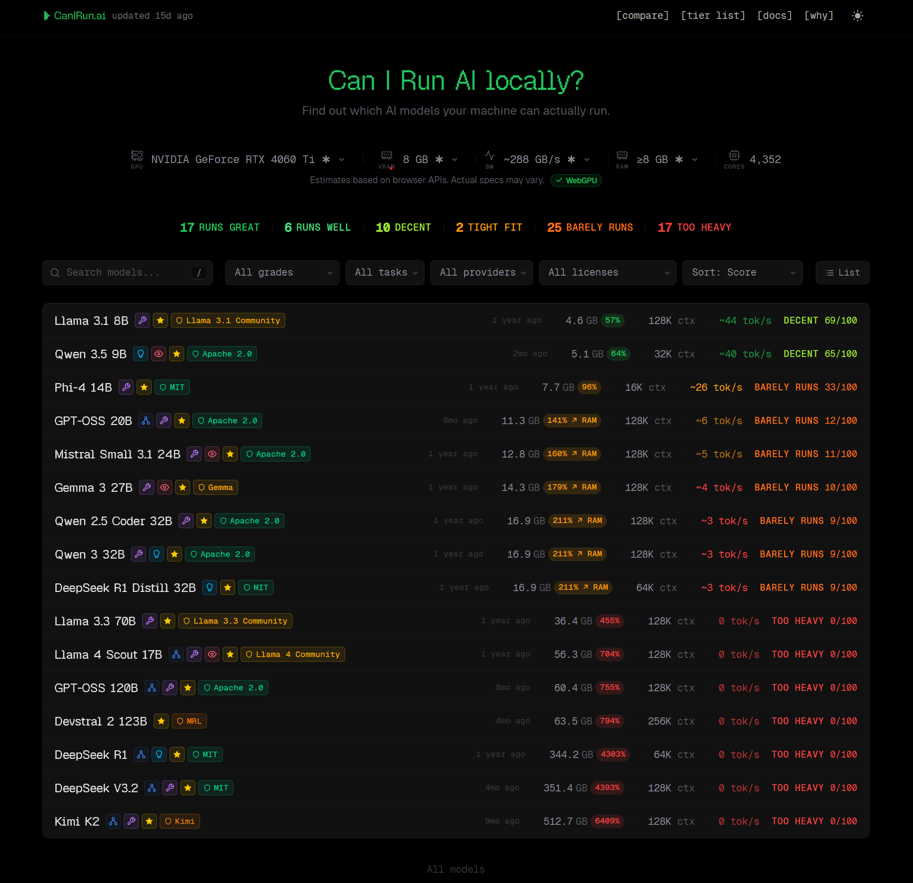

# Ollama

简单来说 ollama 可以让你在本地拉取并且运行一些小号的的 LLM，然后像运行一个本地服务一样直接聊天、调用。

需要注意的是 ollama 不是 meta 开发的（meta 开发了 llama 这个小模型系列）

我们可以在 [Ollama](https://ollama.com/) 中拿到下载命令

```powershell
irm https://ollama.com/install.ps1 | iex
```

这条命令会把将其安装到默认位置（一般是 C 盘）我们可以做一些修改

```powershell
[Environment]::SetEnvironmentVariable('OLLAMA_MODELS', 'D:\ollama-models', 'User')
$env:OLLAMA_MODELS = 'D:\ollama-models'
$env:OLLAMA_INSTALL_DIR = 'F:\Programs\Ollama'
irm https://ollama.com/install.ps1 | iex
```

这里的意思是：

- OLLAMA_MODELS 永久设成用户环境变量，当前这个 PowerShell 会话里也立刻生效一次
- OLLAMA_INSTALL_DIR 只给这次安装脚本用，把程序本体装到 F:\Programs\Ollama

这样子的话 ollama 拉取 LLM 就会将其存放到 D 盘 然后程序安装到 F 盘

验证，是否安装好

```powershell
ollama --version
```

## model select

可以去这个 [CanIRun.ai — Can your machine run AI models?](https://www.canirun.ai/) 网站看看本地有那些适合的模型可以跑



我自己选择是 qwen 9b，最好可以选择你的显存能够装下的最大的模型（优先于跑一个小模型的高精度版本）

## import model

我们可以下面的命令来拉取模型

```powershell
ollama pull <model-name>
```

需要注意的是 Ollama 使用“清单 + 内容块”的方式存储 LLM 模型权重文件

- `manifests\registry.ollama.ai\library\qwen3.5\9b` 这是索引文件，只有大约 `1 KB`
- `blobs\sha256-...` 这里才是真正的内容本体，6.4 GB 会在这里

如果直接读取 `9b` manifest

```json
{
  "layers": [
    {
      "mediaType": "application/vnd.ollama.image.model",
      "digest": "sha256:dec52a44569a2a25341c4e4d3fee25846eed4f6f0b936278e3a3c900bb99d37c",
      "size": 6594462816
    }
  ]
}
```

意思是：

- qwen3.5:9b 实际指向了一个 digest 为 `sha256:dec52a...` 的大文件
- 这个文件大小是 `6594462816` 字节，也就是那个大约 `6.1~6.6 GB` 的 blob

## run model

使用下面的命令运行

```powershell
ollama run <model-name>
```

一般来说第一次运行会比较慢。

想要退出，可以使用 `ctrl + D`, `ctrl + C`

常用命令：

- `ollama ps` 看当前有没有模型在跑、是在吃 CPU 还是 GPU。
- `ollama list` 看你本地已经下载了哪些模型。

### session manage

在 `Ollama` 的终端模式里，没有会话列表，当前会话上下文保存在显存中，退出就没了。

但是会记住你以前输入过的 prompt，可以使用键盘 `↑ / ↓`  查看“上一条输入过什么”

# next action

目前来说只能是在终端使用？或许要搭配一个 webui ? 或许不需要？等到有需求的时候直接调用 


