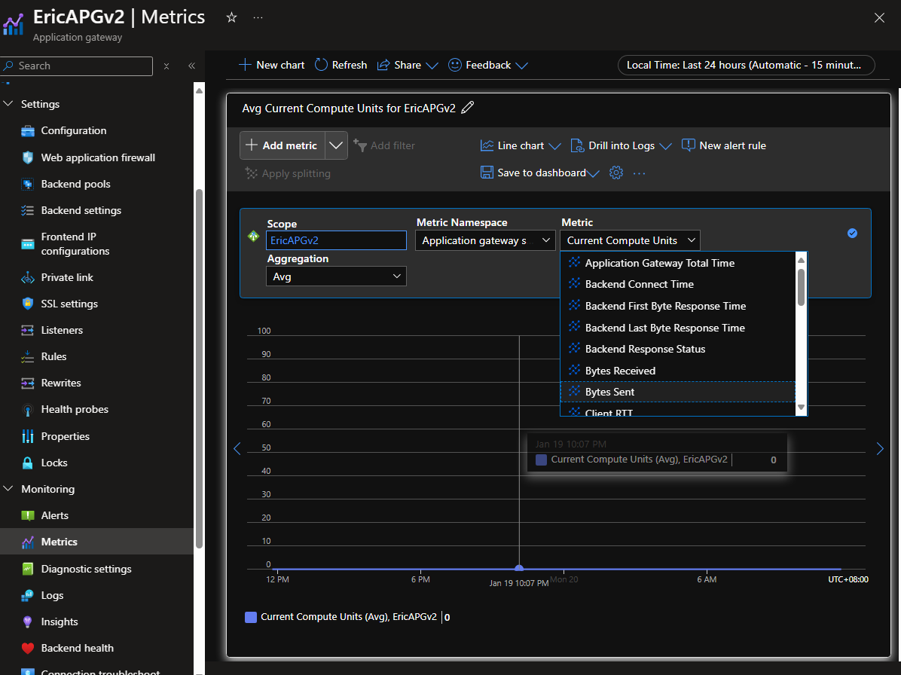

# Azure Application gateway metric

有时候我们可以在APG的portal界面看到很多的metric, 比如说

如何知道这每一个metric的具体含义呢？

文档在这里 [Monitoring data reference for Azure Application Gateway | Microsoft Learn](https://learn.microsoft.com/en-us/azure/application-gateway/monitor-application-gateway-reference#metrics-for-application-gateway-v2-sku)

