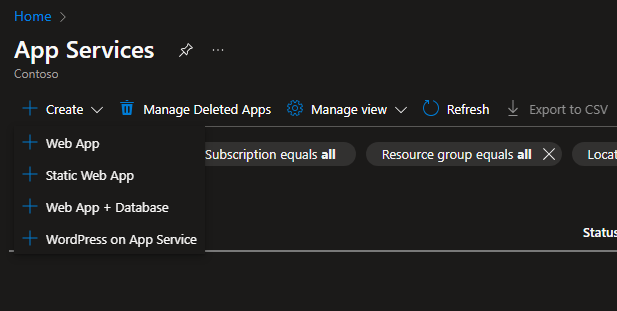

# Azure App Service 选择指南

当我们想要为网站创建一个 app service 的时候，就会发现，我们有4个选择：

但是实际上 web app 和 static web app 是不同的2个产品

web app: [Overview of Azure App Service - Azure App Service | Microsoft Learn](https://learn.microsoft.com/en-us/azure/app-service/overview)

static web app: [What is Azure Static Web Apps? | Microsoft Learn](https://learn.microsoft.com/en-us/azure/static-web-apps/overview)

web app + Database: 其实和 web app 一样，但是会同时创建一个数据库

wordpress on app service: 预配置的 wordpress 部署模板，专供于 wordpress 网站使用

## web app VS. static web app

static web app 只能托管纯前端网站，也就是只能提供一开始就静态存在的 HTML、CSS、JS，而如果你的网站就算 html 是静态的，但是只要是生成的，那么就不适合

