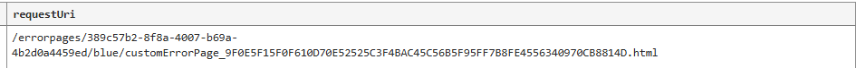

[Create Azure Application Gateway custom error pages | Microsoft Learn](https://learn.microsoft.com/en-us/azure/application-gateway/custom-error)

当你尝试在 apg listeners 上面使用 custom error page 的时候，实际上它是去拿去这个url 并且存放到 apg 内部

> After you specify an error page in your application gateway's configuration, your gateway verifies the connectivity to the HTML page over the internet. It then downloads the file on its local cache.

并且如果你触发的 http code 定义了 custom error page, 实际上它还有一个 rewrite 行为

其 requestUri 会变为类似于下面的 url

