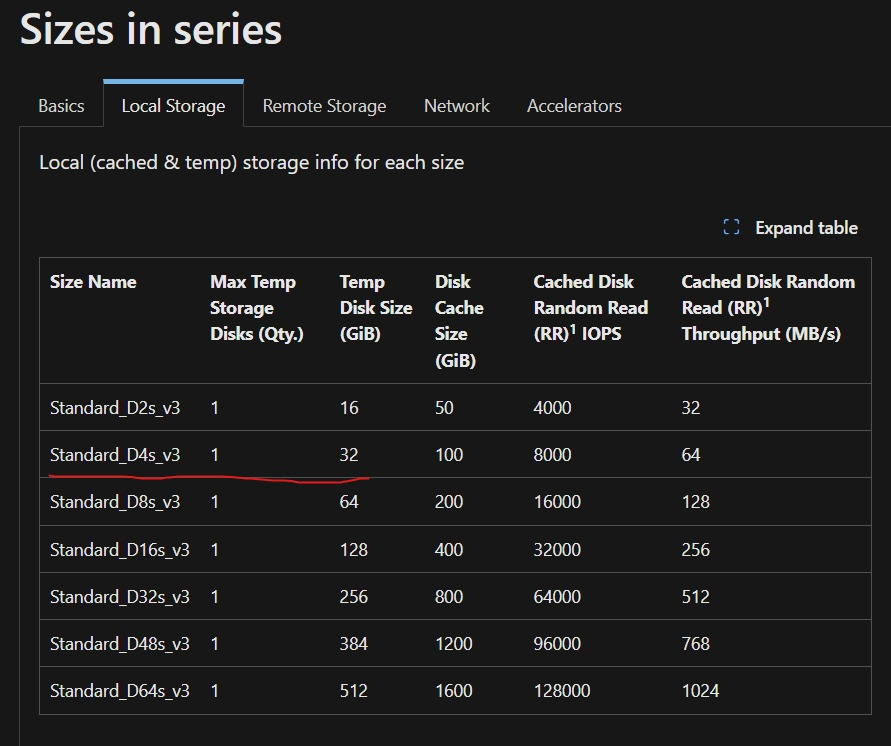
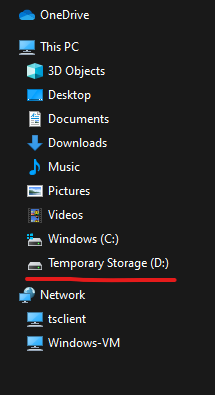
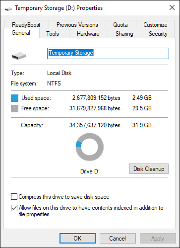

# VM size

参考这篇文章 [Virtual machine sizes overview - Azure Virtual Machines | Microsoft Learn](https://learn.microsoft.com/en-us/azure/virtual-machines/sizes/overview?tabs=breakdownseries%2Cgeneralsizelist%2Ccomputesizelist%2Cmemorysizelist%2Cstoragesizelist%2Cgpusizelist%2Cfpgasizelist%2Chpcsizelist)

Azure VM size的命名通常是有规律的，一般遵循以下格式：

```plaintext
[Series]_[SubSeries][vCPUs][AdditionalInfo]_[Version]
```

例如 `Standard_D4s_v3`，我们可以拆解它的含义：

- `Standard`  代表标准定价模式（非低优先级、非抢占式）
- `D`  代表 D 系列（通用计算优化）
- `4`  代表 4 vCPUs（4 核 CPU）
- `s`  代表 支持 Premium SSD（`s` = 支持 `Premium_LRS` 磁盘）
- `v3`  代表 第三代版本（通常意味着更新的 CPU 及优化）


### **Azure VM 主要系列**

不同系列的 VM 适用于不同的场景：

| 系列       | 适用场景                                    | 例子                                      |
| ---------- | ------------------------------------------- | ----------------------------------------- |
| **A 系列** | 基础计算                                    | Standard_A1_v2, Standard_A2_v2            |
| **B 系列** | 突发可用 VM（低负载，节省成本）             | Standard_B2s, Standard_B4ms               |
| **D 系列** | **通用计算优化**（平衡 CPU、内存）          | **Standard_D4s_v3**, Standard_D8s_v4      |
| **E 系列** | **内存优化**（适合数据库、大数据）          | Standard_E16s_v4, Standard_E32s_v3        |
| **F 系列** | **计算优化**（高 CPU 频率，适用于批量计算） | Standard_F8s_v2, Standard_F16s_v2         |
| **H 系列** | 高性能计算（HPC，如 CFD、科学计算）         | Standard_H8, Standard_H16mr               |
| **L 系列** | 存储优化（适合 NoSQL、大数据存储）          | Standard_L8s_v2, Standard_L32s_v2         |
| **N 系列** | **GPU VM（AI/渲染）**                       | Standard_NC6s_v3, Standard_NV32ads_A10_v5 |


# Azure VM Disk 的本质

为了理解 Azure VM Disk 的某些 setting option，例如 `caching`，需要理解Azure VM Disk的存储机制，

这其中会涉及到 Blob 存储，是理解 `caching` 这个option的关键

以及你的 VM 配置（内存和 SSD 磁盘）跟它的关系。

## Azure VM 磁盘的本质
在 Azure 中，当你创建一个虚拟机并为它分配一个磁盘（比如 `os_disk` 使用 `StandardSSD_LRS`），这个磁盘并不是直接绑定到 VM 的物理硬件上，而是存储在 Azure 的云存储系统中。具体来说，所有 Azure VM 的磁盘（包括 OS Disk 和Data Disk）实际上都是基于 Azure Blob 存储 的 VHD（虚拟硬盘文件，Virtual Hard Disk）。

你看到的配置：
- 在 Terraform 或 Azure Portal 中，你定义了 VM 的规格（比如 `vm_size`，决定了 CPU 和内存）和磁盘类型（比如 `StandardSSD_LRS`）。
- 你可能会觉得磁盘是“直接挂载”到 VM 上的，就像物理服务器插上一个 SSD 硬盘一样。

实际发生的事情：
- Azure 在背后创建了一个 VHD 文件（本质是一个 `.vhd` 文件），并将它存储在 Azure Blob 存储 中。
- 这个 VHD 文件通过 Azure 的虚拟化层（Hypervisor）挂载到你的 VM 上，表现得像一个本地的 SSD 磁盘。

换句话说，你定义的 `StandardSSD_LRS` 磁盘并不是 VM 本地的物理 SSD，而是 Azure 云端的一个逻辑磁盘，数据最终持久化在 Blob 存储中。


## Azure Blob 简单介绍
Azure Blob 存储是 Azure 提供的一种对象存储服务，用于存储大规模非结构化数据（比如文件、图片、视频，或者像这里一样的 VHD 文件）

在 VM 的场景下：
- 你创建的磁盘（`os_disk` 或 `data_disk`）是 Blob 存储中的一个“Page Blob”（Page Blob，一种适合随机读写的 Blob 类型）。
- Azure 通过网络（类似 iSCSI 的协议）将这个 Blob 挂载到 VM 上，让它看起来像一个本地磁盘。


## 为什么看不到 Blob 存储？
VM 配置中只定义了内存（`vm_size`）和磁盘（`StandardSSD_LRS`），没有显式提到 Blob 存储，这是因为：

Azure 把底层的 Blob 存储管理隐藏起来了。你不需要手动创建一个存储账户或 Blob 容器，Azure 在你部署 VM 时自动完成这些步骤。

Azure 上面大部可选的 Disk type, e.g. `StandardSSD_LRS`，都是 [Azure Managed Disk](https://learn.microsoft.com/en-us/azure/virtual-machines/managed-disks-overview). 它会自动在后台分配 Blob 存储，并为你管理存储账户和冗余（LRS 是本地冗余存储的意思）

所以，虽然你没直接配置 Blob 存储，但它确实是磁盘数据的最终存储位置。


## Caching option
现在我们回到 `caching` 的问题，结合 Blob 存储来解释一下：

VM 本地资源：

[Dsv3 size series - Azure Virtual Machines | Microsoft Learn](https://learn.microsoft.com/en-us/azure/virtual-machines/sizes/general-purpose/dsv3-series?tabs=sizestoragelocal#sizes-in-series)

缓存（`ReadOnly` 或 `ReadWrite`）利用的就是这些本地资源（内存和本地 SSD）

可以查看 VM size 文档确定是否有本地 SSD, 例如对于 `Standard_D4s_v3` 有 32 GB 的本地存储

[Dsv3 size series - Azure Virtual Machines | Microsoft Learn](https://learn.microsoft.com/en-us/azure/virtual-machines/sizes/general-purpose/dsv3-series?tabs=sizestoragelocal#sizes-in-series)



或者直接进入 virtual machine 确认，以 windows vm 为例

<div style="display: flex; justify-content: center; align-items: center;">
    
    
</div>

Blob 存储：

- `os_disk`（`StandardSSD_LRS`）是持久化的，数据存储在 Blob 存储中。
- VM 通过网络访问这个磁盘，速度比本地内存或 SSD 慢。

缓存的作用：
- 当你设置 `caching = "ReadWrite"` 时，VM 会先把数据读写到本地缓存（内存或 SSD），然后再同步到 Blob 存储。
- 如果没有缓存（`None`），VM 每次读写都直接通过网络访问 Blob 存储，延迟会更高。

[Azure premium storage: Design for high performance - Azure Virtual Machines | Microsoft Learn](https://learn.microsoft.com/en-us/azure/virtual-machines/premium-storage-performance#disk-caching) 在这个文档中倒是详细讲了每一个选项

### 5. 你的配置里有哪些存储？
以你的例子为例：
```hcl
os_disk {
  caching              = "ReadWrite"
  storage_account_type = "StandardSSD_LRS"
}
```
- **StandardSSD_LRS**：这是一个托管磁盘，背后是 Blob 存储中的一个 VHD 文件，类型是标准 SSD（比 HDD 快，但比 Premium SSD 便宜）。
- **内存**：由 `vm_size` 决定，用于运行 VM 和缓存。
- **本地 SSD**：如果你的 `vm_size` 包含临时磁盘（比如 D 系列），缓存可能会用它；否则只用内存。

你没看到 Blob 存储，是因为它是托管磁盘的一部分，Azure 自动管理了。

---

### 6. 为什么用 Blob 存储，而不是直接用本地 SSD？
你可能会想：既然有 SSD，为什么不直接把数据存在 VM 本地 SSD 上？原因如下：
- **持久性**：本地 SSD 是临时的，VM 关机或迁移到其他主机时数据会丢失。Blob 存储提供持久化，即使 VM 销毁，磁盘数据依然保留。
- **灵活性**：Blob 存储支持快照、备份和跨区域复制，适合云环境。
- **可扩展性**：Blob 存储是分布式系统，可以动态扩展，而本地 SSD 受限于物理硬件。

在 Azure 中，本地 SSD（如果有）通常只用作临时存储（比如 `temp disk`）或缓存，而持久化数据必须依赖 Blob 存储。

---

### 7. 澄清你的疑惑
你说“SSD 似乎没有额外的 Blob 存储”，其实 SSD 和 Blob 存储不是对立的：
- **SSD** 是指磁盘的性能级别（Standard SSD 或 Premium SSD），决定了读写速度和 IOPS。
- **Blob 存储** 是数据的实际存储位置，SSD 的性能是通过 Blob 存储的底层硬件实现的。

在你的配置中，`StandardSSD_LRS` 是一个托管磁盘，它的物理实现依赖 Blob 存储，但 Azure 通过优化（比如更快的存储硬件和网络）让它表现得像一个 SSD。

---

### 总结
- 你的 VM 磁盘（`StandardSSD_LRS`）实际上存储在 Azure Blob 存储中，表现为一个 VHD 文件。
- 你没显式定义 Blob 存储，是因为用的是托管磁盘，Azure 自动处理了。
- 缓存（`caching`）利用 VM 本地资源（内存或 SSD）加速对 Blob 存储的访问，优化性能。

希望这解释清楚了 Blob 存储的角色！如果还有其他疑问，比如想确认你的 `vm_size` 是否有本地 SSD，或者如何优化配置，随时问我吧！
