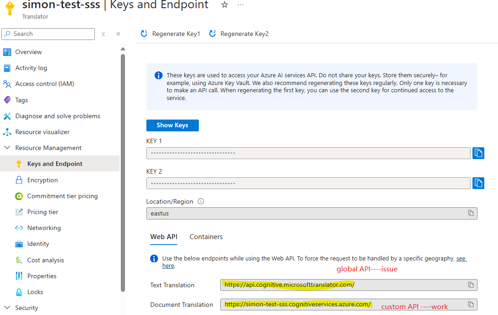
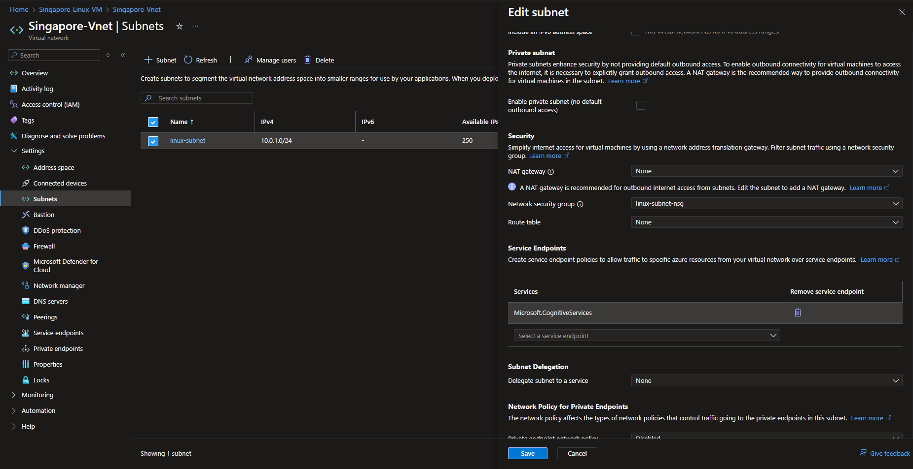

在 Vnet/subnet 上面 microsoft.cognitiveservices enable 了之后会导致，在这个 subnet 中的 VM 某些 AI service 的 Global API 无法链接上，但是 custom API 是可以使用的

对于 golbal api 连 tcp connection 都会失败

e.g.

这个其实是关于这个 service 的 bug，但是可能一直没有修复（似乎打算放弃修复了）。目前唯一的 public link, 似乎只有这个：[Not able to access the cognitive service urlfrom inside the virtual machine. - Microsoft Q&A](https://learn.microsoft.com/en-ca/answers/questions/452532/not-able-to-access-the-cognitive-service-urlfrom-i)

删除vnet/subnet 里面的

详细的文档： [Azure virtual network service endpoints | Microsoft Learn](https://learn.microsoft.com/en-us/azure/virtual-network/virtual-network-service-endpoints-overview)

里面又一句很奇怪的话：

> With service endpoints, the source IP addresses of the virtual machines in the subnet for service traffic switches from using public IPv4 addresses to using private IPv4 addresses.
