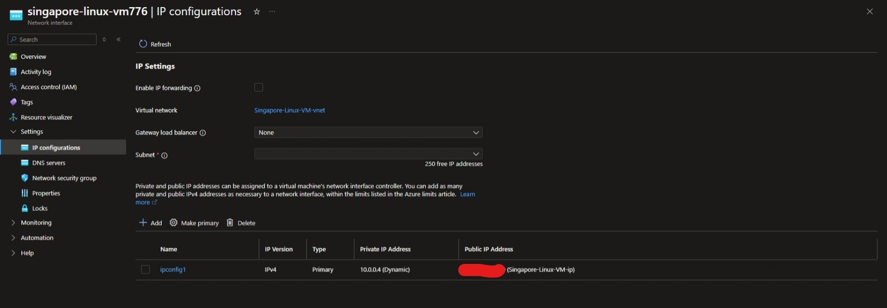

[azurerm_public_ip | Resources | hashicorp/azurerm | Terraform | Terraform Registry](https://registry.terraform.io/providers/hashicorp/azurerm/latest/docs/resources/public_ip)

创建一个 Public ip 的 terraform code


# NSG rule

reference: [azurerm_network_security_rule | Resources | hashicorp/azurerm | Terraform | Terraform Registry](https://registry.terraform.io/providers/hashicorp/azurerm/latest/docs/resources/network_security_rule)

for example

```terraform
# create windows subnet nsg
resource "azurerm_network_security_group" "windows_subnet_nsg" {
    name = var.windows_subnet_nsg_name
    location = azurerm_resource_group.main.location
    resource_group_name = azurerm_resource_group.main.name

    # inbound security rule
    # all RDP 10499 tcp port
    security_rule {
        name = "allow-RDP-tcp"
        priority = 100
        direction = "Inbound"
        access = "Allow"
        protocol = "Tcp"
        source_port_range = "*"
        destination_port_range = "10499"
        source_address_prefix = "*"
        destination_address_prefix = var.windows_subnet[0]
    }
    # all RDP 10499 udp port
    security_rule {
        name = "allow-RDP-udp"
        priority = 101
        direction = "Inbound"
        access = "Allow"
        protocol = "Udp"
        source_port_range = "*"
        destination_port_range = "10499"
        source_address_prefix = "*"
        destination_address_prefix = var.windows_subnet[0]
    }
  
}
```

### destination port 

- destination_port_ranges –> 列表类型 –> 无论有几个端口，都必须写成 `["80", "443"]` 或 `["10499"]`
- destination_port_range –> 字符串类型 → 只有一个端口时可以直接写 `"10499"`

添加多条规则，只需定义多个 `security_rule` 即可

# Network interface

reference [azurerm_network_interface | Resources | hashicorp/azurerm | Terraform | Terraform Registry](https://registry.terraform.io/providers/hashicorp/azurerm/latest/docs/resources/network_interface)

其中关于 ip_configuration 的部分对应 Azure portal 的这个部分

