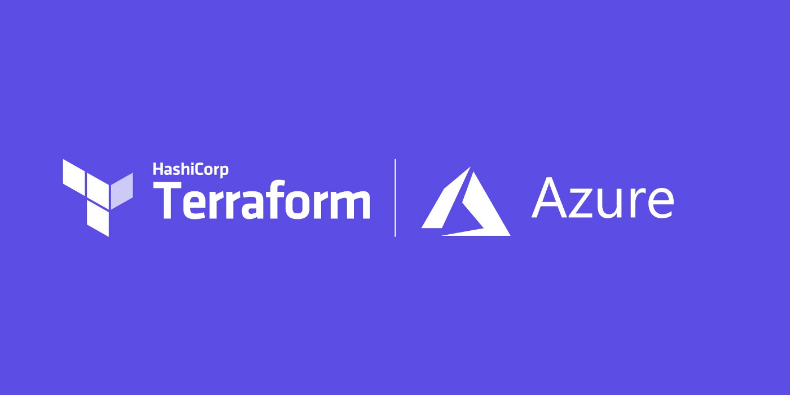
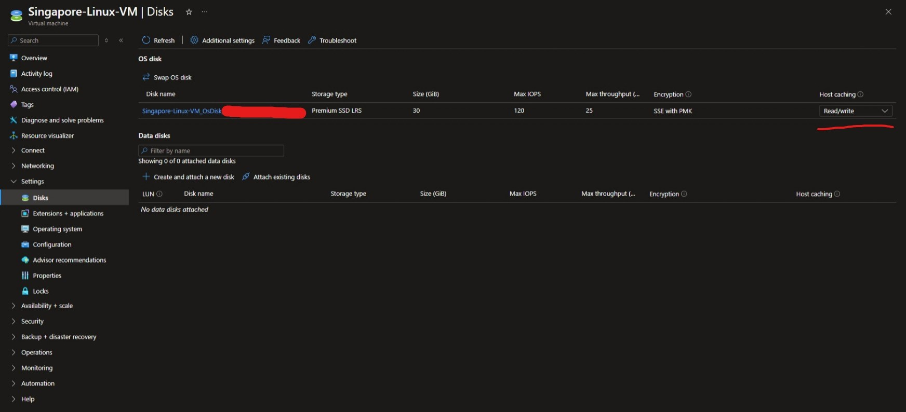
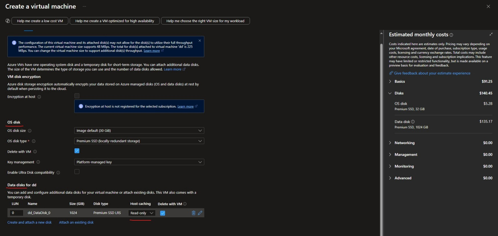
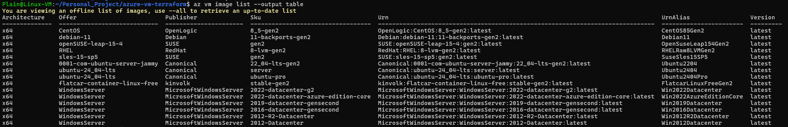
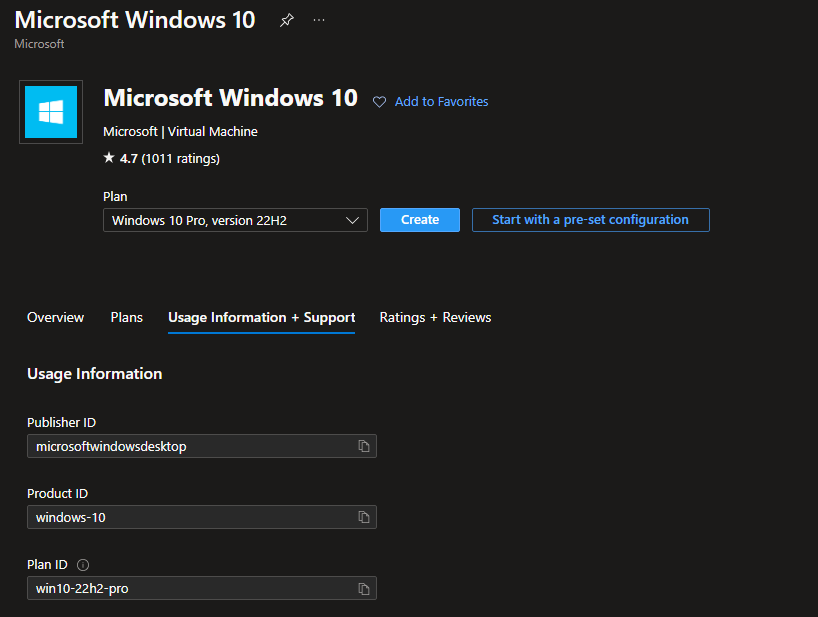
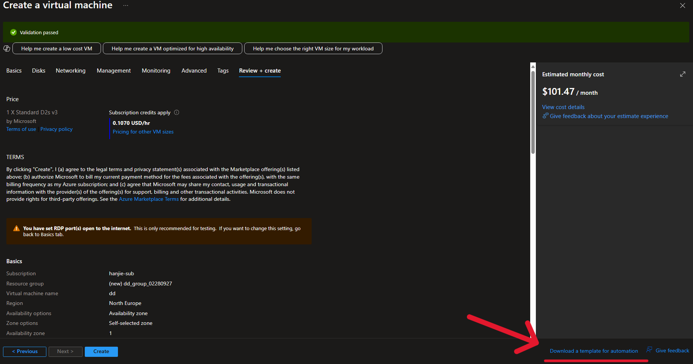
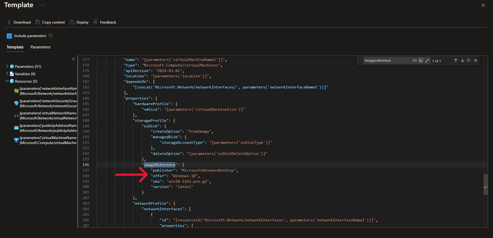

```
BriefIntroduction: 
这里讲了使用 terraform 创建 Azure virutal machine的一些细节
```

<!-- split -->



# VM OS disk setting

当我们使用 terraform 创建一台 vm 的时候，会发现 `os_disk` block 是必须要选择的，实际上对对应的就是 Azure portal 创建 virutal machine 界面的 disk 部分


根据这篇terraform 的文章 [azurerm_linux_virtual_machine | Resources | hashicorp/azurerm | Terraform | Terraform Registry](https://registry.terraform.io/providers/hashicorp/azurerm/latest/docs/resources/linux_virtual_machine)

这个 os_disk block 存在2个必选项 `caching` `storage_account_type`

## caching

关于 `caching` 在 Azure portal 上面指的是 Host caching



在 Portal 创建 Azure VM 的时候系统盘无法指定，但是 data disk可以指定



关于Azure VM Disk的具体内容可以查看这篇[文档](../native/virtual-machine/virtual-machine.md)

用一句话总结3个option的区别：

- **ReadOnly**：缓存只加速读，不管写。
- **ReadWrite**：缓存加速读和写，但有风险。
- **None**：不用缓存，慢但稳。

## storage account type

而关于 `stroage_account_type` 部分实际上就是 OS disk type

> [`storage_account_type`](https://registry.terraform.io/providers/hashicorp/azurerm/latest/docs/resources/linux_virtual_machine#storage_account_type-1) - (Required) The Type of Storage Account which should back this the Internal OS Disk. Possible values are `Standard_LRS`, `StandardSSD_LRS`, `Premium_LRS`, `StandardSSD_ZRS` and `Premium_ZRS`. Changing this forces a new resource to be created.

所谓的 LRS 就是 local redundant storage, ZRS 就是 zone redundant sotrage


# 关于默认的磁盘大小

因为我们实际上没有设置磁盘大小 `disk_size_gb` 所以会使用默认的大小

在Azure中，当你创建一台虚拟机时，如果未指定操作系统磁盘（OS Disk）的大小，**默认大小为**：

- **Linux 虚拟机：** 30 GB
- **Windows 虚拟机：** 127 GB

但是实际上感觉默认的也够用了对于 Linux 和 Windows 的话


# Vm image

在 Azure terraform 中 image 的确认由4个属性构成

```
source_image_reference {
    publisher = "Canonical"
    offer = "ubuntu-24_04-lts"
    sku = "server"
    version = "latest"
 }
```

为了得到这里4个属性，可以使用命令 `az vm image list --output table` 可以看到部分选择最多的 image

[Find and use marketplace purchase plan information using the CLI - Azure Virtual Machines | Microsoft Learn](https://learn.microsoft.com/en-us/azure/virtual-machines/linux/cli-ps-findimage)



如果想看全部的 image 的话需要加上 `--all` 参数

```shell
az vm image list --all
```

但是这个命令会运行很久很久，这个时间根本就不是正常人可以等的

可以去到这个 [Azure VM Image List](https://az-vm-image.info/) 上面查看所有的 image 本质上还是去运行这个命令，但是它会快上很多

有一个反向的方法，可以从已经创建的 Azure VM 中提取到这些信息

使用 az 命令

```
az vm show --resource-group <rg-name> --name <VM-name> --query "storageProfile.imageReference"
```

output like

```
{
    "communityGalleryImageId": null,
    "exactVersion": "19045.4529.240607",
    "id": null,
    "offer": "Windows-10",
    "publisher": "MicrosoftWindowsDesktop",
    "sharedGalleryImageId": null,
    "sku": "win10-22h2-pro-g2",
    "version": "latest"
  }
```

可以从中提取到这些信息

## MarketPlace

可以到到 Azure marketplace 稍微可以看到一些信息，比如说 publisher ID, product ID 这 2 个小大写可能对不上



不过可以将某些关键字放在 [Azure VM Image List](https://az-vm-image.info/) 网站进行搜索，在结合一下 grok3

## Arm template

我们不必把这个 vm 真正的创建出来，仅仅设定到 review 界面，就可以看到右下角存在 `Downlaod a template for automation` 点击进入



来到这个界面，直接 ctrl + F 查找 `imagereference` 就能看到



# VM size

可以看这篇[文档](../native/virtual-machine/virtual-machine.md)


# Windows virtual machine

[azurerm_windows_virtual_machine | Resources | hashicorp/azurerm | Terraform | Terraform Registry](https://registry.terraform.io/providers/hashicorp/azurerm/latest/docs/resources/windows_virtual_machine)

关于 widnows vm 还有一个需要注意的地方，那就是 `compute_name` 如果你不主动设定，那么就会默认使用 `name` 中提供的值

> [`computer_name`](https://registry.terraform.io/providers/hashicorp/azurerm/latest/docs/resources/windows_virtual_machine#computer_name-1) - (Optional) Specifies the Hostname which should be used for this Virtual Machine. If unspecified this defaults to the value for the `name` field. If the value of the `name` field is not a valid `computer_name`, then you must specify `computer_name`. Changing this forces a new resource to be created.

但是由于 Windows 对计算机名称（NetBIOS 名称）有 15 字符的限制，这是 Windows 操作系统的历史遗留规范（源于 NetBIOS 和早期 Windows 网络协议）所以，如果你不配置 `compute_name` 并且你的 `name` 超过了15个字符，那么就会存在如下报错

```shell
│ Error: unable to assume default computer name "computer_name" can be at most 15 characters, got 20. Please adjust the "name", or specify an explicit "computer_name"
```

