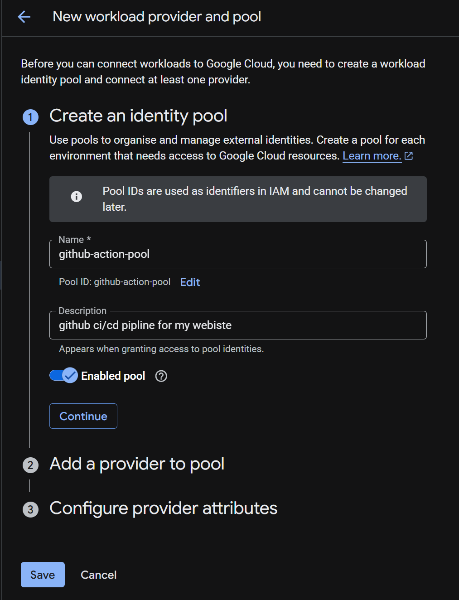
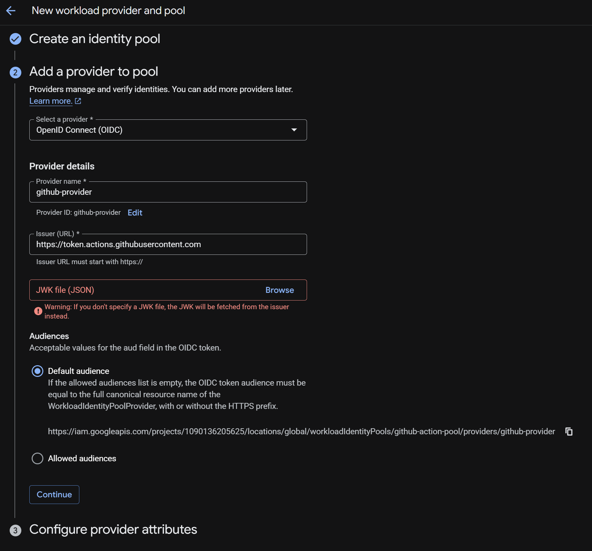
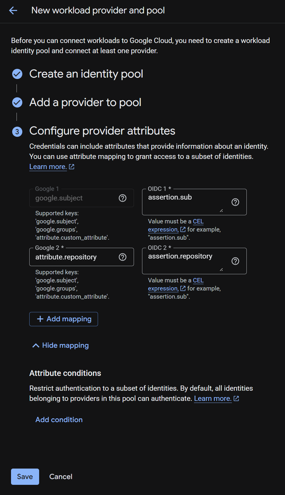

# setup-wif

以下是在 GCP 控制台配置 Workload Identity Federation (WIF) 的详细步骤：

### 第一步：进入 WIF 配置界面

1. 登录 [GCP Console](https://console.cloud.google.com/)。
2. 在左侧导航菜单中，点击 “IAM & Admin” (IAM 和管理)。
3. 在二级菜单中找到并点击 “Workload Identity Federation”。

### 第二步：创建身份池 (Identity Pool)

1. 点击页面顶部的 “+ CREATE POOL”。
2. Name: 输入一个名字（如 `github-actions-pool`）。
3. Description: 可选，建议写上“用于 GitHub 自动化部署”。
4. 点击 “Continue”。

### 第三步：添加提供商 (Add Provider)

在 “Add a provider to pool” 步骤中：

1. Select a provider: 选择 “OpenID Connect (OIDC)”。
2. Provider name: 输入名字（如 `github-provider`）。
3. Issuer (URL): 填入 GitHub 的官方地址：`https://token.actions.githubusercontent.com`。
4. Audiences: 选择 “Default audience” 即可。
5. 点击 “Continue”。

> [!note]
>
> 这个 Warning 不需要管它，直接点击 Continue 即可。
>
> 为什么可以忽略？
>
> - 自动获取机制：正如提示所言，如果你不上传 JWK 文件，GCP 会自动去你填写的 `Issuer (URL)`（即 GitHub 的服务器）获取公钥。
> - 标准做法：对于 GitHub Actions 这种成熟的 OIDC 提供商，它们会自动维护和轮换这些公钥。手动上传反而会导致密钥过期后认证失败。

### 第四步：配置属性映射 (Attribute Mapping)

这一步至关重要，它决定了 GCP 如何读取 GitHub 传过来的信息：

1. Google target: `google.subject` ↔ Assertion: `assertion.sub` (这是必填的默认项)。

2. 点击 “+ ADD MAPPING”：

   - Google target: `attribute.repository` ↔ Assertion: `assertion.repository`
   - *(可选)* Google target: `attribute.actor` ↔ Assertion: `assertion.actor`

3. 填写 condition

   assertion.repository == "hanjie-chen/website"

4. 点击 “SAVE”。

> [!note]
>
> 简单来说，这一步是“对暗号”。
>
> GitHub 在请求登录时，会发给 GCP 一个“身份证明”（OIDC Token），里面包含了大量信息（谁触发的、哪个仓库、哪个分支等）。Mapping（映射） 的作用就是告诉 GCP：“请把 GitHub 证明里的 A 字段，对应到我这里的 B 变量上。”
>
> 1. 为什么要配置 Mapping（映射）？
>
> GCP 的权限系统（IAM）并不直接认识 GitHub 的数据格式。通过映射，你可以把 GitHub 的信息转换成 GCP 能理解的“标签”。
>
> - google.subject：这是必填项，通常映射为 `assertion.sub`。它代表了这个身份的唯一标识符。
> - 自定义映射（重要）：
>   - 如果你映射了 `attribute.repository` ↔ `assertion.repository`，你就可以在后面设置：“只允许 `knowledge-base` 这个仓库访问我的云资源”。
>   - 如果不做映射，GCP 就无法根据仓库名来过滤请求，安全性会降低。
>
> 2. Provider Attributes（提供者属性）的作用
>
> 这些属性就像是给进入你云系统的自动化程序贴上的身份标签。
>
> - 精细化授权：你可以限制只有来自 `main` 分支的任务才能部署生产环境。
> - 审计追踪：在 GCP 的日志里，你可以看到具体是哪一个 GitHub 仓库、哪一个用户触发了这次 Terraform 操作。

### 第五步：关联服务账号 (Connect Service Account)

池子建好了，现在要授权给特定的 Service Account：

1. 在 WIF 列表页面，点击你刚创建的池子。
2. 进入后，点击顶部的 “GRANT ACCESS”。
3. Select a service account: 选择你打算让 Terraform 使用的那个服务账号（例如 `terraform-sa`）。
4. Select principals:
   - Attribute name: 选择 `repository`。
   - Attribute value: 填入你的 GitHub 仓库路径（格式为：`你的用户名/仓库名`，例如 `myuser/knowledge-base`）。
5. 点击 “SAVE”。

## 关键参数

workload_identity_provider：

projects/【项目编号】/locations/global/workloadIdentityPools/【Pool名称】/providers/【Provider名称】

Service Account Email：

在左侧黑色导航栏，Workload Identity Federation 的正上方，有一个菜单叫 Service accounts，可以看到这个

