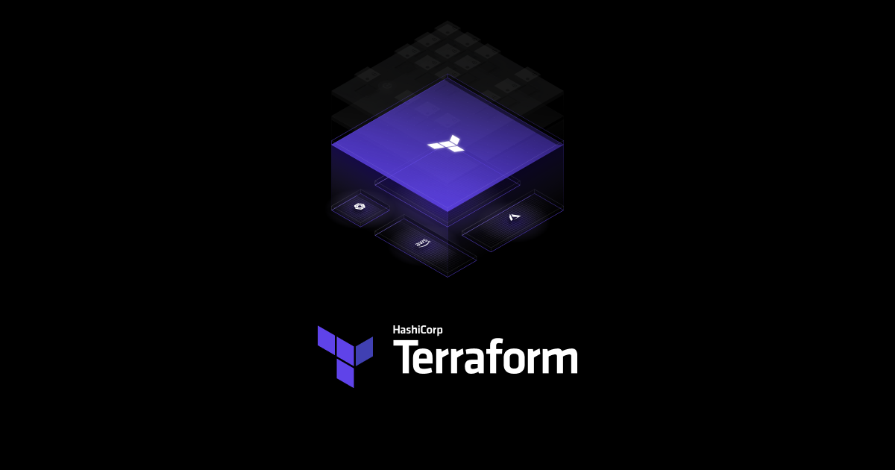

```
BriefIntroduction: 
terraform 入门指南
```

<!-- split -->



# Terraform 入门指南

云原生的痛：想象一下在云平台上狂点鼠标创建了 10 台服务器、配置了网络和防火墙，花了半天时间。结果第二天发现还需要在另一个地区照原样再搞一套测试环境。—— 会不会崩溃？

基础设施即代码（IaC）：如果能像写代码一样，把这些配置写下来，每次只要点击“运行”，环境就自动搭好了，岂不是很爽？这就是 Terraform 要做的事。

Terraform 简单来说就是使用代码来管理 cloud(azure, gcp, aws) 上面的组件，这样子就不需要在 portal 上面点来点去了，而且管理起来非常方便，创建许多资源的时候可以同步进行，加快速度。

官网地址下载 [Install | Terraform | HashiCorp Developer](https://developer.hashicorp.com/terraform/install), 可以用命令 `terraform --version` 来验证是否下载完成

```shell
$ terraform --version
Terraform v1.10.5
on linux_amd64
```

如果使用 vscode 那么可以下载这个官方插件：HashiCorp Terraform

# Minimal Terraform Project

一个最小可运行的 Terraform 项目通常包含以下四个核心文件：

  - `providers.tf`：声明 provider（要操作哪个云）
  - `main.tf`：定义 cloud 资源（resource）
  - `variables.tf` & `terraform.tfvars`：可复用参数（region/name 等）和敏感密码。
  - `outputs.tf`：部署完成后希望终端打印出的信息（如 IP 地址）

## Syntax (main.tf)

在 Terraform 中，资源块的语法格式是：

```cpp
resource "<resource-type>" "<local-resource-name>" {
  # 资源配置
}
```

例如，创建一个 Azure 资源组：

```cpp
resource "azurerm_resource_group" "main" {
  name     = var.resource_group_name
  location = var.resource_region
}
```

这里

- `"azurerm_resource_group"` 是资源类型，表示创建一个 Azure 的资源组

- `"main"` 是本地资源名称（Local Name），它只在 Terraform 代码内部使用，方便其他资源引用它。例如：

  ```cpp
  resource "azurerm_virtual_network" "main" {
    name                = var.vnet_name
    resource_group_name = azurerm_resource_group.main.name
    # 这里的azurerm_resource_group.main.name就是引用之前定义的资源组
  }
  ```

  > [!note]
  >
  > - 这个名称在 Terraform 配置的范围内必须是唯一的，但在云提供商的实际资源中，这个名称不会被使用。
  > - 可以根据自己的喜好和项目需要，选择合适的名称。例如，用 `"main"`,  `"resource_group"`, `"rg"`。

## Variables (variables.tf & terraform.tfvars)

我们会在在 `variables.tf` 这个文件中编写那些可以用来复用的变量，例如 resource location

```yaml
variable "resource_region" {
  description = "Azure resource location: Singapore"
  default = "southeastasia"
}
```

> [!note]
>
> Azure 对于位置名称有两种表示方式：
>
> 1. 人类可读的名称（Display Name）：例如 "Southeast Asia"、"East US" 等，通常在 Azure 门户中显示。
> 2. 地点代码（Location Name 或 Location Code）：例如 "southeastasia"、"eastus" 等，通常用于 API 调用和脚本中。
>
> 在 Terraform 中，AzureRM 提供程序（Azure Resource Manager Provider）同时接受这两种形式的位置名称。
>
> 推荐使用标准的区域代码（canonical location names），即全小写、无空格的形式，例如 `"southeastasia"`。
>
> 因为使用标准的区域代码可以确保配置与 Azure 的 API、CLI 和 SDK 保持一致。这些工具通常使用标准的区域代码来指定位置。

### Using Variables

再其他的 tf 文件，比如说 network.tf 中我们可以使用 `var.<variable-name>` 的方式来使用再 variables.tf 中定义的变量 e.g.

```yaml
# variables.tf
variable "resource_region" {
  description = "Azure resource location: Singapore"
  default = "southeastasia"
}

variable "resource_group_name" {
    description = "resource group name"
    default = "Singapore-RG"
}
---
# network.tf
# create resource group
resource "azurerm_resource_group" "main" {
  name = var.resource_group_name
  location = var.resource_region
}
```

### Sensitive variables

由于代码会推送到 Github，所以密码绝对不能写在 `variables.tf` 中，最佳实践是使用 `terraform.tfvars` 文件：

创建一个名为 `terraform.tfvars` 的文件，其中包含密码变量。然后，将该文件添加到 `.gitignore` 中，防止其被提交到 GitHub。

1. 创建 `terraform.tfvars` 文件：

   ```cpp
   admin_password = "YourSecurePassword"
   ```

2. 在 `.gitignore` 文件中，添加 `terraform.tfvars`

3. 在 `variables.tf` 中，声明 `admin_password` 变量，不设置默认值，并标记。

   ```cpp
   variable "admin_password" {
     description = "Admin password for the Linux VM"
     type        = string
     sensitive   = true
   }
   ```

4. Terraform 会自动读取 `terraform.tfvars` 中的变量值。

## outputs

部署完成后，我们需要获取一些关键信息（比如刚建好的 VM 的公网 IP），这就在 `outputs.tf` 里定义：

```hcl
# outputs.tf
output "vm_public_ip" {
  value = azurerm_public_ip.main.ip_address
}
```

# Terraform Workflow

在我们开始之前，要让 Terraform 操作 cloud 资源，还需要通过 cloud 认证：[Azure](../azure/terraform/auth.md) [GCP](../gcp/terraform/auth.md)

写好了上面这些 `.tf` 文件后，我们就可以按顺序执行 Terraform 命令“四部曲”了（code --> cloud resource）。在执行的过程中，Terraform 会自动生成一些极其重要的文件和文件夹。

## Step 1: initialize (terraform init)

这个命令会初始化 tf 项目，类似于 git init 但它必须在写好 `providers.tf` 后才能运行。Terraform 会读取你的配置，知道你要用 Azure 后，它会做以下事情：

1. 下载 Provider 插件：自动下载 Azure 的插件代码。
2. 初始化 Backend：配置状态文件的存放位置。

运行后产生：

1. `.terraform/` 文件夹：本地缓存目录，存放刚下载的插件。必须加入 `.gitignore`。

   - 插件（Providers） `.terraform/providers/...`

     Terraform 需要知道如何与云平台（如 AWS, Azure, GCP）沟通。它会下载这些平台的二进制插件

   - 模块（Modules） `.terraform/modules/`

     如果代码中引用了外部模块（不管是本地路径还是远程 GitHub 仓库），`init` 会拷贝或链接这些模块的代码

   - 后端配置（Backend Configuration） `.terraform/terraform.tfstate`：

     类似于“指针”。它不记录你的资源，它只记录：“嘿，Terraform，真正的状态文件在远端的 S3 桶里，名字叫 network.tfstate”。

     只有当配置了 `backend`（如 AWS S3, Azure Blob, etc）时，`init` 才会生成这个隐藏文件来记录连接信息。

2. `.terraform.lock.hcl`：版本锁定文件。确保团队中所有人下载的 Provider 版本一致，避免版本冲突。需要提交到 Git。

   - 已有该文件，读取现有的 `.terraform.lock.hcl` 文件，并按照其中指定的 provider 初始化。
   - 没有该文件，会在初始化过程中生成新的 `.terraform.lock.hcl` 文件。

e.g.

```shell
$ terraform init
Initializing the backend...
Initializing provider plugins...
- Finding hashicorp/azurerm versions matching "~> 4.16"...
- Installing hashicorp/azurerm v4.16.0...
- Installed hashicorp/azurerm v4.16.0 (signed by HashiCorp)
Terraform has created a lock file .terraform.lock.hcl to record the provider
selections it made above. Include this file in your version control repository
so that Terraform can guarantee to make the same selections by default when
you run "terraform init" in the future.

Terraform has been successfully initialized!

You may now begin working with Terraform. Try running "terraform plan" to see
any changes that are required for your infrastructure. All Terraform commands
should now work.

If you ever set or change modules or backend configuration for Terraform,
rerun this command to reinitialize your working directory. If you forget, other
commands will detect it and remind you to do so if necessary.
```

## step 2: validate syntax (terraform validate)

`terraform validate` 这个命令验证 Terraform 配置文件的语法和逻辑是否正确。e.g.

```shell
$ terraform validate
Success! The configuration is valid.
```

它检查：

1. 语法（比如括号匹配、引号使用）。
2. 资源属性是否符合 Terraform 提供者的模式（schema），比如 azurerm_network_interface 的 name 是否是字符串类型。
3. 引用（比如你引用的变量或资源是否存在）。

> [!note]
>
> 它不会检查 cloud 上状态或资源是否存在，只要语法正确且符合资源的要求，validate 就不会报错。

## step 3: preview changes (terraform plan)

`terraform plan` 命令不修改任何东西，只输出一个“计划书”，告诉你它打算干嘛：

- `+` 表示要新建资源。
- `-` 表示要销毁资源。
- `~` 表示要修改资源属性。

### Core Concept: 边界在哪里？

很多初学者对 `terraform plan` 有一个巨大的误解：以为它是“云端吸尘器”，只要云上存在但本地代码里没有的资源，它全会删掉。—— 这是错的！

Terraform 实际上只管自己的“一亩三分地”，这个地盘是由它的状态文件（`terraform.tfstate` 账本）决定的。

1. 云上有，但代码和账本里没有：
   （比如同事手动在网页上建了一台 VM）。Terraform 就像瞎子一样视而不见，绝对不会去删除它，因为它不在 Terraform 的管辖范围内。
2. 账本里有，云上也有，但你把代码删了：
   Terraform 会敏锐地发现：“这台机器归我管，但老板今天给我的新代码里把它划掉了。” 此时 `plan` 才会输出 `- destroy`，去云上把机器删掉。
3. 别人手动改了归 Terraform 管的资源：
   （比如偷偷在网页上加了一个 80 端口）。Terraform 会发现实际状态和代码不符，`plan` 会输出 `~ update`，在下次部署时无情地把 80 端口抹掉，强行恢复成代码里的样子。

> 总结：Terraform 只对比并修正 “由它自己创建并记录在册的资源”。不在账本里的资源，它一概不管！

### prod best practice

这个命令底部还可以看到这样子一个 note

```shell
Note: You didn't use the -out option to save this plan, so Terraform can't guarantee to take exactly these actions if you run "terraform apply" now.
```

因为 `terraform apply` 会重新评估状态并生成一个新的计划。如果在这段时间内某些东西发生了变化（比如远程状态被修改，或者你工作目录中的代码被调整），`terraform apply` 执行的动作可能与你之前看到的 `terraform plan` 输出不完全一致。

我们可以使用 `-out` 参数

```shell
terraform plan -out myplan.tfplan
```

那么 Terraform 会把这个计划保存到 `myplan.tfplan` 中，然后可以用这个保存的计划文件运行

```shell
terraform apply myplan.tfplan
```

确保 Terraform 严格按照之前审查的计划执行。

## step 4: deploy resources (terraform apply)

检查 plan 无误后，执行部署。

如果上一步存了计划文件，可以直接运行 `terraform apply myplan.tfplan`。如果没有那么就是 `terraform apply` 它会再展示一次 plan，并让你输入 `yes` 确认（或者使用 `-auto-approve` 参数跳过）。

运行后产生的文件：

`terraform.tfstate`：状态文件。Terraform 把刚在云上建好的资源详细信息（包括刚才那个 `tfvars` 传进来的密码！）全写在这个 JSON 文件里。它是 Terraform 以后管理这些资源的唯一依据。包含敏感信息，绝对不能提交到 Git！

## step 5: check output

如果在 `outputs.tf` 中定义了输出，apply 成功后会自动打印。你也可以随时敲 `terraform output` 重新查看这些关键信息。
