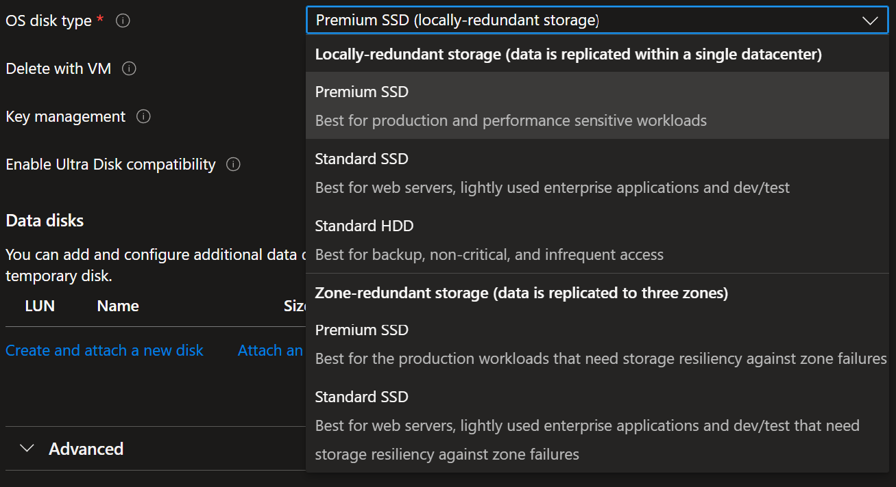

当我们使用 terraform 创建一台 vm 的时候，会发现 `os_disk` block 是必须要选择的，实际上对对应的就是 Azure portal 创建 virutal machine 界面的 disk 部分

根据这篇terraform 的文章 [azurerm_linux_virtual_machine | Resources | hashicorp/azurerm | Terraform | Terraform Registry](https://registry.terraform.io/providers/hashicorp/azurerm/latest/docs/resources/linux_virtual_machine)

这个 os_disk block 存在2个必选项 `caching` `storage_account_type`

# caching

其中`caching`对应这篇vm的文章，但是我没有看明白，得去问下 vm 组的人 [Virtual machine and disk performance - Azure Virtual Machines | Microsoft Learn](https://learn.microsoft.com/en-us/azure/virtual-machines/disks-performance)

# storage account type

而关于 `stroage_account_type` 部分实际上就是 OS disk type

> [`storage_account_type`](https://registry.terraform.io/providers/hashicorp/azurerm/latest/docs/resources/linux_virtual_machine#storage_account_type-1) - (Required) The Type of Storage Account which should back this the Internal OS Disk. Possible values are `Standard_LRS`, `StandardSSD_LRS`, `Premium_LRS`, `StandardSSD_ZRS` and `Premium_ZRS`. Changing this forces a new resource to be created.

所谓的 LRS 就是 local redundant storage, ZRS 就是 zone redundant sotrage

# 关于默认的磁盘大小

因为我们实际上没有设置磁盘大小 `disk_size_gb` 所以会使用默认的大小

在Azure中，当你创建一台虚拟机时，如果未指定操作系统磁盘（OS Disk）的大小，**默认大小为**：

- **Linux 虚拟机：** 30 GB
- **Windows 虚拟机：** 127 GB

但是实际上感觉也够用了对于 Linux 的话

# Vm image

关于 vm 的镜像问题，也得去问一下 [Find and use marketplace purchase plan information using the CLI - Azure Virtual Machines | Microsoft Learn](https://learn.microsoft.com/en-us/azure/virtual-machines/linux/cli-ps-findimage)

似乎也没有看懂

使用命令 `az vm image list --output table` 可以看到部分选择最多的 image, 如果想看
