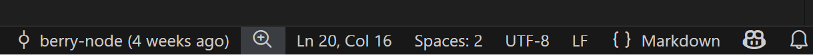

# Background Problem

当我们使用 `git add` 有时候会看到这样子的 warning

```text
warning: in the working copy of 'xxx', LF will be replaced by CRLF the next time Git touches it
```

这是什么东西呢？

在深入了解这个 warning 之前，我们需要先知道 LF & CRLF

- LF: Unix/Linux 风格的换行符（`\n`）
- CRLF: Windows 风格的换行符（`\r\n`）

这个警告的含义是：文件目前使用的是 LF，运行了 `git add` 之后

Git 发现当前配置可能会在“工作区”把这个文本文件检出/写回成 CRLF，所以提醒你下一次 Git touches it 时，工作区内容可能从 LF 变成 CRLF。

# Why It Matters

如果我们在 windows 环境中打开一个 Linux 脚本文件，并且将其复制到一个 Linux container 中，运行可能出现这样子的问题

```shell
exec /usr/local/bin/init.sh: no such file or directory
```

明明这个脚本文件是存在的，为什么会是这个报错呢？

虽然文件存在，并且 shebang 行是正确的 `#!/bin/sh`，但脚本文件使用了 CRLF，而不是 LF。导致 shebang 行 `#!/bin/sh` 会被错误解析为 `#!/bin/sh\r`。

系统会尝试寻找解释器 `/bin/sh\r`，但这个路径不存在，因此会报 "no such file or directory" 的错误。

解决方法是把脚本文件的换行符转换为 LF，可以直接使用 vscode 打开这个脚本文件，检查脚本文件的换行符（右下角）

如果是 `CRLF`，点击它并选择 `LF` 保存文件



# Use `.gitattributes`

为了防止将来再次出现此问题，可以配置 Git 处理换行符，添加 `.gitattributes` 文件，强制指定文本文件的换行符为 LF：

```gitattributes
* text=auto eol=lf
```

当 Git 判断为本文的文件，会自动将换行符设置为 LF。

和 `.gitignore` 一样，可以配置 global：

```shell
git config --global core.attributesFile "C:/Users/Windows 10/.gitattributes"
```
