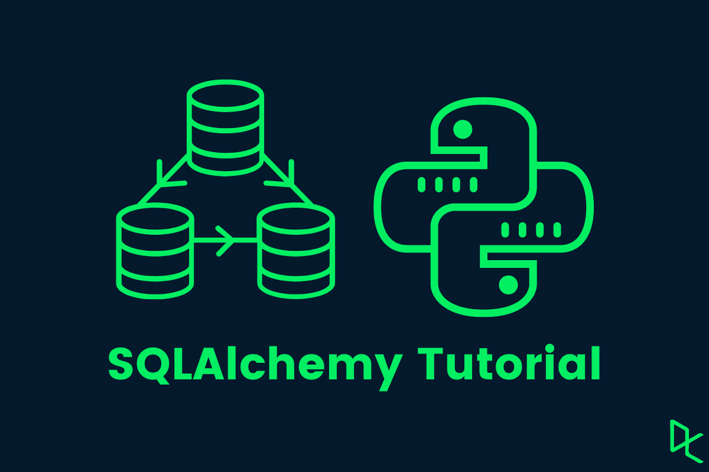

```
BriefIntroduction: 
这是关于 SQLalchemy 基础知识的部分笔记总结
```

<!-- split -->



# SQLAlchemy Core Components

# 关于ORM(Object-Relational Mapping)

ORM是一种编程技术,用于在面向对象编程语言和关系型数据库之间建立映射关系，全称是Object-Relational Mapping,即对象关系映射。

通过使用这种技术，可以直接通过编程语言来操作数据库，而不需要直接编写SQL语句。而且写得代码可以方便的在不同的数据库系统之间迁移

ORM的基本概念

- 实体(Entity): 对应数据库中的表。
- 属性(Property): 对应表中的列。
- 关系(Relationship): 表示实体之间的关联(如一对多,多对多等)。

## Python SQLAlchemy示例

假设我们有一个User类和一个对应的users表:

```python
# Python示例,使用SQLAlchemy
from sqlalchemy import Column, Integer, String
from sqlalchemy.orm import DeclarativeBase

class Base(DeclarativeBase):
    pass

class User(Base):
    __tablename__ = 'users'
    
    id = Column(Integer, primary_key=True)
    name = Column(String)
    email = Column(String)

# 使用ORM创建新用户
new_user = User(name="Alice", email="alice@example.com")
session.add(new_user)
session.commit()

# 使用ORM查询用户
users = session.query(User).filter(User.name == "Alice").all()
```

在这个例子中,我们定义了一个User类,它映射到数据库中的users表。我们可以使用面向对象的方式来创建、查询和操作用户数据,而不需要直接编写SQL语句。

ORM与传统数据库操作的对比:

- 传统方式:
  ```sql
  INSERT INTO users (name, email) VALUES ('Alice', 'alice@example.com');
  SELECT * FROM users WHERE name = 'Alice';
  ```
- ORM方式:
  ```python
  new_user = User(name="Alice", email="alice@example.com")
  session.add(new_user)
  users = session.query(User).filter(User.name == "Alice").all()
  ```

ORM方式更接近于面向对象的编程思维,代码更加直观和易于维护。

# Engine

Sqlalchemy engine 使用函数`create_engine` 连接数据库

例如：

```python
from sqlalchemy import create_engine
engine = create_engine("sqlite+pysqlite:///:memory:", echo=True)
```

其中第二行代码用于创建一个SQLAlchemy的`engine`对象，它负责管理与数据库的连接。让我们逐步解释这行代码的含义：

```python
engine = create_engine('sqlite+pysqlite:///:memory:', echo=True)
```

1. **`create_engine`函数**：

   - `create_engine`是SQLAlchemy提供的一个函数，用于创建`engine`对象。这个对象是与数据库交互的核心

2. **数据库URL**：

   - `'sqlite+pysqlite:///:memory:'`是一个数据库URL，用于指定数据库的类型和连接方式。

     - `sqlite`：指定使用SQLite数据库。

     - `pysqlite`：指定使用的DBAPI驱动程序。在现代Python中，`pysqlite`通常对应于`sqlite3`标准库。

     - `/:memory:`：指定数据库在内存中运行。

       这意味着数据库是临时的，并且在创建时没有任何表或数据，而且不会持久化到磁盘。需要在连接后手动创建表并插入数据，以便进行实际的数据库操作。每次重启程序，数据库都会重置。这种方式非常适合测试和开发。

3. **`echo=True`参数**：

   - `echo=True`是一个可选参数，表示SQLAlchemy将会打印所有生成的SQL语句到标准输出。这对于调试和学习SQLAlchemy的SQL生成过程非常有用。

# Connection

## Build connect and Execute SQL statement

SQLAlchemy提供了一种简单而强大的方式来与数据库交互。让我们通过一个例子来了解基本的connect和SQL执行过程。

```python
from sqlalchemy import text
from sqlalchemy import create_engine

# 创建一个内存SQLite数据库引擎
engine = create_engine("sqlite+pysqlite:///:memory:", echo=True)

# 使用with语句来管理连接
with engine.connect() as conn:
    # 创建表
    conn.execute(text("CREATE TABLE some_table (x int, y int)"))
    
    # 插入数据
    conn.execute(
        text("INSERT INTO some_table (x, y) VALUES (:x, :y)"),
        [{"x": 1, "y": 1}, {"x": 2, "y": 4}],
    )
    
    # 提交事务
    conn.commit()
```

执行这段代码会产生以下输出：

```bash
2024-09-07 14:39:14,179 INFO sqlalchemy.engine.Engine BEGIN (implicit)
2024-09-07 14:39:14,179 INFO sqlalchemy.engine.Engine CREATE TABLE some_table (x int, y int)
2024-09-07 14:39:14,179 INFO sqlalchemy.engine.Engine [generated in 0.00041s] ()
<sqlalchemy.engine.cursor.CursorResult object at 0x7f81523dc820>
2024-09-07 14:39:14,181 INFO sqlalchemy.engine.Engine INSERT INTO some_table (x, y) VALUES (?, ?)
2024-09-07 14:39:14,181 INFO sqlalchemy.engine.Engine [generated in 0.00020s] [(1, 1), (2, 4)]
<sqlalchemy.engine.cursor.CursorResult object at 0x7f81523dc880>
2024-09-07 14:39:14,181 INFO sqlalchemy.engine.Engine COMMIT
```

---

### 代码解释 `text()`-->`execute()`

`text()` 用于创建一个可以执行的 SQL 文本对象，这个对象可以传递给连接对象的 `execute()` 来执行。

> note:
>
> 在 SQLAlchemy 的早期版本中，`execute()` 方法可以直接接受原生 SQL 字符串。然而，从 SQLAlchemy 1.4 开始，为了提高安全性和一致性，直接传递 SQL 字符串的做法被弃用了。

使用 `text()` 允许我们使用命名参数 `:parameter`，可以更好地防止 SQL 注入攻击，提高了代码的可读性

例如：

```python
from sqlalchemy import text

# 推荐的方式
result = conn.execute(text("SELECT * FROM users WHERE id = :id"), {"id": 1})

# 不推荐的方式（在新版本中可能会产生警告）
# result = conn.execute("SELECT * FROM users WHERE id = 1")
```

而在我们的例子中

```python
# 插入数据
conn.execute(
	text("INSERT INTO some_table (x, y) VALUES (:x, :y)"),
	[
        {"x": 1, "y": 1},
        {"x": 2, "y": 4}
    ],
)
```

### BEGIN (implicit) 事务管理

当 SQLAlchemy 记录“BEGIN (implicit)”时，它表示 SQLAlchemy 识别到一个事务的开始，但这是基于数据库驱动程序的行为，而不是因为 SQLAlchemy 或者应用程序显式地发送了 `BEGIN` 命令。

许多数据库驱动程序会在你执行第一个需要事务的操作时自动开始一个事务。这种行为意味着你不需要显式地调用 `BEGIN` 来开始事务。

## execute 查询返回值

让我们首先看一个基本的查询执行示例：

```bash
>>> with engine.connect() as conn:
...     result = conn.execute(text("SELECT x, y FROM some_table"))
...     print(result.all())
...
2024-09-07 15:04:00,062 INFO sqlalchemy.engine.Engine BEGIN (implicit)
2024-09-07 15:04:00,062 INFO sqlalchemy.engine.Engine SELECT x, y FROM some_table
2024-09-07 15:04:00,062 INFO sqlalchemy.engine.Engine [generated in 0.00038s] ()
[(1, 1), (2, 4)]
2024-09-07 15:04:00,063 INFO sqlalchemy.engine.Engine ROLLBACK
```

result 是一个列表`list` 在这个例子中result包含2个元组`tuple` (1, 1), (2, 4)

### 参数查询

```bash
>>> with engine.connect() as conn:
...     result = conn.execute(text("SELECT x, y FROM some_table WHERE y > :y"), {"y": 2})
...     for row in result:
...             print(f"x: {row.x}  y: {row.y}")
...
2024-09-07 15:51:19,434 INFO sqlalchemy.engine.Engine BEGIN (implicit)
2024-09-07 15:51:19,435 INFO sqlalchemy.engine.Engine SELECT x, y FROM some_table WHERE y > ?
2024-09-07 15:51:19,435 INFO sqlalchemy.engine.Engine [generated in 0.00051s] (2,)
x: 2  y: 4
2024-09-07 15:51:19,435 INFO sqlalchemy.engine.Engine ROLLBACK
```

**执行带参数的查询**：

- `text("SELECT x, y FROM some_table WHERE y > :y")`: 创建一个 SQL 查询文本对象，使用命名参数 `:y`
- `{"y": 2}`: 参数字典，将命名参数 `:y` 绑定到值 `2`

运行日志结果解释

- `BEGIN (implicit)`: 开始一个隐式事务
- `SELECT x, y FROM some_table WHERE y > ?`: 实际执行的SQL，`?` 是参数占位符
- `[generated in 0.00051s] (2,)`: 显示查询生成时间和绑定的参数值

- `x: 2 y: 4`: 打印了符合条件 `y > 2` 的一行数据，其中 `x` 为 `2`，`y` 为 `4`

- `OLLBACK`: 结束事务并回滚。这通常是因为在 `with` 块结束时自动处理事务

## ORM

`Session` 是 SQLAlchemy ORM (对象关系映射) 的核心概念，它提供了一个更高级的抽象层来管理数据库交互。

example code

```python
from sqlalchemy.orm import Session
from sqlalchemy import text

stmt = text("SELECT x, y FROM some_table WHERE y > :y ORDER BY x, y")

with Session(engine) as session:
    result = session.execute(stmt, {"y": 6})
    for row in result:
        print(f"x: {row.x}  y: {row.y}")
```

result

```bash
2024-09-07 16:06:34,299 INFO sqlalchemy.engine.Engine BEGIN (implicit)
2024-09-07 16:06:34,299 INFO sqlalchemy.engine.Engine SELECT x, y FROM some_table WHERE y > ? ORDER BY x, y
2024-09-07 16:06:34,300 INFO sqlalchemy.engine.Engine [generated in 0.00036s] (6,)
x: 11  y: 12
x: 13  y: 14
2024-09-07 16:06:34,300 INFO sqlalchemy.engine.Engine ROLLBACK
```

# Metadata

想象一下你在设计一座房子：

- 你需要一张蓝图，上面标注了每个房间的位置、大小、用途
- 你还需要施工说明，告诉工人如何建造这座房子

在 SQLAlchemy 中，Metadata 就像这张蓝图：

- 它记录了所有表的"设计图"（表名、列名、数据类型等）
- 它还带有"施工说明书"（create_all、drop_all 等方法）来指导数据库按照设计图建表

## Core define

使用 Table 对象直接定义表结构，例如

```python
from sqlalchemy import Table, Column, Integer, String, MetaData, ForeignKey

# 创建一个空白的"设计图"
metadata_obj = MetaData()

# 在设计图上画出表的结构
user_table = Table(
	"user_account",
	metadata_obj,	# 把表的设计添加到这张图纸上
	Column("id", Integer, primary_key=True),
	Column("name", String(30)),
  	# ... 其他字段
)
address_table = Table(
	"address",
	metadata_obj,
	Column("id", Integer, primary_key=True),
	Column("user_id", ForeignKey("user_account.id"), nullable=False),
	Column("email_address", String, nullable=False),
	)

# 根据设计图建造真实的数据库表
metadata_obj.create_all(engine)
```

~~正常人都不会用的~~

## ORM Declarative Forms define

先看完整的代码

```python
from typing import List
from typing import Optional
from sqlalchemy import ForeignKey
from sqlalchemy import Table, Column, Integer, String
from sqlalchemy import MetaData
from sqlalchemy import text
from sqlalchemy import create_engine
from sqlalchemy.orm import DeclarativeBase
from sqlalchemy.orm import Mapped
from sqlalchemy.orm import mapped_column
from sqlalchemy.orm import relationship

class Base(DeclarativeBase):
    pass

class User(Base):
    __tablename__ = "user_account"
    id: Mapped[int] = mapped_column(primary_key=True)
    name: Mapped[str] = mapped_column(String(30))
    fullname: Mapped[Optional[str]]
    addresses: Mapped[List["Address"]] = relationship(back_populates="user")
    def __repr__(self) -> str:
        return f"User(id={self.id!r}, name={self.name!r}, fullname={self.fullname!r})"

class Address(Base):
    __tablename__ = "address"
    id: Mapped[int] = mapped_column(primary_key=True)
    email_address: Mapped[str]
    user_id = mapped_column(ForeignKey("user_account.id"))
    user: Mapped[User] = relationship(back_populates="addresses")
    def __repr__(self) -> str:
        return f"Address(id={self.id!r}, email_address={self.email_address!r})"

engine = create_engine("sqlite+pysqlite:///:memory:", echo=True)

# Base.metadata 自动收集了所有模型类的表结构信息
Base.metadata.create_all(engine)
```

### 关于空的Base类

通过定义空的 `Base` 类，可以在将来添加自定义方法或属性，而这些将被所有模型类继承，无需修改每个单独的模型类。

例如，为所有表添加一个 `created_at` 列：

   ```python
   from sqlalchemy.orm import DeclarativeBase, Mapped, mapped_column
   from sqlalchemy import DateTime
   from datetime import datetime

   class Base(DeclarativeBase):
       created_at: Mapped[datetime] = mapped_column(DateTime, default=datetime.utcnow)
   ```

在大型项目中，可以将 `Base` 类定义在一个单独的文件中以提高代码的组织性。

> 新旧版本变化：
>
> 值得注意的是，SQLAlchemy 在不同版本中对声明式基类的处理有所变化，在旧版本中，使用 `declarative_base()` 函数来创建基类。在 SQLAlchemy 2.0 中，引入了 `DeclarativeBase` 类。

---

### Mapped 和 mapped_column

`Mapped` 和 `mapped_column` 是 SQLAlchemy 2.0 中的新概念：类型注解 (type annotations)

- `Mapped[]` 用于类型提示，指定ORM映射属性的类型
- `mapped_column()` 定义列的具体属性，创建 Column 对象

结合User & Address Class 解读

```python
class User(Base):
    __tablename__ = "user_account"
    
    # 定义一个整数类型的主键列
    id: Mapped[int] = mapped_column(primary_key=True)
    
    # 定义一个最大长度为30的字符串列 默认nullable=False
    name: Mapped[str] = mapped_column(String(30))
    
    # 定义一个可为空的字符串列 Optional[] 
    # 如果不适用Optional[] 默认 not null
    fullname: Mapped[Optional[str]]

# 	same as following
#	存在Optional 默认nullable=True
#   fullname: Mapped[Optional[str]] = mapped_column(String, nullable=True)
#	fullname: Mapped[Optional[str]] = mapped_column(String)

    # 定义一个到 Address 模型的一对多关系。
    addresses: Mapped[List["Address"]] = relationship(back_populates="user")


class Address(Base):
    __tablename__ = "address"
    
    id: Mapped[int] = mapped_column(primary_key=True)
    # 不指定String长度 使用数据库默认值
    email_address: Mapped[str]
    
    # 定义一个外键列。注意这里没有使用 `Mapped`，因为它不是直接映射到模型属性的。
    user_id = mapped_column(ForeignKey("user_account.id"))
    
    # 定义到 User 模型的多对一关系。
    user: Mapped[User] = relationship(back_populates="addresses")
```

> 在旧版本的 SQLAlchemy 中，可能会看到这样的代码：
>
> ```python
> class User(Base):
>     __tablename__ = "user_account"
>     
>     id = Column(Integer, primary_key=True)
>     name = Column(String(30))
>     fullname = Column(String)
>     addresses = relationship("Address", back_populates="user")
> ```
>
> 新版本的主要区别在于使用了`something: Mapped[int]`和`mapped_cloumn`，使得代码更加明确和类型安全。不过，SQLAlchemy 2.0 仍然支持旧的定义方式。

more details please read [Table Configuration with Declarative — SQLAlchemy 2.0 Documentation](https://docs.sqlalchemy.org/en/20/orm/declarative_tables.html#orm-declarative-table)

***

Python 常用的内置类型（特别是在数据库上下文中）：

```python
int        # 整数
float      # 浮点数
str        # 字符串
bool       # 布尔值
bytes      # 字节串
datetime   # 日期时间（来自 datetime 模块）
date       # 日期（来自 datetime 模块）
time       # 时间（来自 datetime 模块）
```

SQLAlchemy 常用的数据库列类型：

```python
from sqlalchemy import (
    String,          # VARCHAR
    Integer,         # INTEGER
    Float,           # FLOAT
    Numeric,         # DECIMAL
    Boolean,         # BOOLEAN
    Date,            # DATE
    DateTime,        # DATETIME
    Time,            # TIME
    Text,            # TEXT
    LargeBinary,     # BLOB
    JSON,            # JSON
    BigInteger,      # BIGINT
    SmallInteger,    # SMALLINT
)
```

[完整的 SQLAlchemy 类型列表](https://docs.sqlalchemy.org/en/20/core/types.html)

如果 Mapped[] 中的 Python 类型与 mapped_column() 中的数据库列类型不兼容，SQLAlchemy 会在运行时抛出错误。例如：

```python
# 这会导致错误，因为类型不兼容
id: Mapped[int] = mapped_column(String)  # 错误！

# 这些是正确的类型匹配
id: Mapped[int] = mapped_column(Integer)
name: Mapped[str] = mapped_column(String)
is_active: Mapped[bool] = mapped_column(Boolean)
```

SQLAlchemy 的类型系统会检查这些类型是否兼容。以下是一些常见的类型对应关系：

```python
Python 类型    SQLAlchemy 类型
int           Integer, BigInteger, SmallInteger
float         Float, Numeric
str           String, Text
bool          Boolean
datetime      DateTime
date          Date
time          Time
bytes         LargeBinary
dict          JSON
```

***

在 SQLAlchemy 2.0+ 中，如果你只写 `Mapped[str]` 而不使用 `mapped_column()`，SQLAlchemy 会使用一些默认的配置：

对于简单的 `Mapped[str]`：

```python
# 这两种写法是等价的
email_address: Mapped[str]
email_address: Mapped[str] = mapped_column(String())  # String() 没有指定长度
```

在这种情况下，SQLAlchemy 会使用数据库的默认 VARCHAR 长度：
- MySQL/MariaDB: 默认是 VARCHAR(255)
- PostgreSQL: 没有特定限制，但推荐还是明确指定长度
- SQLite: 没有强制的长度限制

最佳实践：
```python
class Address(Base):
    __tablename__ = "address"
    
    # 不推荐：依赖默认值
    email_address1: Mapped[str]
    
    # 推荐：明确指定长度
    email_address2: Mapped[str] = mapped_column(String(255))
```

### Metadata特性

所有继承自 Base 的模型类的表信息都会自动注册到 Base.metadata

可以通过 metadata.tables 访问所有已注册的表

```python
# 创建所有表
Base.metadata.create_all(engine)

# 删除所有表
Base.metadata.drop_all(engine)

# 检查表是否存在
Base.metadata.reflect(engine)
```


## Run ORM Declarative code

```bash
2024-09-13 10:11:23,848 INFO sqlalchemy.engine.Engine BEGIN (implicit)
2024-09-13 10:11:23,848 INFO sqlalchemy.engine.Engine PRAGMA main.table_info("user_account")
2024-09-13 10:11:23,848 INFO sqlalchemy.engine.Engine [raw sql] ()
2024-09-13 10:11:23,849 INFO sqlalchemy.engine.Engine PRAGMA temp.table_info("user_account")
2024-09-13 10:11:23,849 INFO sqlalchemy.engine.Engine [raw sql] ()
2024-09-13 10:11:23,849 INFO sqlalchemy.engine.Engine PRAGMA main.table_info("address")
2024-09-13 10:11:23,849 INFO sqlalchemy.engine.Engine [raw sql] ()
2024-09-13 10:11:23,850 INFO sqlalchemy.engine.Engine PRAGMA temp.table_info("address")
2024-09-13 10:11:23,850 INFO sqlalchemy.engine.Engine [raw sql] ()
2024-09-13 10:11:23,850 INFO sqlalchemy.engine.Engine 
CREATE TABLE user_account (
        id INTEGER NOT NULL, 
        name VARCHAR(30) NOT NULL, 
        fullname VARCHAR, 
        PRIMARY KEY (id)
)


2024-09-13 10:11:23,850 INFO sqlalchemy.engine.Engine [no key 0.00013s] ()
2024-09-13 10:11:23,852 INFO sqlalchemy.engine.Engine 
CREATE TABLE address (
        id INTEGER NOT NULL, 
        email_address VARCHAR NOT NULL, 
        user_id INTEGER, 
        PRIMARY KEY (id), 
        FOREIGN KEY(user_id) REFERENCES user_account (id)
)


2024-09-13 10:11:23,852 INFO sqlalchemy.engine.Engine [no key 0.00033s] ()
2024-09-13 10:11:23,853 INFO sqlalchemy.engine.Engine COMMIT
```

SQLAlchemy 在创建表之前，会先执行的 PRAGMA 语句，检查主数据库（main）和临时数据库（temp）中这些表是否已经存在，确保不会重复创建已存在的表。

```
PRAGMA main.table_info("user_account")
PRAGMA temp.table_info("user_account")
PRAGMA main.table_info("address")
PRAGMA temp.table_info("address")
```

# CUDR Operation

同样的，存在Core方式的CUDR和ORM方式的CUDR，我们会分别介绍这2种，当然着重于ORM

## Core CUDR

### Insert()

```python
from sqlalchemy import insert
stmt = insert(user_table).values(name="plain")

# 通过print可以看到
>>> print(stmt)
INSERT INTO user_account (name) VALUES (:name)
# 转换为特定数据库的SQL语句
>>> compiled = stmt.compile()
>>> compiled.params
{'name': 'plain'}
```

### Select()

```python
from sqlalchemy import select
stmt = select(user_table).where(user_table.c.name == "spongebob")

>>> print(stmt)
SELECT user_account.id, user_account.name
FROM user_account
WHERE user_account.name = :name_1
```

### Update() and Delete()

```python
# 1. 基本的UPDATE操作
basic_update = (
    update(user_table)
    .where(user_table.c.name == "patrick")    # 指定更新条件
    .values(fullname="Patrick Star")          # 设置要更新的值
)
# 4. 基本的DELETE操作
basic_delete = (
    delete(user_table)
    .where(user_table.c.name == "patrick")    # 指定删除条件
)
```

more details in [Basic.py file](./Basic.py)

## ORM CUDR

### Session.new() & session.add()

session.new 是 SQLAlchemy Session 对象的一个属性，它表示所有已经被添加到 session 中但还没有被提交到数据库的新对象集合。

让我们通过代码来理解：

```python
# User类的实例代表数据库表中的一行数据
plain = User(name="plain", fullname="Plain Ethan")
krabs = User(name="ehkrabs", fullname="Eugene H. Krabs")

# 此时这些对象还不在 session.new 中
print(session.new)  # 输出：IdentitySet([])

# 添加到 session
session.add(plain)
session.add(krabs)

# 现在这些对象出现在 session.new 中
print(session.new)  # 输出：IdentitySet([User(...), User(...)])

# 当执行 flush 或 commit 后，这些对象就不再在 session.new 中了
session.flush()
print(session.new)  # 输出：IdentitySet([])

```

相关的其他 Session 状态集合：

- `session.dirty`: 包含已修改但未提交的对象
- `session.deleted`: 包含已标记为删除但未提交的对象
- `session.identity_map`: 包含所有被 session 跟踪的对象

这些集合共同构成了 SQLAlchemy 的对象状态管理系统，帮助实现了高效的数据库操作和事务管理。

### Session.get()

`session.get(entity, primary_key)` 接收两个主要参数:
1. 第一个参数是实体类(在这个例子中是 `User` 类)
2. 第二个参数是主键值(在这个例子中是 `4`)

如果这条记录已经在 session 的 identity map 中存在,则直接返回已存在的对象

如果不存在,则会发送 SQL 查询到数据库获取数据

一些使用示例:
```python
# 通过 id 获取单个用户
user = session.get(User, 1)  # 获取 id=1 的用户

# 如果记录不存在,返回 None
non_exist_user = session.get(User, 999)  # 返回 None

# 如果表使用复合主键,可以传入元组
# 假设 Order 表使用 (order_id, user_id) 作为复合主键
order = session.get(Order, (order_id, user_id))
```


### Session.flush() & Session.commit()

flush 只是将当前 session 中的改动同步到数据库，但这些改动还在事务中，还没有真正提交

commit 会真正地提交事务，使改动永久保存到数据库，实际上commit()会先执行 flush 操作，然后提交当前事务，然后开启新事务

通常不需要手动调用 `flush()`，让 SQLAlchemy 自动处理

记住：`flush()` 就像是把改动写入草稿，而 `commit()` 才是真正的保存。

> 应用场景：
>
> 如果需要在commit()之前就需要用到主键id 那么可以显示调用flush()
>
> ```python
> from sqlalchemy.ext.declarative import declarative_base
> 
> Base = declarative_base()
> 
> class User(Base):
>     __tablename__ = 'users'
>     id = Column(Integer, primary_key=True)
>     name = Column(String)
> 
> # 创建用户
> user = User(name="Alice")
> session.add(user)
> print(user.id)  # 输出: None
> 
> # flush 之后
> session.flush()
> print(user.id)  # 输出: 1 (已经有 ID 了)
> 
> # 这时其他事务还看不到这条数据
> # commit 之后其他事务才能看到
> session.commit()
> ```


### Session.delete()

```python
1. 标记删除
session.delete(user)  
# 此时：
# - 对象被标记为 'marked for deletion'
# - 对象仍然存在于 session 中
# - 数据库中的数据还未被删除

2. flush 同步
# 自动触发 flush 或手动 flush 时：
session.flush()  
# - 生成 DELETE SQL 语句
# - 在当前事务中执行删除操作
# - 数据在当前事务中已不可见

3. 最终提交
session.commit()
# - 删除操作被永久化到数据库
# - 事务被提交
# - 删除无法撤销
```

一个具体的例子：
```python
# 假设有一个用户对象
user = session.get(User, 1)

# 1. 标记删除
session.delete(user)
# 此时可以通过 session.rollback() 取消删除

# 2. 执行 flush (通常自动触发)
session.flush()
# 此时数据库中执行了 DELETE 语句，但在事务中
# 仍然可以通过 rollback() 撤销

# 3. 提交事务
session.commit()
# 删除永久生效，无法撤销
```

关键点：
- `session.delete()` 不是仅作用于未提交的数据，它会真实删除数据库中的记录
- 但删除操作要等到 `commit()` 后才真正永久生效
- 在 `commit()` 之前，可以通过 `session.rollback()` 撤销删除操作

所以 `session.delete()` 的行为和 `add()`/`update()` 是一致的：
- 首先在 session 中标记改动
- 然后通过 flush 同步到数据库
- 最后通过 commit 永久保存


### Rollback

`session.rollback()` 会撤销所有未 commit 的改动，让我详细解释一下：

```python
### session.rollback() 的作用

1. 撤销范围
- 所有未 commit 的操作都会被撤销，包括：
  * add() - 添加的新对象
  * delete() - 标记删除的对象
  * update - 对象属性的修改
  * flush() - 已经 flush 但未 commit 的改动

2. 工作原理
- 回滚当前事务中的所有数据库操作
- 重置 session 中对象的状态
- 使对象回到最后一次 commit 时的状态

3. 示例代码
session = Session(engine)

# 假设有一个用户对象
user = User(name="test")
session.add(user)                # 新增
user.name = "new_name"          # 修改
session.delete(other_user)       # 删除

# 即使执行了 flush，只要还没 commit，都可以回滚
session.flush()

session.rollback()  
# 此时：
# - add 的对象被移除
# - 修改被撤销
# - 删除标记被清除
# - 所有对象恢复到上次 commit 的状态
```

一个完整的例子：
```python
# 开始新事务
session = Session(engine)

try:
    # 进行一系列操作
    user1 = User(name="user1")
    session.add(user1)          # 添加新用户
    
    user2.name = "new_name"     # 修改现有用户
    
    session.delete(user3)       # 删除用户
    
    # 如果出现错误
    if something_wrong:
        session.rollback()      # 撤销所有改动
    else:
        session.commit()        # 提交所有改动
except Exception as e:
    session.rollback()          # 发生异常时回滚
    raise
finally:
    session.close()             # 最后关闭 session
```

所以可以把 SQLAlchemy 的事务操作理解为：
- `commit()` 是保存所有改动
- `rollback()` 是撤销所有未保存的改动
- `flush()` 是预览改动效果，但还可以通过 `rollback()` 撤销

### Session.close()

```python
### session.close() 详解

1. 主要作用
- 释放数据库连接，返回到连接池
- 清空当前 session 中的所有对象
- 结束当前事务（未提交的事务会回滚）

2. 自动关闭的情况
- 使用 with 语句时会自动关闭：
    with Session() as session:
        # 代码块结束时自动调用 close()
        pass

- 使用 scoped_session 时会在请求结束时自动关闭：
    # Flask-SQLAlchemy 就是这样处理的
    db.session.remove()  # 内部会调用 close()

3. 常见问题
# 问题1：使用已关闭的 session
session.close()
user = session.query(User).first()  # 错误：Session已关闭

# 问题2：忘记关闭导致连接泄露
session = Session()
try:
    # 一些操作
    return result  # 忘记关闭！
except Exception:
    raise  # 异常时也忘记关闭！

# 正确做法
session = Session()
try:
    # 一些操作
    session.commit()
    return result
except Exception:
    session.rollback()
    raise
finally:
    session.close()  # 确保总是关闭
```

最佳实践：

1. 使用上下文管理器（推荐）
```python
# 方式1：使用 with 语句
with Session() as session:
    user = session.query(User).first()
    session.commit()
    # 自动关闭

# 方式2：在 Flask 等框架中使用 scoped_session
# 无需手动关闭，框架会处理
```

2. 手动管理时的完整模式
```python
session = Session()
try:
    # 1. 执行数据库操作
    user = User(name="test")
    session.add(user)
    
    # 2. 提交或回滚
    session.commit()
    
except Exception as e:
    # 3. 异常处理
    session.rollback()
    raise
    
finally:
    # 4. 确保关闭
    session.close()
```

### 查询 query & select

查询对象类型

```python
# 使用模型类名(User)而不是表名(user_account)
# 因为SQLAlchemy ORM操作的是Python对象，而不是直接操作数据库表
session.query(User)  # 正确
# session.query('user_account')  # 错误
```

查询结果获取方法

```python
# 假设我们查询name="sandy"的用户
query = session.query(User).filter_by(name="sandy")

# 1. first() - 返回第一个结果，如果没有返回None
user = query.first()

# 2. one() - 期望且仅返回一个结果
# - 如果没有结果或有多个结果，会抛出异常
user = query.one()  # 可能抛出 NoResultFound 或 MultipleResultsFound

# 3. one_or_none() - 期望零个或一个结果
# - 如果有多个结果会抛出异常
user = query.one_or_none()  # 返回结果或None

# 4. all() - 返回所有结果的列表
users = query.all()  # 返回列表，可能为空

# 5. scalar() - 返回第一个结果的第一个字段
# - 通常用于查询单个值
count = session.query(func.count(User.id)).scalar()

# 6. get() - 通过主键获取
# - 这是query对象的特殊方法
user = session.query(User).get(1)  # 获取id=1的用户
# 新版本推荐使用:
user = session.get(User, 1)
```

现代方式（2.0风格）的查询 ==recommended==

```python
from sqlalchemy import select

# 新的查询语法使用select()函数
stmt = select(User).where(User.name == "sandy")

# 执行查询的方法：
# 1. scalar() - 返回单个标量结果
user = session.scalar(stmt)

# 2. scalar_one() - 返回一个结果，如果没有或有多个则抛出异常
user = session.scalar_one(stmt)

# 3. scalar_one_or_none() - 返回一个结果或None
user = session.scalar_one_or_none(stmt)

# 4. execute()后跟scalars().all() - 返回所有结果
users = session.execute(stmt).scalars().all()
```

复杂查询示例

```python
# 多条件查询
stmt = (
    select(User)
    .where(User.name == "sandy")
    .where(User.fullname.isnot(None))
)

# 排序
stmt = (
    select(User)
    .order_by(User.name.desc())  # 降序
    .limit(5)  # 限制返回数量
)

# 聚合查询
from sqlalchemy import func
stmt = (
    select(func.count(User.id))
    .select_from(User)
    .where(User.name.like('s%'))
)

# JOIN查询
stmt = (
    select(User, Address)
    .join(Address)
    .where(Address.email_address.like('%@gmail.com'))
)

# 分组查询
stmt = (
    select(User.name, func.count(Address.id))
    .join(Address)
    .group_by(User.name)
    .having(func.count(Address.id) > 1)
)
```

5. **查询方法的选择建议**
- 当期望只有一个结果时：
  - 确定必须有结果：使用 `one()`
  - 可能没有结果：使用 `one_or_none()`
  - 只需要第一个结果：使用 `first()`

- 当需要多个结果时：
  - 使用 `all()` 获取列表
  - 使用 `scalars().all()` (2.0风格)

- 当通过主键查询时：
  - 使用 `session.get(User, id)`

- 当需要分页时：
```python
# 分页查询
page = 2
per_page = 10
stmt = (
    select(User)
    .order_by(User.id)
    .offset((page - 1) * per_page)
    .limit(per_page)
)
```

记住，新版本SQLAlchemy推荐使用2.0风格的查询语法（使用`select()`），它提供了更好的类型提示和一致性。但是旧式的`query()`语法仍然可用，并在许多现有代码中使用。

### Session.execute

在SQLAlchemy 2.x中，确实存在两种主要的查询执行方式：直接使用`scalar()`系列方法和使用`execute()`方法。这两种方式各有其适用场景，让我们来分析一下：

1. 直接使用`scalar()`系列方法：
   - `scalar()`
   - `scalar_one()`
   - `scalar_one_or_none()`

2. 使用`execute()`方法，然后根据需要调用其他方法如`scalars().all()`

推荐使用哪种方式主要取决于您的具体需求：

1. 当您期望查询返回单个结果时，直接使用`scalar()`系列方法更为简洁和直接：

   - 如果您确定查询只会返回一个结果或None，使用`scalar_one_or_none()`
   - 如果您确定查询必定会返回一个结果，使用`scalar_one()`
   - 如果您想要第一个结果（如果有的话），使用`scalar()`

   这些方法直接返回ORM对象，无需进一步处理。

2. 当您需要更灵活的结果处理，或者预期会返回多个结果时，使用`execute()`方法更合适：

   - `execute()`返回一个`Result`对象，它提供了更多的灵活性和控制
   - 您可以根据需要调用`scalars()`、`all()`、`first()`等方法
   - 这种方式适合处理多行结果，或者当您需要对结果进行进一步处理时

总的来说，SQLAlchemy 2.x推荐的做法是：

- 对于单一结果查询，优先使用`scalar()`系列方法，因为它们更简洁，直接返回ORM对象。
- 对于可能返回多个结果的查询，或需要更多结果处理选项的情况，使用`execute()`方法。

例如：

```python
# 查询单个用户
user = session.scalar_one_or_none(select(User).where(User.id == 1))

# 查询多个用户
users = session.execute(select(User).where(User.age > 18)).scalars().all()
```

这种方式既保持了代码的简洁性，又提供了足够的灵活性来处理各种查询场景。

### 关于select更进一步的说明

当我们导入并且使用了``select`之后，就不需要导入其他的关键字了比如说`where`, `order_by` 等，因为select自带了：

[SELECT and Related Constructs — SQLAlchemy 2.0 Documentation](https://docs.sqlalchemy.org/en/20/core/selectable.html#sqlalchemy.sql.expression.Select)

其中我们可以看到select包含的方法：
```python
__init__(), add_columns(), add_cte(), alias(), as_scalar(), c, column(), column_descriptions, columns_clause_froms, correlate(), correlate_except(), corresponding_column(), cte(), distinct(), except_(), except_all(), execution_options(), exists(), exported_columns, fetch(), filter(), filter_by(), from_statement(), froms, get_children(), get_execution_options(), get_final_froms(), get_label_style(), group_by(), having(), inherit_cache, inner_columns, intersect(), intersect_all(), is_derived_from(), join(), join_from(), label(), lateral(), limit(), offset(), options(), order_by(), outerjoin(), outerjoin_from(), prefix_with(), reduce_columns(), replace_selectable(), scalar_subquery(), select(), select_from(), selected_columns, self_group(), set_label_style(), slice(), subquery(), suffix_with(), union(), union_all(), where(), whereclause, with_for_update(), with_hint(), with_only_columns(), with_statement_hint()
```

## ORM CUDR <u>***SELECT***</u>

source: [Using SELECT Statements — SQLAlchemy 2.0 Documentation](https://docs.sqlalchemy.org/en/20/tutorial/data_select.html)


### `.where` usage

在SQLAlchemy 2.0中，可以使用多个`.where()`子句，它们会以AND的方式连接起来

```python
exist_check = db.session.execute(
    db.select(Article_Meta_Data)
    .where(Article_Meta_Data.title == article_metadata.title)
    .where(Article_Meta_Data.category == article_metadata.category)
).scalar()
```

不过，还有几种等效的替代写法：

在where中用逗号分隔多个条件（会自动以AND连接）：

```python
exist_check = db.session.execute(
    db.select(Article_Meta_Data).where(
        Article_Meta_Data.title == article_metadata.title,
        Article_Meta_Data.category == article_metadata.category
    )
).scalar()
```

使用and_函数：

```python
from sqlalchemy import and_

exist_check = db.session.execute(
    db.select(Article_Meta_Data).where(
        and_(
            Article_Meta_Data.title == article_metadata.title,
            Article_Meta_Data.category == article_metadata.category
        )
    )
).scalar()
```

> [!note]
>
> 关于 `and_()` 和 `or_()` 的用法参考下面这个例子
>
> ```python
> from sqlalchemy import and_, or_
> print(
>     select(Address.email_address).where(
>         and_(
>             or_(User.name == "squidward", User.name == "sandy"),
>             Address.user_id == User.id,
>         )
>     )
> )
> ```
>
> equal to
>
> ```sql
> SELECT address.email_address
> FROM address, user_account
> WHERE (user_account.name = :name_1 OR user_account.name = :name_2)
> AND address.user_id = user_account.id
> ```

这些方法都是等价的，会生成相同的SQL查询。

# ORM relationship

关于ORM relationship的相关特质

## 关系加载策略

我们可以通过具体例子来理解4个不同的关系加载策略，假设我们有这样的数据：

- 10个用户
- 每个用户有3个地址

让我们比较不同加载策略的查询情况：

### Select in load()

```python
# 使用 selectinload
stmt = select(User).options(selectinload(User.addresses))
users = session.execute(stmt).scalars().all()

# 实际执行的SQL：
# Query 1: SELECT * FROM user_account;  # 获取10个用户
# Query 2: SELECT * FROM address WHERE user_id IN (1,2,3,4,5,6,7,8,9,10);  # 一次获取所有地址
```

### Lazy Load(default) - N+1问题

```python
# 不使用 selectinload
stmt = select(User)
users = session.execute(stmt).scalars().all()  # 1次查询获取用户
for user in users:
    print(user.addresses)  # 每个用户都会触发一次新查询！

# 实际执行的SQL：
# Query 1: SELECT * FROM user_account;  # 获取10个用户
# Query 2: SELECT * FROM address WHERE user_id = 1;  # 获取用户1的地址
# Query 3: SELECT * FROM address WHERE user_id = 2;  # 获取用户2的地址
# ... （总共执行11次查询！）
```

### Joined Load

```python
# 使用 joinedload
stmt = select(User).options(joinedload(User.addresses))
users = session.execute(stmt).scalars().all()

# 实际执行的SQL：
# SELECT user_account.*, address.* 
# FROM user_account 
# LEFT OUTER JOIN address ON user_account.id = address.user_id
# 
# 问题：
# 1. 如果每个用户有3个地址，结果集会有30行（10用户 × 3地址）
# 2. 数据有重复，用户信息会重复3次
# 3. 数据量大时，传输和处理的数据量会急剧增加
```

网络开销分析：

```python
# 假设每次数据库连接有20ms的网络延迟：

# 懒加载：
# 11次查询 × 20ms = 220ms 的网络延迟

# JOIN加载：
# 1次查询 × 20ms = 20ms 的网络延迟
# 但是传输的数据量更大（因为数据重复）

# Select IN：
# 2次查询 × 20ms = 40ms 的网络延迟
# 传输的数据量最优（没有重复）
```

最佳实践建议：
- 小数据量、一对一关系：可以使用 joinedload
- 大数据量、一对多关系：使用 selectinload
- 不确定是否需要关联数据：使用默认的懒加载


## Session 执行方法

```python
# 1. session.scalar(stmt)
user = session.scalar(stmt)  # 简洁写法

# 2. session.execute(stmt).scalar()
user = session.execute(stmt).scalar()  # 完整写法
```

这两种方式本质上是一样的，`session.scalar()` 实际上是 `session.execute().scalar()` 的快捷方式。

**使用推荐：**

1. 查询单个结果时，用 `session.scalar()`：
```python
# 获取单个用户
user = session.scalar(select(User).where(User.id == 1))
```

2. 查询多个结果时，用 `session.execute().scalars().all()`：
```python
# 获取多个用户
users = session.execute(select(User)).scalars().all()
```

3. 需要对结果做更多处理时，用 `execute()`：
```python
# 需要进一步处理结果
result = session.execute(select(User))
for user in result.scalars():
    # 处理每个用户
    pass
```

省流：

`session.scalar()` 查询单个结果

`session.execute()` 返回 Result 对象，提供更多控制和灵活性，适用于多行结果

## Stmt 函数

常见函数

```python
from sqlalchemy import select, and_, or_
from sqlalchemy.orm import joinedload

# 1. 基础查询
# 查询单个
stmt = select(User).where(User.id == 1)
user = session.scalar(stmt)

# 查询多个
stmt = select(User)
users = session.execute(stmt).scalars().all()

# 2. 条件查询
stmt = (
    select(User).where(
        and_(
            User.age >= 18,
            User.name.like('A%')  # 名字以A开头
        )
    )
)

# 3. 排序
stmt = (
    select(User)
    .order_by(User.age.desc())  # 降序
    .order_by(User.name)        # 升序
)

# 4. 限制结果数量
stmt = (
    select(User)
    .limit(10)        # 最多10条
    .offset(20)       # 跳过前20条
)

# 5. 关联查询
# 内连接（只返回有地址的用户）
stmt = (
    select(User)
    .join(User.addresses)
    .distinct()
)

# 左连接（包含没有地址的用户）
stmt = (
    select(User)
    .outerjoin(User.addresses)
)

# 6. 预加载关联数据
stmt = (
    select(User)
    .options(joinedload(User.addresses))  # 一次性加载地址信息
)

# 7. 聚合函数
from sqlalchemy import func
stmt = (
    select(func.count(User.id))
    .where(User.age > 18)
)
count = session.scalar(stmt)
```

常用的修改器（Modifiers）：
- `.where()`: 添加条件
- `.join()`: 内连接
- `.outerjoin()`: 左连接
- `.distinct()`: 去重
- `.order_by()`: 排序
- `.limit()`: 限制数量
- `.offset()`: 跳过记录
- `.options()`: 配置加载选项

常用的过滤条件：
- `==`: 等于
- `!=`: 不等于
- `.in_()`: 在列表中
- `.like()`: 模糊匹配
- `.ilike()`: 不区分大小写的模糊匹配
- `>`, `<`, `>=`, `<=`: 比较
- `and_()`: 且
- `or_()`: 或
- `.is_(None)`: 为空
- `.is_not(None)`: 不为空
