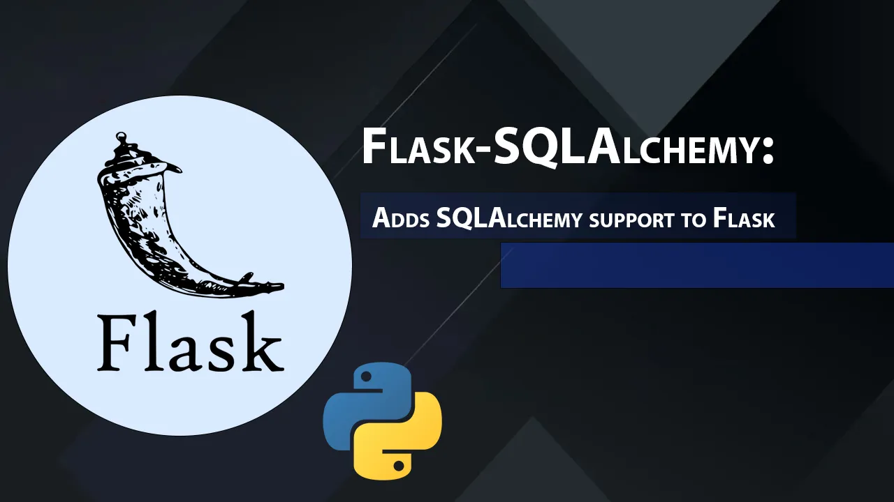

```
BriefIntroduction: 
flask-sqlalchemy 基础知识
```

<!-- split -->



# Before we beginning

最好可以先看完 [SQLAlchemy Basic](../SQLAlchemy/Basic.md) 然后再来看这部分

# Flask-SQLAlchemy Basic

for flask-sqlalchemy 3.x and sqlalchemy 2.x

# Initialize

```python
from flask import Flask
from flask_sqlalchemy import SQLAlchemy
from sqlalchemy.orm import DeclarativeBase

class Base(DeclarativeBase):
  pass

db = SQLAlchemy(model_class=Base)
```

## 初始化代码详解

### `flask` VS `Flask`

`flask` (小写) 是Python包的名称，这是一个模块/包的标准命名方式

`Flask` (大写) 是类名，在Python中类名通常使用大写字母开头（PascalCase命名法）

这是Python的常见命名规范，不是混淆：
- 包名/模块名用小写（如：flask, os, sys）
- 类名用大写开头（如：Flask, String, Dict）

### `SQLAlchemy` in the flask_sqlalchemy

`SQLAlchemy` 这个类是一个集成类，它的主要作用是：

作为Flask和SQLAlchemy之间的桥梁，提供了一个统一的接口来管理：

数据库连接，会话管理，模型定义，查询构建

## `db = SQLAlchemy(model_class=Base)`

### SQLAlchemy 原生用法
在原生 SQLAlchemy 中，我们是这样定义模型的：
```python
# 1. 定义基类
class Base(DeclarativeBase):
    pass

# 2. 定义模型类
class User(Base):
    __tablename__ = 'users'  # 必须指定表名
    id: Mapped[int] = mapped_column(primary_key=True)
    username: Mapped[str] = mapped_column(unique=True)
    email: Mapped[str]
```

### Flask-SQLAlchemy 用法
在 Flask-SQLAlchemy 中：
```python
# 1. 创建基类和db实例
class Base(DeclarativeBase):
    pass
db = SQLAlchemy(model_class=Base)

# 2. 定义模型类
class User(db.Model):  # 使用 db.Model 而不是 Base
    # 不需要 __tablename__，会自动生成
    id: Mapped[int] = mapped_column(primary_key=True)
    username: Mapped[str] = mapped_column(unique=True)
    email: Mapped[str]
```

### 关键点解释

**db = SQLAlchemy(model_class=Base) 做了什么？**

```python
# Flask-SQLAlchemy 内部大致实现（简化版）
class SQLAlchemy:
    def __init__(self, model_class=None):
        # 将传入的 Base 类扩展，添加 Flask-SQLAlchemy 特定的功能
        self.Model = self.make_declarative_base(model_class)
        
    def make_declarative_base(self, model_class):
        # 如果没有提供 model_class，创建一个新的
        if model_class is None:
            model_class = DeclarativeBase
        
        # 添加 Flask-SQLAlchemy 特定的功能
        class Model(model_class):
            # 自动生成表名的功能
            @declared_attr
            def __tablename__(cls):
                return cls.__name__.lower()
            
            # 添加查询助手
            query = QueryProperty()
            
            # 添加其他 Flask-SQLAlchemy 特定的功能...
        
        return Model
```

**为什么使用 db.Model？**

- `db.Model` 是经过 Flask-SQLAlchemy 增强的基类
- 它继承了原始的 `Base` 类，但添加了额外的功能：
  - 自动生成表名（不需要 `__tablename__`）
  - 集成了 Flask 的上下文管理
  - 提供了更便捷的查询接口
  - 添加了会话管理功能

**Flask-SQLAlchemy 和 SQLAlchemy 的关系**

```
Flask-SQLAlchemy
     │
     ├── 提供 Flask 集成
     ├── 自动管理数据库连接
     ├── 处理应用上下文
     └── 简化配置和使用
         │
         ▼
   SQLAlchemy (核心)
     │
     ├── 数据库抽象层
     ├── SQL 查询构建
     └── ORM 功能
```

# Define and Create Table

## Define TABLE

```python
class Base(DeclarativeBase):
    pass

db = SQLAlchemy(model_class=Base)

# 文章元数据
class Article_Meta_Data(db.Model):
    # 指定数据模型在数据库中的表名称 如果未指定那么为类名称的小写
    __tablename__ = 'article_meta_date'
    # 主键 但是无需为其赋值 SQLite数据库会自动为其生成一个唯一的值
    id: Mapped[int] = mapped_column(Integer, primary_key=True)

    # 文章标题 最长不超过100个字 默认nullable=False
    title: Mapped[str] = mapped_column(String(100))

    # 文章发布时间
    rollout_date: Mapped[date] = mapped_column(Date)

    # 表示文章最后更新的日期 只精确到年月日
    ultimate_modified_date: Mapped[date] = mapped_column(Date)

    # 文章作者 最长不超过50个字符
    author: Mapped[str] = mapped_column(String(50))

    # 文章指导者 存在Optional 默认nullable=True
    instructor: Mapped[Optional[str]] = mapped_column(String(100), nullable=True)

    # 文章内容简介
    brief_introduction: Mapped[str] = mapped_column(Text)

    # 文章封面链接
    cover_image_url: Mapped[str] = mapped_column(String(100))

    # 文章分类
    category: Mapped[str] = mapped_column(String(100))
    
    # 文章分类 使用 mptt 待开发和测试
    # category_id = db.Column(db.Integer, db.ForeignKey('category.id'), nullable=False)
    # category = db.relationship('Category')

    def __repr__(self):
        return f'<Article {self.title}>'
```

由于SQLAlchemy 和 Flask-SQLAlchemy 的工作机制：

1. 当你的模型类继承自 `db.Model` 时，这个模型会自动注册到 SQLAlchemy 的元数据（metadata）中。
2. 当你调用 `db.create_all()` 时，SQLAlchemy 会检查所有已注册的模型类来创建表。

但是！这里有一个重要的前提：**你的模型类必须在调用 `db.create_all()` 之前被 Python 解释器导入和执行**。


## Create Table

```python
with app.app_context():
    db.create_all()
```

这段代码会：

- 创建不存在的表
- 不会修改已存在的表
- 不会删除已存在的表
- 不会覆盖现有数据

### `db.create_all()`

让我们看看 `create_all()` 的工作原理：

```python
# 简化版的内部实现逻辑
def create_all(self):
    # 1. 获取所有表的元数据
    for table in self.metadata.sorted_tables:
        # 2. 检查表是否存在
        if not table.exists():
            # 3. 如果表不存在，创建表
            table.create()
```

常见场景示例

```python
# 初始模型
class User(db.Model):
    id: Mapped[int] = mapped_column(primary_key=True)
    username: Mapped[str]

# 执行 db.create_all() -> 创建表

# 后来修改模型，添加新字段
class User(db.Model):
    id: Mapped[int] = mapped_column(primary_key=True)
    username: Mapped[str]
    email: Mapped[str]  # 新增字段

# 再次执行 db.create_all() -> 不会添加新字段！
```

> note
>
> `db.create_all()` 会根据 `app.config['SQLALCHEMY_DATABASE_URI']` 自动创建数据库文件

### 如何处理表结构更新？

**删除重建**（开发环境）：

```python
with app.app_context():
    db.drop_all()   # 删除所有表
    db.create_all() # 重新创建
```

**使用数据库迁移**（推荐，生产环境）：

```python
# 使用 Flask-Migrate
from flask_migrate import Migrate
migrate = Migrate(app, db)

# 初始化迁移
$ flask db init

# 创建迁移脚本
$ flask db migrate -m "Add email column"

# 应用迁移
$ flask db upgrade
```


## `app.app_context()`

### Application instance and its context

首先，我们需要理解，每个 `Flask` 对象都代表一个独立的应用实例。当你创建一个 Flask 应用时，你实际上是在创建这个应用的实例：

```python
app = Flask(__name__)
```

这个 `app` 对象就是一个特定的应用实例。而`app.app_context()` 创建了一个应用上下文（Application Context）这是一个独立的执行环境，其中的操作都与特定的应用实例相关联。

Flask 使用 `_app_ctx_stack` 来跟踪当前活动的应用上下文。当你使用 `with app.app_context():` 时：

该应用的上下文被推送到 `_app_ctx_stack`。

在 `with` 块内，`current_app` 代理对象指向栈顶的应用上下文。退出 `with` 块时，上下文被弹出。

```python
with app.app_context():
    # 这个应用的上下文被推送到栈顶
    ...
# 退出 with 块时，上下文被弹出
```

在多应用场景中，每个应用都有自己的上下文。例如：

```python
app1 = Flask('app1')
app2 = Flask('app2')

with app1.app_context():
    # 这里的操作属于 app1
    ...

with app2.app_context():
    # 这里的操作属于 app2
    ...
```

让我们看一个完整的例子来理解这个过程：

```python
from flask import Flask, current_app

app1 = Flask('app1')
app2 = Flask('app2')

@app1.route('/')
def index1():
    return f"This is {current_app.name}"

@app2.route('/')
def index2():
    return f"This is {current_app.name}"

# 在脚本中使用
with app1.app_context():
    print(current_app.name)  # 输出: app1
    
with app2.app_context():
    print(current_app.name)  # 输出: app2

# 嵌套使用
with app1.app_context():
    print(current_app.name)  # 输出: app1
    with app2.app_context():
        print(current_app.name)  # 输出: app2
    print(current_app.name)  # 输出: app1
```

> note:
>
> 在 CLI 命令中：如果使用 `@app.cli.command()` 装饰器，Flask 也会自动提供上下文。
>
> 在测试中可以使用 `app.test_request_context()` 来模拟请求上下文。

### 为什么 db.create_all() 需要应用上下文？

`db.create_all()` 需要应用上下文的原因有几个：

1. **数据库配置**：数据库连接信息通常存储在应用配置中（如 `app.config['SQLALCHEMY_DATABASE_URI']`）。

2. **多应用支持**：如果你的项目有多个 Flask 应用，每个使用不同的数据库，上下文确保使用正确的配置。

3. **延迟初始化**：Flask-SQLAlchemy 使用延迟初始化模式，某些设置只有在应用上下文中才能完成。

### 视图函数的自动处理

在处理 Web 请求时，Flask 会自动为每个请求创建和管理应用上下文，所以在视图函数中不需要显式使用 `with app.app_context()`。

```python
@app.route('/')
def index():
    # 这里已经在应用上下文中了
    return f"Current app: {current_app.name}"
```

# CUDR

Flask-SQLAlchemy CUDR与sqlalchemy ORM CUDR非常相似.

## Insert

实例化Table class –> add –> commit

```python
# part code of import_articles_scripts
article = Article_Meta_Data(
            title=metadata.get('Title', 'Untitled'),
            author=metadata.get('Author', 'Unknown'),
            instructor=metadata.get('Instructor'),
            cover_image_url=metadata.get('CoverImage'),
            rollout_date=metadata.get('RolloutDate'),
            ultimate_modified_date=metadata.get('UltimateModifiedDate'),
            category=metadata.get('Category', 'Uncategorized'),
            brief_introduction=brief_intro_text
        )
db.session.add(article_metadata)
db.session.commit()
```

## Query

query语句`stmt`需要放到`db.session.execute()`中执行，只需 `select` 前面加上 `db.` 即可，因为 `db.select` 本质就是`sqlalchemy.select`

例如，一个复杂的查询可能看起来像这样：

```python
result = db.session.execute(
    db.select(User, Address)
    .join(Address)
    .where(User.name == "plain")
    .order_by(User.id)
)
```

### `db.select` 本质探索

从 [flask-sqlalchemy extension.py](https://github.com/pallets-eco/flask-sqlalchemy/blob/3e3e92ba557649ab5251eda860a67656cc8c10af/src/flask_sqlalchemy/extension.py) 源码中我们可以看到，SQLAlchemy 类并没有直接定义 select 方法，而是通过 `__getattr__` 魔术方法来处理未定义的属性访问。这个机制非常巧妙，让我们看看具体是如何工作的：

```python
import typing as t
import sqlalchemy as sa
import sqlalchmey.event as sa.event
import sqlalchemy.orm as sa.orm

class SQLALchemy:

    # ... igonre before code

    
    def __getattr__(self, name: str) -> t.Any:
    if name == "relation":
        return self._relation

    if name == "event":
        return sa_event

    if name.startswith("_"):
        raise AttributeError(name)

    # 关键在这里
    for mod in (sa, sa_orm):
        if hasattr(mod, name):
            return getattr(mod, name)

    raise AttributeError(name)
```

这段代码的工作流程是：

1. 当我们访问 `db.select` 时，Python 首先会查找 SQLAlchemy 类中是否有这个属性
2. 如果没有找到，就会调用 `__getattr__` 方法
3. 在 `__getattr__` 中，它会依次在 `sa` (SQLAlchemy) 和 `sa_orm` (SQLAlchemy ORM) 模块中查找这个属性
4. 由于 `select` 函数存在于 `sqlalchemy` 模块中，所以 `hasattr(sa, 'select')` 返回 True
5. 然后通过 `getattr(sa, 'select')` 返回原始的 SQLAlchemy select 函数

这就解释了为什么：

1. `db.select` 实际上就是 `sqlalchemy.select`
2. 在源码中找不到 select 的直接定义
3. `type(db.select())` 显示 `<class 'sqlalchemy.sql.selectable.Select'>` 即为SQLAlchemy 的 Select 对象

这种设计模式被称为代理模式（Proxy Pattern），Flask-SQLAlchemy 通过这种方式把 SQLAlchemy 的大部分功能都代理到了 `db` 对象上，使得我们可以直接通过 `db` 对象访问 SQLAlchemy 的功能。

### `sqlalchemy.select` VS `db.select`

既然我们考虑到实际上`db.select`就是`sqlalchemy.select`，那么直接使用`sqlalchemy.select`是否会因为节省了加载 `__getattr__()` 更快呢？

实际上这两种写法在执行速度上是完全一样的，没有任何性能差异

```python
# 方式1
from sqlalchemy import select
select(User)  # 直接调用sqlalchemy.select

# 方式2
db.select(User)  # 通过__getattr__获取后调用sqlalchemy.select
```

虽然 `db.select` 需要通过 `__getattr__` 魔术方法来获取函数，但这个过程：

- 只发生在第一次访问 `db.select` 时
- 后续访问会直接使用已经缓存的属性
- 这个额外开销在实际查询执行时间中可以忽略不计

但是还是推荐使用 `db.select` 因为：

- 所有数据库相关的操作都通过 `db` 对象进行，如果将来 Flask-SQLAlchemy 需要对 select 做扩展或修改，你的代码不需要改变

- 从软件工程的角度来看，使用 `db.select` 是更好的实践。这符合依赖注入和关注点分离的原则，也使得代码更容易维护和测试。

## Delete & Update

首先使用query语句筛选出特定的条目，例如

```python
article = db.session.execute(
    db.select(Article_Meta_Data)
    .where(Article_Meta_Data.title == "test-article")
)
```

### Delete

```python
db.session.delete(article)
db.session.commit()
```

### Update

```python
article.author = Plain
db.session.commit()
```

# Reference

[Flask-SQLAlchemy — Flask-SQLAlchemy Documentation (3.1.x)](https://flask-sqlalchemy.palletsprojects.com/en/latest/)
