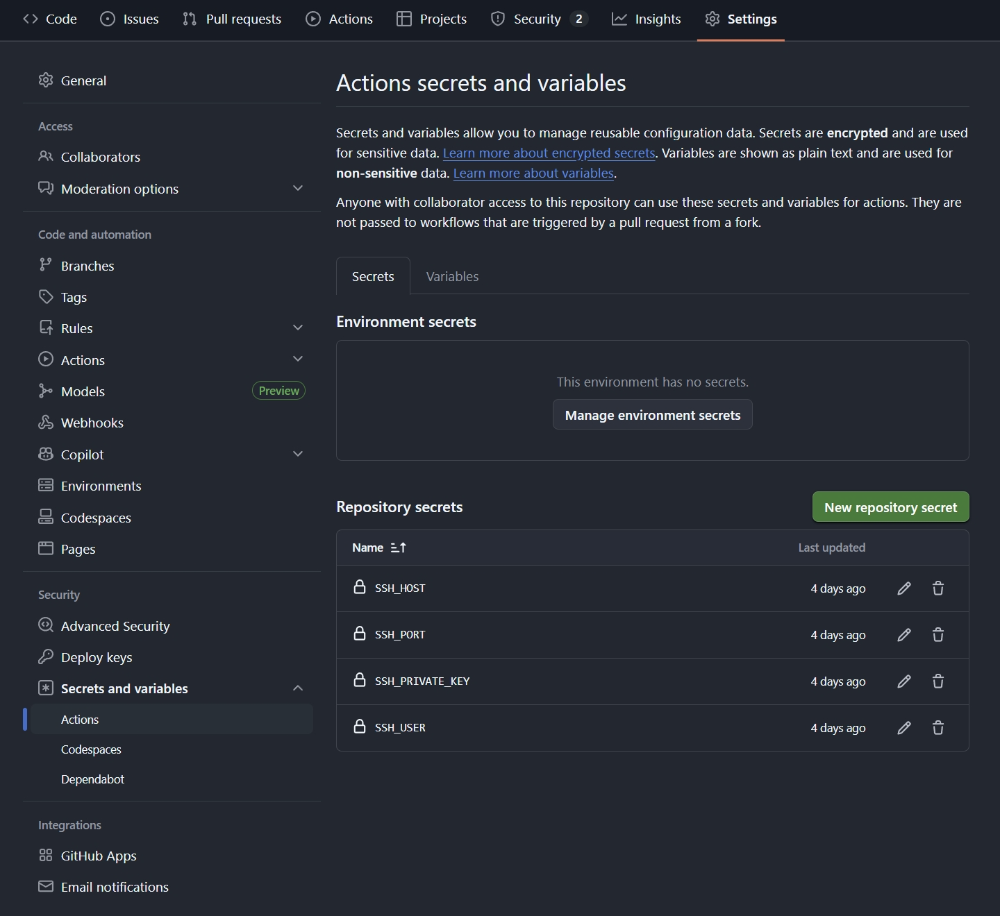

cd.yml example

```
name: CD

on:
  workflow_run:
    workflows: ["CI"] # 监控名为 "CI" 的工作流
    types: [completed] # 当它运行结束时
    branches: [main] # 且必须是在 main 分支上结束

jobs:
  deploy:
    # ci 成功之后才部署
    if: ${{ github.event.workflow_run.conclusion == 'success' }}
    runs-on: ubuntu-latest
    steps:
      - name: Pull latest images over SSH (no restart)
        uses: appleboy/ssh-action@v1.2.0
        with:
          host: ${{ secrets.SSH_HOST }}
          username: ${{ secrets.SSH_USER }}
          port: ${{ secrets.SSH_PORT }}
          key: ${{ secrets.SSH_PRIVATE_KEY }}
          script: |
            set -e
            cd /home/plain/projects/website
            git fetch --all --prune
            git checkout main
            git pull --ff-only origin main
            # GHCR images are expected to be public.
            # Only pull latest images; do not recreate/restart containers in this workflow.
            docker compose pull web-app articles-sync
            docker images | head -n 20
```

核心逻辑：“当 CI 成功把镜像造出来后，GitHub 远程登录到你的服务器，把新代码拉下来，并把最新的镜像提前下载好。”

### 1. 触发机制 (Workflow Chaining)

```yaml
on:
  workflow_run:
    workflows: ["CI"]     # 目标：名为 "CI" 的工作流
    types: [completed]    # 状态：运行结束时
    branches: [main]      # 分支：仅限 main 分支
```

这是一种流水线联动。它不像 CI 那样监听 Git 代码变动，而是**监听 CI 的结果**。只有当 `main` 分支的 CI 跑完后，这个部署流程才会排队启动。

### 2. 部署门槛

```yaml
if: ${{ github.event.workflow_run.conclusion == 'success' }}
```

这是一道安全保险：如果 CI 失败了（比如代码报错或镜像构建失败），部署流程会自动取消，防止把有问题的版本拉取到生产服务器。

### 3. SSH 远程操作

它使用了著名的 `appleboy/ssh-action`。这相当于在 GitHub 的虚拟服务器上打开了一个终端，然后通过 SSH 连到了你的私有服务器。

Secrets 保护：`${{ secrets.SSH_HOST }}` 等变量说明你需要在 GitHub 仓库的 `Settings -> Secrets and variables -> Actions` 中手动添加。



