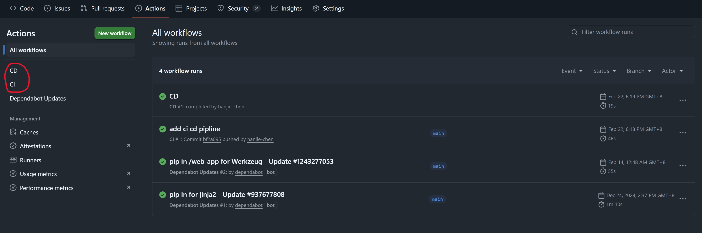
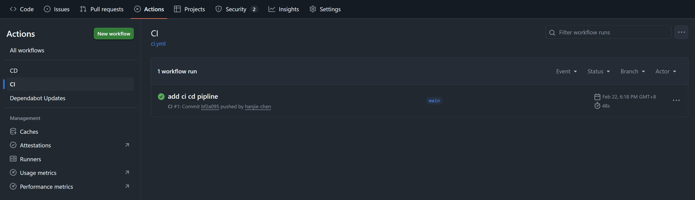
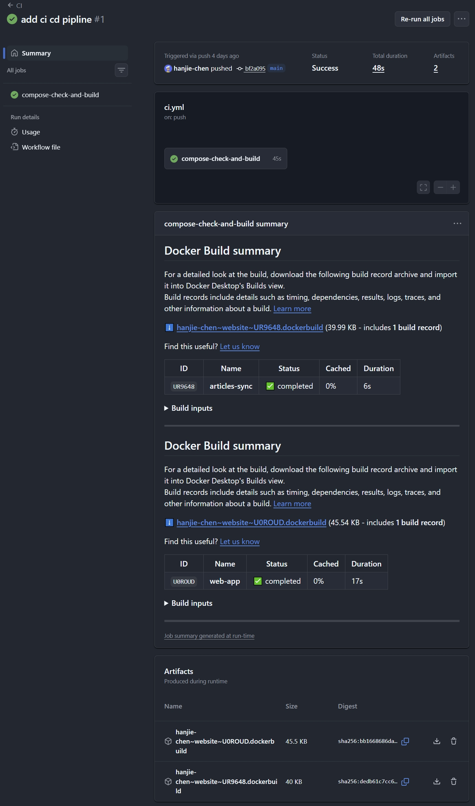
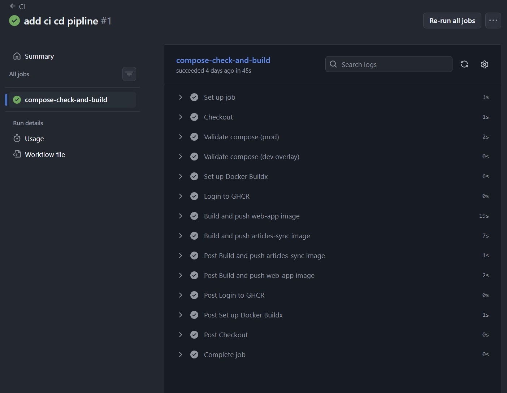

# Github Action

简单来说，GitHub Actions 是 GitHub 提供的一台免费的、云端的 Linux 电脑，平时关机。

我们可以通过在项目根目录中 `.github/workflows/` 下的 `.yml` 文件，给这台电脑下达指令：当某个事件发生时（比如 Push 了代码），请立刻开机，执行相关命令。

可以把 GitHub Actions 理解为一套“自动化流程”：

- Workflow (工作流)： 整个 `.yml` 文件。代表一个完整的自动化任务。
- Event (事件/触发器)： “什么时候开始跑？”。比如 `push` 代码、有人提了 `PR`、或者你设定了定时任务。
- Job (作业)： 这一台“云电脑”要做的事。一个 Workflow 可以有好几个 Job（比如一个负责测试，一个负责部署）。
- Step (步骤)： 在这台电脑上具体敲的命令。比如 `ls`, `docker build`, `npm install`。

GitHub Actions 的强大之处在于：

1. env： 它这台“云电脑”里已经预装好了 `git`, `docker`, `python`, `node` 等几乎所有你需要的环境。

2. Actions Marketplace：别人写好的功能你可以直接拿来用。

3. free： 对于 Public Repo，完全免费。


# CI

example:
```yaml
name: CI

on:
  push:
    branches:
      - "**" # 任何分支有 push 都会触发
  pull_request:
    branches:
      - main # 或者针对 main 分支的pull request 也会触发

# GHCR push 需要 packages: write。
# 说明：这里使用 GitHub 自动注入的 GITHUB_TOKEN，不需要手动创建 token。
permissions:
  contents: read
  packages: write

jobs:
  compose-check-and-build:
    runs-on: ubuntu-latest # 使用最近的 ubuntu image
    steps:
      # 拉取代码
      - name: Checkout
        uses: actions/checkout@v4
      # 检查 compose.yml 语法
      - name: Validate compose (prod)
        run: docker compose -f compose.yml config

      - name: Validate compose (dev overlay)
        run: docker compose -f compose.yml -f compose.dev.yml config

      # GHCR（ghcr.io）集成：
      # - 仅在 push 事件执行（PR 只做检查，不推镜像）
      # - 镜像命名：ghcr.io/<owner>/<repo>-<service>:<tag>
      - name: Set up Docker Buildx
        if: github.event_name == 'push'
        uses: docker/setup-buildx-action@v3

      - name: Login to GHCR
        if: github.event_name == 'push'
        uses: docker/login-action@v3
        with:
          registry: ghcr.io
          username: ${{ github.actor }}
          password: ${{ secrets.GITHUB_TOKEN }}

      - name: Build and push web-app image
        if: github.event_name == 'push'
        uses: docker/build-push-action@v6
        with:
          context: ./web-app
          push: true
          tags: |
            ghcr.io/${{ github.repository_owner }}/website-web-app:${{ github.sha }}
            ghcr.io/${{ github.repository_owner }}/website-web-app:latest

      - name: Build and push articles-sync image
        if: github.event_name == 'push'
        uses: docker/build-push-action@v6
        with:
          context: ./articles-sync
          push: true
          tags: |
            ghcr.io/${{ github.repository_owner }}/website-articles-sync:${{ github.sha }}
            ghcr.io/${{ github.repository_owner }}/website-articles-sync:latest

```


## `name` 字段

`name` 是给人类看的显示名称。

在 GitHub 界面上： 当你打开项目的 Actions 标签页，左侧列出的任务列表名称就是由这个 `name` 决定的。如果不写，GitHub 默认会用文件名。



在别的地方，可以通过使用 `workflows: ["CI"]` （这里的 `"CI"` 对应的是那个文件里的 `name: CI`）的方式，给其他地方调用，就像是给程序起个名字。

## Action 指令：`run` vs `uses`

在 GitHub Actions 中，命令有两种执行方式：

1. `run`: 执行原始的 Shell 命令（就像你在 Linux 终端敲代码一样）。
2. `uses`: 调用一个现成的、封装好的“脚本组件”（官方称为 Action）。
   - 语法：`{author}/{project-name}@{version}`
   - 常用模块：`actions/checkout@v4`（作用：把代码拉取到当前虚拟机工作目录，通常是所有 Pipeline 的第一步）。

`actions/checkout@v4` 其实是一个由 GitHub 官方维护的开源项目（地址就在 `github.com/actions/checkout`）。它内部帮你写好了极其复杂的逻辑：

- 初始化 Git 环境。
- 配置身份验证（Token）。
- 执行 `git clone`。
- 切换到正确的 Git 分支或 Commit。

你当然可以自己写 `run: git clone https://github.com/...`，但你会面临以下麻烦：

- 权限问题： 你的私有仓库需要配置 SSH Key 或 Token 才能克隆，自己写很麻烦。
- 版本问题： 你需要手动判断当前触发 CI 的是哪个分支、哪个提交点。
- 性能问题： 官方的 `checkout` 经过了极致优化（比如支持浅克隆 `--depth`，只拉取最后一层提交以节省时间）。

所以，`uses: actions/checkout@v4` 就像是 DevOps 界的“一键启动脚本”。

- **`run: docker build`**：就像是**自己做饭**。你很清楚每一道工序（切菜、开火、翻炒），对应 Linux 里的每一个原生指令。
- **`uses: actions/checkout@v4`**：就像是**点外卖**。你不需要知道外卖员是怎么骑车来的、厨师是怎么洗菜的，你只需要下达订单（`uses`），代码（饭菜）就会准时出现在你的 Ubuntu 虚拟机（餐桌）上。

## 运行记录

在 github Repo 的 Actions 界面可以看到运行记录



以 CI 为例，我们可以看到，它是由 `main` 分支上的 commit `bf2a095` 触发。之所以显示 `add ci cd pipline` 因为这是 commit message

当我们点击进入可以看到这个 Workflow 运行详情。



### 1. 顶部状态栏：概览信息

- Triggered via push: 因为推送了代码到 `main` 分支触发。
- Status: Success: 整个流顺利完成。
- Total duration: 从开始拉取代码到镜像推送到云端，一共只花了 48 秒。
- Artifacts: 代表产生了两个构建产物（即两个 Docker 镜像构建日志文件）。

### 2. 中间部分：Docker Build Summary（核心看板）

因为在 `ci.yml` 中使用了 `docker/build-push-action`，它会自动在 GitHub 界面上生成这种可视化的表格。

这两个表格分别对应两个服务：

- articles-sync: 耗时 6 秒。
- web-app: 耗时 17 秒。

### 3. 底部：Artifacts (构建附件)

这里的两个文件（`.dockerbuild` 结尾）是构建报告。

它们不是镜像本身（镜像已经去 GHCR 了），而是本次构建的详细过程记录。

## action 执行日志

点击左侧那个带绿勾的 `compose-check-and-build` 就能看到 action 的执行日志



每一个带勾的选项，都对应 `ci.yml` 文件中的一个 `step`。

流程拆解：

- Set up job: GitHub 正在为你分配一台虚拟服务器（Ubuntu），并安装必要的插件。
- Checkout: 把你的代码从仓库下载到这台服务器上。
- Validate compose (prod/dev overlay): 对应你配置的 `docker compose config` 检查。
- Set up Docker Buildx: 准备高性能的 Docker 构建环境（支持缓存、多架构等高级功能）。
- Login to GHCR: 使用临时生成的 `GITHUB_TOKEN` 登录 GitHub 镜像仓库。
- Build and push ... image:
  - 这是最耗时的步骤（截图中显示 `web-app` 花了 19s）。
  - 它正在执行 `docker build` 并将成品发送到 `ghcr.io`。
- Post ... (收尾工作): GitHub 会自动清理临时生成的 Token 和缓存文件，确保服务器环境在任务结束后是干净的。

如果你代码写错了，其中某一行会变红。点击那个红色的箭头，它会展开详细的错误堆栈信息。


