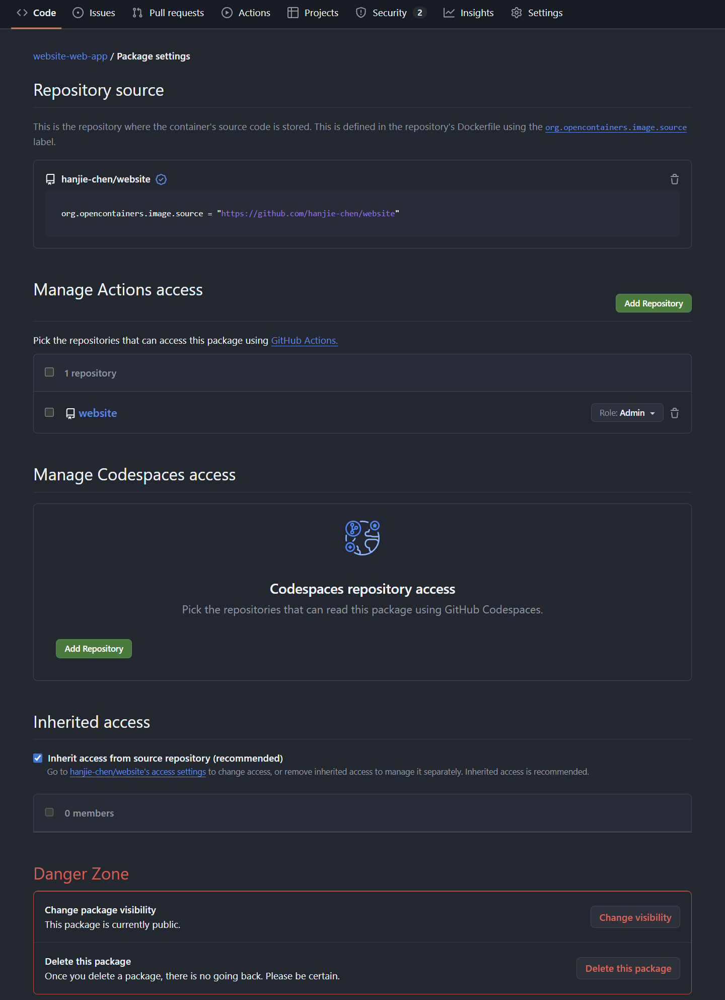

# publish-image

在 CI/CD yml 文件中如果声明了如下的 write 权限

```yaml
permissions:
  packages: write
```

那么GitHub Actions 在运行过程中会生成一个临时的 `GITHUB_TOKEN`。这个 Token 默认就拥有向当前仓库所属的账户/组织写入 Package 的权力。

如果在 tags 中设定如下

```yaml
- name: Build and push web-app image
        if: github.event_name == 'push'
        uses: docker/build-push-action@v6
        with:
          context: ./web-app
          push: true
          tags: |
            ghcr.io/${{ github.repository_owner }}/website-web-app:${{ github.sha }}
            ghcr.io/${{ github.repository_owner }}/website-web-app:latest
```

**`${{ github.repository_owner }}`**: 这个变量会自动解析为你的用户名。

ghcr.io: 只要前缀是这个，GitHub 就会知道你要把东西存到它的 Container Registry。

GitHub 并不是盲目地把镜像塞进你的仓库，它有三层逻辑来确保关联正确：

第一层：Action 上下文关联：镜像在 `hanjie-chen/website` 这个仓库里的 Actions 任务中构建并推出的。GitHub 会记录这个镜像的“出身”。即使镜像起名叫 `apple`，它也会初步认为这和 `website` 仓库有关。

第二层：命名匹配：在 `ci.yml` 里写的镜像名是 `website-web-app`。因为它以仓库名 `website` 开头，GitHub 的算法会自动匹配到一起。

第三层：标签溯源，`docker/build-push-action@v6` 会自动注入 `image.source`。

如果点击右侧的 Packages 里的镜像进入详情页，在 Package settings 中，你会看到如下所示



### Repository source

这里显示了这个镜像对应的源代码仓库。

```yaml
org.opencontainers.image.source = "https://github.com/hanjie-chen/website"
```

这是 Docker 镜像的一种元数据（Labels）。虽然没在 `ci.yml` 里显式写这一行，但 `docker/build-push-action@v6` 非常智能，它会自动检测到自己在 GitHub Action 里运行，并自动给镜像打上这个“溯源标签”。

### Manage Actions access (CI/CD 访问权)

这里显示 `website` 仓库拥有 `Role: Admin`。

这意味着 `website` 仓库里的任意 Action 脚本都有权更新、覆盖或删除这个镜像。

### Inherit access from source repository

它默认继承了仓库的访问权限（仓库是 Public，镜像就是 Public）。

### Danger Zone (危险区)

Change visibility：如果你想让代码开源，但镜像只给自己用，可以在这里单独把镜像改成 `Private`。

Delete this package：彻底删除。注意，删除后 CI 流程下次运行会重新创建一个。