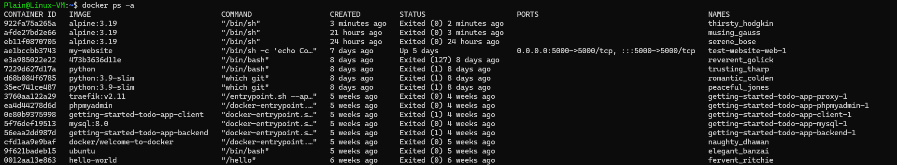

# run image

我们可以使用 `docker run` 命令来将一个 image 启动为一个 container

```shell
docker run -i -t ubuntu /bin/sh
```

运行这个命令后，会进入到一个 Ubuntu 容器的命令行界面，可以像使用普通的 Ubuntu 系统一样，在容器内执行各种 Linux 命令，要退出容器，输入 `exit` 命令即可

当我们使用 exit 退出 container 之后，容器会停止运行，但是实际上这个 contianer 依然存在，在容器中做的所有更改都还保留在这个已停止的容器中

当我们使用 `docker ps` 命令的时候，仅仅会显示正在运行的container


而当我们使用 `docker ps -a` 命令查看所有正在运行的和关闭的container 



只有使用 `docker rm` 命令才会真正删除 container

```shell
# 使用容器ID删除
docker rm 922fa75a265a

# 或使用容器名称删除
docker rm thirsty_hodgkin

# 删除所有已停止的容器
docker container prune

# 强制删除容器（包括正在运行的容器）
docker rm -f 容器ID/名称
```


如果想要重新启动之前停止的 container，可以使用 `docker start` 命令

```shell
# 使用容器ID启动
docker start 922fa75a265a

# 或使用容器名称启动
docker start thirsty_hodgkin
```

> [!note]
>
> 关于 Docker 自动命名
>
> 虽然我们没有手动指定 container 的名字，但是在 `docker ps` 命令中可以看到每一个 container 都有 NAMES
>
> 这是docker的自动命名机制，Docker会自动为容器生成一个名称，这个自动生成的名称由两部分组成：
>
> 1. 一个形容词（adjective）
> 2. 一个著名科学家/黑客的姓氏（surname）
>
> e.g.
> - `thirsty_hodgkin`（渴望的_霍奇金）
> - `musing_gauss`（沉思的_高斯）
> - `serene_bose`（平静的_玻色）
>
> 如果想要指定容器名称，可以使用 `--name` 参数
>
> ```bash
> docker run --name my-alpine -it alpine:3.19 /bin/sh
> ```
>


如果想要从已经存在的 images 中运行一个指定的 image, 比如要运行 Python 3.9-slim 镜像，我们可以这么做

首先使用 `docker images` 查看所有的 image

```bash
Plain@Linux-VM:~$ docker images
REPOSITORY                         TAG        IMAGE ID       CREATED         SIZE
my-website                         latest     3de94fb68dd9   11 days ago     960MB
<none>                             <none>     d13e3db30839   12 days ago     975MB
<none>                             <none>     47b85b6b64fe   13 days ago     975MB
<none>                             <none>     337b7d9e28aa   13 days ago     975MB
<none>                             <none>     233b14a3e3d7   13 days ago     975MB
python                             3.9-slim   473b3636d11e   13 days ago     125MB
python                             latest     3ca4060004b1   13 days ago     1.02GB
<none>                             <none>     f4d246af4e89   2 weeks ago     182MB
getting-started-todo-app-client    latest     7a126d24d539   3 weeks ago     1.19GB
<none>                             <none>     a17cd65912e7   4 weeks ago     1.19GB
getting-started-todo-app-backend   latest     58ff7bba8548   4 weeks ago     1.17GB
traefik                            v2.11      8ea66c686b7b   7 weeks ago     173MB
mysql                              8.0        9f4b39935f20   2 months ago    590MB
ubuntu                             latest     59ab366372d5   2 months ago    78.1MB
docker/welcome-to-docker           latest     c1f619b6477e   13 months ago   18.5MB
phpmyadmin                         latest     e5b700ec0014   17 months ago   559MB
hello-world                        latest     d2c94e258dcb   19 months ago   13.3kB
```

这里我们可以看到 REPOSITORY, TAG, IMAGE ID 这三个关键的鉴别信息，所以我们有2种方式来指定某个images

1. 使用仓库名+标签（推荐的方式）：`docker run <REPOSITORY:TAG>` e.g. `docker run python:3.9-slim`
2. 使用镜像 ID（最精确的方式）：`docker run <IMAGE ID>` e.g. `docker run 473b3636d11e `

一般来说我们使用第一种 `REPOSITORY:TAG` 的方式，因为这样更加清晰明了，而且镜像 ID 可能会随着镜像更新而改变。标签则会保持稳定，更容易维护和理解。

 

# interact running container

如果我们已经存在一个 container 正在运行，而我们想要进入正在运行的 Docker 容器的 bash 则可以使用如下命令

``` bash
docker exec -it <container_id/container_name> /bin/sh
```
- `-i`: 保持 STDIN 开放
- `-t`: 分配一个伪终端
- `bash`: 要执行的命令（在这里是打开 bash shell）
