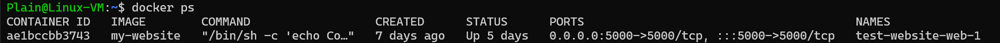

# docker command

我们可以使用 `docker run` 命令来将一个 image 启动为一个 container

例如 `docker run -i -t ubuntu /bin/sh` 命令

这个命令是用来启动一个 Ubuntu 容器的，让我们逐个部分来分析：

`-i`（interactive）：

- 保持标准输入（STDIN）开启
- 允许你与容器进行交互，如果不加这个参数，你将无法向容器输入命令

`-t`（terminal）：

- 分配一个伪终端（pseudo-TTY）
- 提供一个交互式的终端界面，让你可以像使用普通的命令行终端一样使用容器

`ubuntu`：

- 这是要使用的 Docker 镜像的名称
- 如果本地没有这个镜像，Docker 会从 Docker Hub 自动下载最新版本

`/bin/bash`：

- 这是容器启动后要执行的命令
- 这将在容器内启动一个 bash shell，让你可以在容器内执行命令

运行这个命令后，会进入到一个 Ubuntu 容器的命令行界面，可以像使用普通的 Ubuntu 系统一样，在容器内执行各种 Linux 命令，要退出容器，输入 `exit` 命令即可

当我们使用 exit 退出 container 之后，容器会停止运行，但是实际上这个 contianer 依然存在，在容器中做的所有更改都还保留在这个已停止的容器中

当我们使用 `docker ps` 命令的时候，仅仅会显示正在运行的container



而当我们使用 `docker ps -a` 命令查看所有正在运行的和关闭的container 


只有使用 `docker rm` 命令才会真正删除 container

```shell
# 使用容器ID删除
docker rm 922fa75a265a

# 或使用容器名称删除
docker rm thirsty_hodgkin

# 删除所有已停止的容器
docker container prune

# 强制删除容器（包括正在运行的容器）
docker rm -f 容器ID/名称
```


如果想要重新启动之前停止的 container，可以使用 `docker start` 命令

```shell
# 使用容器ID启动
docker start 922fa75a265a

# 或使用容器名称启动
docker start thirsty_hodgkin
```

> [!note]
>
> 关于 Docker 自动命名
>
> 虽然我们没有手动指定 container 的名字，但是在 `docker ps` 命令中可以看到每一个 container 都有 NAMES
>
> 这是docker的自动命名机制，Docker会自动为容器生成一个名称，这个自动生成的名称由两部分组成：
>
> 1. 一个形容词（adjective）
> 2. 一个著名科学家/黑客的姓氏（surname）
>
> e.g.
> - `thirsty_hodgkin`（渴望的_霍奇金）
> - `musing_gauss`（沉思的_高斯）
> - `serene_bose`（平静的_玻色）
>
> 如果想要指定容器名称，可以使用 `--name` 参数
>
> ```bash
> docker run --name my-alpine -it alpine:3.19 /bin/sh
> ```
>


如果想要运行一个特定的 image, 比如要运行 Python 3.9-slim 镜像，我们可以这么做

首先使用 `docker images` 查看所有的 image

```bash
Plain@Linux-VM:~$ docker images
REPOSITORY                         TAG        IMAGE ID       CREATED         SIZE
my-website                         latest     3de94fb68dd9   11 days ago     960MB
<none>                             <none>     d13e3db30839   12 days ago     975MB
<none>                             <none>     47b85b6b64fe   13 days ago     975MB
<none>                             <none>     337b7d9e28aa   13 days ago     975MB
<none>                             <none>     233b14a3e3d7   13 days ago     975MB
python                             3.9-slim   473b3636d11e   13 days ago     125MB
python                             latest     3ca4060004b1   13 days ago     1.02GB
<none>                             <none>     f4d246af4e89   2 weeks ago     182MB
getting-started-todo-app-client    latest     7a126d24d539   3 weeks ago     1.19GB
<none>                             <none>     a17cd65912e7   4 weeks ago     1.19GB
getting-started-todo-app-backend   latest     58ff7bba8548   4 weeks ago     1.17GB
traefik                            v2.11      8ea66c686b7b   7 weeks ago     173MB
mysql                              8.0        9f4b39935f20   2 months ago    590MB
ubuntu                             latest     59ab366372d5   2 months ago    78.1MB
docker/welcome-to-docker           latest     c1f619b6477e   13 months ago   18.5MB
phpmyadmin                         latest     e5b700ec0014   17 months ago   559MB
hello-world                        latest     d2c94e258dcb   19 months ago   13.3kB
```

这里我们可以看到 REPOSITORY, TAG, IMAGE ID 这三个关键的鉴别信息，所以我们有2种方式来指定某个images

1. 使用仓库名+标签（推荐的方式）：`docker run <REPOSITORY:TAG>` e.g. `docker run python:3.9-slim`
2. 使用镜像 ID（最精确的方式）：`docker run <IMAGE ID>` e.g. `docker run 473b3636d11e `

一般来说我们使用第一种 `REPOSITORY:TAG` 的方式，因为这样更加清晰明了，而且镜像 ID 可能会随着镜像更新而改变。标签则会保持稳定，更容易维护和理解。

 

# `docker compose` command

`docker compose` 命令基于当前目录下的 compose.yaml 或者 docker-compose.yaml 文件来操作

**项目隔离**

- 每个使用 Docker Compose 的项目都是独立的
- 容器名称会自动加上项目名作为前缀
- 网络也是独立的，默认创建的网络名称为 `项目名_default`

例如：

**docker compose up -d**

- 只会启动当前 compose 文件中定义的服务
- `-d` 表示 detached 模式（后台运行）
- 会自动使用当前目录名作为项目名称前缀
- 如果服务之前没有构建过镜像，会自动构建

``` bash
# 只会启动 getting-started-todo-app 项目中定义的服务
sudo docker compose up -d
```

**docker compose down**

- 只会停止和删除当前 compose 文件中定义的服务的容器
- 同时也会删除默认网络
- 不会影响其他项目的容器

``` bash
# 只会关闭 getting-started-todo-app 项目的容器
sudo docker compose down
```

## `docker compose watch`

`docker compose watch` 是 Docker Compose 的一个重要功能，主要用于开发环境中实现实时更新。它的主要作用和特点如下：

**实时文件监控**

- 监视项目中的源代码文件变化
- 当检测到文件变更时，自动重新构建和更新相关的容器
- 无需手动重启容器或重新运行 compose 命令

**工作原理**

- 持续监控指定的目录和文件
- 当发现文件变化时，根据配置执行以下操作之一：
  - 同步文件变更到容器中
  - 重新构建容器
  - 重启受影响的服务

这个命令特别适合在开发环境中使用，它极大地提高了使用 Docker 进行开发时的效率。在文章中的 todo 应用例子里，正是这个命令让我们能够实时看到对前端样式、后端逻辑的修改效果，而不需要手动重启任何服务。

## `docker compose ps`

`docker ps` 和 `docker compose ps` 有以下几个主要区别：

**显示范围不同**：

- `docker ps`：显示所有正在运行的容器，无论它们是如何启动的（手动启动、Docker Compose 启动等）
- `docker compose ps`：只显示由当前目录下的 docker-compose.yml（或 compose.yml）文件创建的容器

**上下文不同**：

- `docker ps`：在全局 Docker 环境中工作
- `docker compose ps`：在特定的 Compose 项目上下文中工作，与当前目录的 compose 文件相关联

**输出格式不同**：

`docker ps` 默认显示：

- CONTAINER ID
- IMAGE
- COMMAND
- CREATED
- STATUS
- PORTS
- NAMES

`docker compose ps` 通常更关注于 Compose 服务，显示：

- NAME（使用 compose 项目名称作为前缀）
- COMMAND
- SERVICE
- STATUS
- PORTS

**使用场景**：

- `docker ps`：适合查看系统中所有运行的容器
- `docker compose ps`：适合在使用 Docker Compose 开发时查看特定项目的容器状态

例如，在你的项目中：

``` bash
# docker compose ps 只会显示 getting-started-todo-app 相关的容器
sudo docker compose ps

# docker ps 会显示系统中所有运行的容器
sudo docker ps
```

建议：

- 当你在特定项目目录下工作时，使用 `docker compose ps` 更清晰
- 当你需要查看系统整体容器状态时，使用 `docker ps`
- 如果你想看到所有容器（包括停止的），可以使用 `docker ps -a` 或 `docker compose ps -a`

# `docker build` command

**基本用法**

``` bash
docker build -t my-app: 1.0 .
# -t 指定镜像名称和标签
# .  表示使用当前目录作为构建上下文
```

**构建过程详解**

当你运行 `docker build` 时，Docker 会：

a) **准备构建上下文**
- 收集构建上下文（默认是当前目录下的所有文件）
- 排除 `.dockerignore` 中指定的文件
- 将这些文件打包发送给 Docker 守护进程

b) **逐行执行 Dockerfile 指令**，每个指令创建一个新的层：

``` Dockerfile
# 1. 拉取基础镜像
FROM python: 3.9-slim
# Docker 会从 Docker Hub 下载 python: 3.9-slim 镜像

# 2. 设置工作目录
WORKDIR /app
# 创建并切换到 /app 目录

# 3. 复制依赖文件
COPY requirements.txt .
# 从构建上下文复制 requirements.txt 到容器的 /app 目录

# 4. 安装依赖
RUN pip install -r requirements.txt
# 在容器中执行 pip install 命令，安装所有依赖

# 5. 复制项目文件
COPY . .
# 复制所有其他文件到容器中

# 6. 设置端口声明
EXPOSE 5000
# 添加端口元数据

# 7. 设置启动命令
CMD ["python", "app.py"]
# 设置容器启动时执行的命令
```

3. **构建缓存机制**

Docker 使用缓存来优化构建过程：
``` bash
# 查看构建过程
Step 1/7 : FROM python: 3.9-slim
 ---> using cache
Step 2/7 : WORKDIR /app
 ---> using cache
Step 3/7 : COPY requirements.txt .
 ---> 9a8f5d8e2c3b
# 如果文件发生变化，从这一步开始会重新构建
```

4. **常用的构建命令选项**
``` bash
# 基本构建
docker build -t my-app .

# 指定 Dockerfile
docker build -f Dockerfile.dev -t my-app .

# 不使用缓存构建
docker build --no-cache -t my-app .

# 指定构建参数
docker build --build-arg VERSION = 1.0 -t my-app .

# 多平台构建
docker build --platform linux/amd64, linux/arm64 -t my-app .
```

5. **构建过程中的注意事项**

a) **构建上下文大小**
``` bash
# 构建开始时会看到类似信息：
Sending build context to Docker daemon  42.3MB
```
- 上下文越大，构建越慢
- 使用 `.dockerignore` 排除不需要的文件

b) **层的大小和数量**
``` Dockerfile
# 不好的做法
RUN apt-get update
RUN apt-get install -y package1
RUN apt-get install -y package2

# 好的做法
RUN apt-get update && \
    apt-get install -y \
    package1 \
    package2
```

6. **构建失败的常见原因**
- 网络问题（无法下载基础镜像或依赖）
- 权限问题
- 依赖冲突
- 构建上下文中缺少必要文件

7. **查看构建结果**
``` bash
# 查看生成的镜像
docker images

# 查看镜像历史（各层信息）
docker history my-app

# 查看镜像详细信息
docker inspect my-app
```

8. **最佳实践**
- 使用 `.dockerignore` 排除不必要的文件
- 合理组织指令顺序，利用缓存机制
- 减少镜像层数
- 及时清理不需要的依赖和文件

总结：
- `docker build` 是将 Dockerfile 转换为实际镜像的过程
- 它按顺序执行每个指令，每个指令创建新的层
- 使用缓存机制优化构建过程
- 构建上下文和层的管理很重要
- 合理的 Dockerfile 结构可以显著提高构建效率

# `docker exec`

如果我们已经存在一个 container 正在运行，而我们想要进入正在运行的 Docker 容器的 bash 则可以使用如下米杠零

``` bash
docker exec -it <container_id/container_name> bash
```
- `-i`: 保持 STDIN 开放
- `-t`: 分配一个伪终端
- `bash`: 要执行的命令（在这里是打开 bash shell）

要退出容器，直接输入 `exit` 

