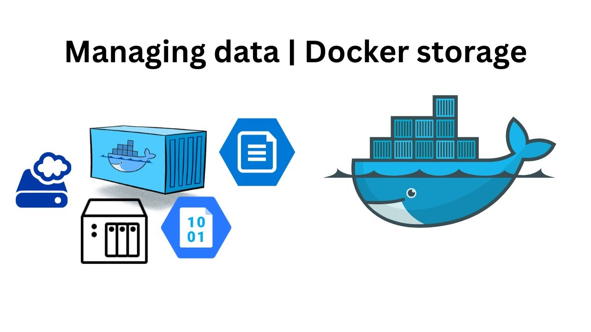

```
BriefIntroduction: 
本人对 docker volume 使用的一些思考和疑惑
```

<!-- split -->



# Docker Volume 

Docker volume 实际上是一个独立于 container 的存储空间，它的生命周期独立于 container 也就是说

- Volume 数据在容器重启后仍然存在
- 删除容器不会删除 volume

可以把它理解为一个"共享文件夹"。

在 compose.yml 我们可以这样子定义和使用 volume

```yaml
services:
  web-app:
    volumes:
      - articles_data:/articles-data  # [volume name]:[container path]
    
  articles-sync:
    volumes:
      - articles_data:/articles-data

volumes:
  articles_data:
```

这个配置声明了一个名为 `articles_data` 的volume，然后这个volume被挂载到：

- articles-data 容器的 `/articles-data` 目录
- web-app 容器的 `/articles-data` 目录

> [!note]
>
> `[volume name]:[container path]` 默认容器对挂载的路径具有读写权限（rw），除非明确指定为只读（ro）
>
> 这里的 `rw` 指的是：容器内部的进程对这个 volume 具有读写权限。

这个volume实际存储在：

```bash
# Docker volumes默认存储在
/var/lib/docker/volumes/[volume-name]/_data
```

## docker volume command

可以通过以下命令去查看 docker volume 的细节

### `docker volume ls`

列出所有 Volume

```shell
$ docker volume ls
DRIVER    VOLUME NAME
local     website_articles_data
```

### `docker volume inspect <volume-name>`

查看 Volume 详细信息

```bash
$ docker volume inspect website_articles_data
[
    {
        "CreatedAt": "2025-03-07T08:57:39Z",
        "Driver": "local",
        "Labels": {
            "com.docker.compose.config-hash": "bbb456a7f8812f1aa7fe3fa10a7a34c76dfb2b1ad60eadbae23a2f386992e456",
            "com.docker.compose.project": "website",
            "com.docker.compose.version": "2.33.1",
            "com.docker.compose.volume": "articles_data"
        },
        "Mountpoint": "/var/lib/docker/volumes/website_articles_data/_data",
        "Name": "website_articles_data",
        "Options": null,
        "Scope": "local"
    }
]
```

其中 `Mountpoint` 就是 Volume 在宿主机上的存储位置。

### `docker volume rm <volume-name>`

删除 Volume, 如果使用 `docker compose down -v` 也可以删除 volume

# when volume mounted?

如果我们在 compose.yml 中定义某个 container 挂载了 volume， 那么这个挂载发生在什么时候呢？

在 Docker Compose 中，Volume 的挂载发生在容器启动时（即 `docker-compose up` 执行时）

对于之前例子中的 compose.yml 来说，当你运行 `docker-compose up` 时，Compose 会按以下顺序执行挂载：

1. 检查 `volumes:` 关键字

   在 `volumes:` 下定义了 `articles_data`，Docker Compose 会检查是否已经存在这个 Volume。

   - 如果不存在，则自动创建这个 Volume
   - 如果存在，则直接挂载这个 Volume

2. 创建和启动 services 中的容器

   创建 `web-app`,   `articles-data` 容器，并将 `articles_data` 挂载到对应的路径

   - 如果容器内的目标路径不存在：Docker 会自动创建该目录，然后挂载 Volume
   - 如果容器内的目标路径已存在：容器内该路径原本的文件会被隐藏（原本的文件仍然存在于容器的中，只是被 Volume 挂载覆盖，如果我们停止容器，移除 Volume 挂载，原目录的内容仍然存在），但不会被删除

3. 容器启动时，Docker 将 Volume 挂载到容器的指定路径

   `web-app` 和 `articles-data` 共享同一个 Volume，它们可以访问 `/articles-data` 目录，存储的文件可互相访问。


## CMD first? or volume mount first?

docker volume 将在 container 启动的时候挂载，但是同样的，我们在 Dockerfile 中定义 CMD/ENTRYPOINT 命令同样也会在 container 启动的时候挂载，那么这个时候我们就会遇到一个问题，谁先执行？

先说结论：

Docker 先挂载 Volume，然后才执行 `CMD` 或 `ENTRYPOINT`

执行顺序如下（假设 `docker run my_image`）：

1. 创建容器（基于镜像）
2. 挂载 Volume（如果 `-v` 参数指定了 Volume，则将其挂载到容器的文件系统）
3. 执行 `ENTRYPOINT` 或 `CMD`（作为容器的主进程）

这是因为 container 的文件系统（包括所有的 mounted volumes）必须完全设置好后，才能在容器内执行命令。而 `CMD/ENTRYPOINT` 指令定义了 container 要运行时的命令或者脚本，但是这些命令依赖于完全准备好的 container environment(其中包括了 mounted volumes)


## next action

似乎找不到对应的 docker document 来支持我的论点

找到一个 [stackflow 帖子](https://stackoverflow.com/questions/69308389/docker-is-volume-mounted-before-running-cmd) 但是在回答的对应文档里面还真没有找到 https://github.com/opencontainers/runtime-spec/blob/master/config.md#createruntime-hooks

如果存在文档说明 container environment 中包含 filesystem，并且存在文档说明 `CMD/ENTRYPOINT` 指令必须要在 container environment 设置好之后才可以执行，同样也可以证明这一点


# Docker volume VS. bind mount

和 bind mount 一样，当 docker volume 挂载上去的路径会被覆盖。而且甚至权限管理都和其类似，bind mount 由宿主机的文件系统决定，而 docker volume 由卷的初始创建者和后续操作决定
