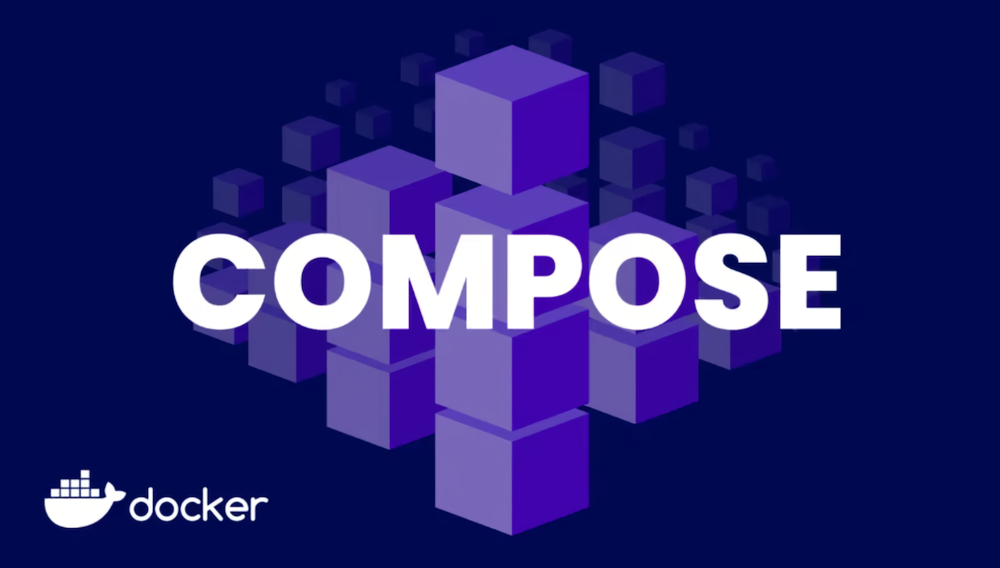

```
BriefIntroduction: 
docker compose.ymal top level services block 语法速查
```

<!-- split -->



# `compose.yml` –> services 语法详解

[Services top-level elements | Docker Docs](https://docs.docker.com/reference/compose-file/services/)


# `container name`

```
# 指定 contianer name
container_name: web-app
```

如果你没有指定 `container_name` Docker Compose 会自动生成一个默认的容器名称, 格式为 `<project>_<service>_<number>`

e.g. `test-website-articles-data-1 `

# `version`

根据最新的 docker compose 规范 [Version and name top-level elements | Docker Docs](https://docs.docker.com/reference/compose-file/version-and-name/)

Compose 不再使用此字段来选择验证模式， 而是默认使用最新的模式来解析文件，如果使用此字段会收到警告消息

# `develop-watch`

[Use Compose Watch | Docker Docs](https://docs.docker.com/compose/how-tos/file-watch/)

在开发的过程中，当某些代码变动时候，我们往往需要 restart, rebuild container 使得代码生效，并且查看其效果，但是手动 docker compose down, 然后 docker compose up 实在是过于繁琐

这个时候我们可以使用 `develop: watch` 字段

## grammer

```yaml
develp:
  watch:
    - path: project-source-path/
      target: container-destination-path
      action: 
      ignore:
        - ignore-path/
```

### `watch`

- 除了 ignore 之外的所有的路径都是基于项目路径
- `.dockerignore` rules 会自动生效，除此之外 `.git` 文件夹会自动忽略

### `action`

- `sync` 将 project path 路径中变化复制到 container target 路径中
- `rebuild` 重建一个新的 images 并且替换掉原来的 container
- `sync+restart` 复制+重启

action 只能为这 3 个值，而不能随意拆分组合，例如不能使用单独的 `restart` 

### `path` and  `target`

- `path` 主机项目路径
- `target` container 路径

如果没有指定 target, 那么 `sync` 动作将默认把主机上的 `path` 路径同步到容器内的相同路径

### `ignore`

必须是一个 数组（列表），即使只有一个元素

```yaml
ignore:
  - logs/
```

wrong config

```yaml
ignore: logs/
```

`ignore` 参数的路径是相对于 `path` 参数的，例如我的项目中

```shell
website
├── Readme.md
├── articles-sync
│   ├── Dockerfile
│   ├── ...
│   ├── logs
├── compose.yml
└── web-app
    ├── Dockerfile
    ├── ...
    ├── ...
    └── templates
```

想要忽略 website/articles-sync/logs 目录下的所有文件，那么在 yaml 中就是

```yaml
services:
  ...

  articles-sync:
    ...
    develop:
      watch:
        - path: ./articles-sync
          ignore:
            - logs/**
          action: rebuild

volumes:
  articles_data:
```

其实关于 ignore realtive path 这个部分 docker compose watch 文档几乎没有解释，所以我创建了一个 PR 来说的更清楚的一些

PR: [Update file-watch.md: add ignore attribute path by hanjie-chen · Pull Request #21820 · docker/docs](https://github.com/docker/docs/pull/21820)

## `compose watch` VS. `bind mounts`

我们可以使用 bind mount 来将一个 主机目录共享到 container 目录中去

同样的，我们可以使用 `compose watch` 字段，检测源代码变化并且同步到 container 中去，而且可以使用 ignore 字段和 `.dockerignore` 控制监控的文件

但是这 2 者往往可以共存，比如说我需要实时查看 container 中一个目录所有的文件变化情况，还是需要 bind mount, 而不仅仅是 sync 源代码

## start watch

我们可以使用下面的命令启用 watch 模式

```shell
docker compose up --watch
```

或者使用

```shell
docker compose watch
```

不过这条命令只输出文件监视相关的信息，不包含容器运行时的详细日志

注意这些第一个命令的输出的本质其实还是 docker log, 所以当你意外的断开ssh 连接之后，可以使用下面的实时查看 docker log 的命令达到类似的效果

```shell
docker compose logs -f
```

# `ports`

docker documents: [Services top-level elements | Docker Docs](https://docs.docker.com/reference/compose-file/services/#ports)

我们可能想要将 contianer 中进程暴露给 host machine 但是，这个时候我们就需要使用到 `ports` 字段

grammer

```yaml
ports:
  - "8080:5000"  # "<host-machine port>":"<container port>"
```

# `image` & `build`

build: [Compose Build Specification | Docker Docs](https://docs.docker.com/reference/compose-file/build/)

## build

用于指定如何构建 image

```yaml
build:
  context: ./articles-sync
  dockerfile: Dockerfile
```

- `context`: 上下文的位置

- `dockerfile`: Dockerfile 的位置，如果默认的名称 `Dockerfile` 这个字段也可以忽略，可以将整体内容省略为

  ```yaml
  build: ./articles-sync
  ```

默认情况下，Docker Compose 会为构建的镜像自动命名，格式为 `<porject-name>_<service-name>`（项目名通常是当前目录名）

如果需要自定义镜像名称，可以结合 image 字段

```yaml
build: ./articles-sync
image: articles-sync1.0
```

> [!tip]
>
> 虽然字段顺序不影响功能，但为了代码的可读性和一致性，我们通常将 build 写在 image 之前：因为逻辑上，先构建（build）然后命名（image）更符合直觉。

## image

用于指定一个已经存在的镜像（可以是本地构建的，也可以是从远程镜像仓库拉取的）。Docker Compose 会直接使用这个镜像来启动容器，而不会去构建新的镜像。

```yaml
image: nginx
```

# `depends_on`

`depends_on` 用于定义服务之间的依赖关系，可以控制服务的启动顺序

如果服务 A 的 depends_on 中指定了服务 B，那么 Docker Compose 会确保服务 B 先启动，然后再启动服务 A。

```yaml
nginx:
  depends_on:
    - web
```

