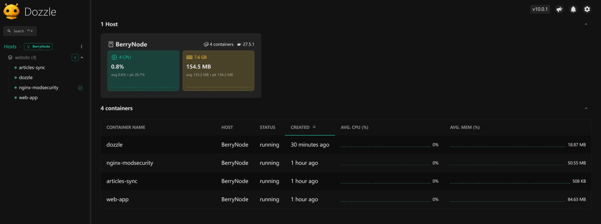

# docker logs

我们可以使用下面的命令来查看 container logs

```shell
# 查看 compose 中定义的服务日志
docker compose logs -f --tail=200 <service-name>
# 查看容器的日志
docker logs -f --tail 200 <container-name/id>
```

其中这里连个命令的本质是一样的，只不过一个使用 yaml 文件中定义的 service name，一个直接使用 container name

`-f`: 实时刷新。它会让终端保持连接，当有新日志产生时，会立即滚动显示在屏幕上

`--tail=200`: 限制行数。只显示该容器最后 200 行的历史日志。

# dozzle-log

在开发的过程中，为了直观的同时监控多个 container, 可以添加 [dozzle](https://github.com/amir20/dozzle) 这个额外的 container 用于监控。

我们可以在 compose.yml 中添加下面的片段

```yaml
services:
  ...
  # use to check 3 container logs
  dozzle:
    image: amir20/dozzle:latest
    container_name: dozzle
    ports:
      - "9999:8080"
    # use docker api, read docker logs
    volumes:
      - /var/run/docker.sock:/var/run/docker.sock:ro

```

最终效果如下所示



> [!note]
>
> 再左侧边栏的 nginx-modsecurity container 右侧中有一个绿色的 ✔ 符号，这是因为它再 compose.yml 中配置了 health check 字段，并且检测为 health

dozzle 的本质就是 `docker logs` 这个命令的 UI 化，所以 dozzle 的日志可见范围由 Docker 日志配置决定。

## dozzle for prod env

一般来说，dozzle 用于开发环境的快速查看，但是如果再项目中仅仅有着几个 container 再跑，那么将其作为 prod 环境下的 log 查看也无不妥


# heavy prod env

什么时候考虑使用 Loki + Grafana + Promtail/Alloy

| 维度       | 选 Dozzle (轻量级)             | 选 Loki + Grafana (生产级)           |
| ---------- | ------------------------------ | ------------------------------------ |
| 项目阶段   | 个人项目、开发测试、小微初创。 | 正式上线项目、公司业务、分布式系统。 |
| 服务器数量 | 1-2 台。                       | 3 台以上或集群（K8s）。              |
| 核心诉求   | 实时看一眼报错，即排即走。     | 需要存历史数据、性能分析、自动报警。 |
| 内存预算   | 极低（< 50MB）。               | 较高（建议预留 1GB+）。              |
| 技术储备   | 只要会写 Docker Compose。      | 需要学习 LogQL 语法及组件配置。      |