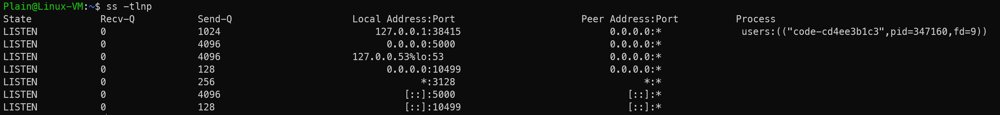

使用ss 命令可以查看linux开放的端口

`ss`（Socket Statistics）是现代替代 `netstat` 的工具，更高效且默认预装。

```
sudo ss -tulnp
```

- **参数解释**：
  - `-t`：TCP 端口
  - `-u`：UDP 端口
  - `-l`：仅显示监听（开放）的端口
  - `-n`：以数字形式显示端口（不解析服务名称）
  - `-p`：显示关联的进程信息（需 `sudo`）

**输出示例**：

```
Netid  State   Recv-Q  Send-Q   Local Address:Port    Peer Address:Port
tcp    LISTEN  0       128          0.0.0.0:22          0.0.0.0:*     users:(("sshd",pid=123,fd=3))
```

- `Local Address:Port` 列显示监听地址和端口（`0.0.0.0` 表示所有接口，`127.0.0.1` 表示仅本地访问）。


e.g.



