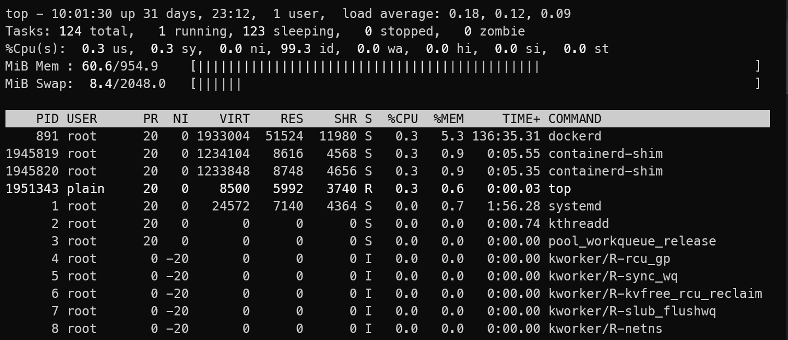

# memory-management

最近在白嫖 gcp 的 free tier vm(GCP e2-micro), 但是发现这个 1 GB Mem 还是比较吃紧，于是顺便学习依稀关于 mem 的相关知识

## free

我们可以使用下面的命令来查看内存使用情况

```shell
$ free -h
               total        used        free      shared  buff/cache   available
Mem:           954Mi       624Mi        62Mi       356Ki       421Mi       330Mi
Swap:          2.0Gi       152Mi       1.9Gi
```

`-h`: `--human-readable`（人类可读）如果不加，则以 KiB（千字节）为单位输出。

从这个命令的结果来看，这台机器目前处于“紧绷但尚未崩溃”的状态。

### 核心指标分析

- Available (330Mi): 这是最重要的指标。

  它表示在不触发交换分区（Swap）大规模抖动的情况下，系统还能分配给新进程的内存。330Mi 约占总内存的 35%，这其实是一个相对安全的缓冲区。

- Used (624Mi): 程序和系统内核已经占用了超过一半的物理内存。

- Swap (152Mi used): 关键点在这里。

  系统使用 Swap（交换分区）Linux 内核可以决定把一些不常用的数据搬到硬盘上。

### 给你的“续命”建议

既然是 Free Tier，我们追求的是极致的性价比。你可以做以下几件事：

- 检查占用大户：

  输入 `top` 然后按 `M` (大写) 按内存占用排序，看看是谁在吃内存。如果是没用的服务，直接关掉。

- 优化系统缓存：

  你的 `buff/cache` 有 421Mi。Linux 会尽可能利用空闲内存做缓存以加速磁盘读取。如果内存实在不够，系统会自动回收这部分。

## top

我们可以直接使用 top 命令来查看，当我们直接输入 `top` 敲回车，系统会进入一个实时刷新的界面。



### 顶部三行

- 第一行（系统概况）：`load average: 0.18, 0.12, 0.00` 这三个数字分别代表过去 1、5、15 分钟的平均负载。如果数字大于你的 CPU 核心数，说明电脑快忙不过来了。
- 第三行（%Cpu(s)）：看 `id` (idling) 的百分比，它表示 CPU 有多闲。如果这个值很低，说明 CPU 正在疯狂干活。
- 第四/五行（Memory/Swap）：这就是 `free` 命令在 `top` 里的体现。

## 常用参数（启动时用）

虽然不带参数也能跑，但这几个参数能让你省事：

- **`top -d 1`**：每一秒钟刷新一次（默认是 3 秒，太慢了）。
- **`top -u root`**：只看 `root` 用户运行的进程。
- **`top -p 1234`**：只监控进程 PID 为 1234 的那个程序。

## 内部快捷键（运行中用）

进到 `top` 界面后，键盘就是控制器。注意：区分大小写！

### 排序大招

- `M` (大写)：按内存使用率排序（找内存杀手最快的方法）。
- `P` (大写)：按 CPU 使用率排序（默认项）。
- `N` (大写)：按进程 ID (PID) 排序。
- `T` (大写)：按进程运行的总时间排序。

### 视图调整

- `1` (数字一)：如果你有多核 CPU，按 `1` 可以展开看到每一颗核心的占用情况。
- `z` (小写)：彩色显示（让界面没那么枯燥）。
- `c` (小写)：显示完整的运行命令路径，而不仅仅是进程名。
- `k` (小写)：杀死进程。输入 `k` 后，它会问你 PID 是多少，回车就能干掉它。

### 退出

- **`q`**：直接退出，回到命令行。