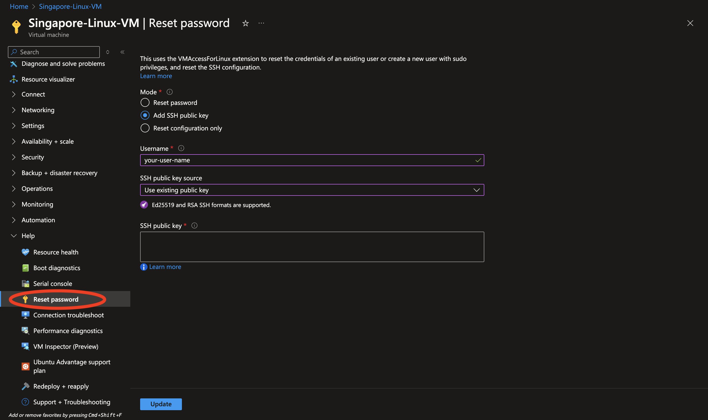
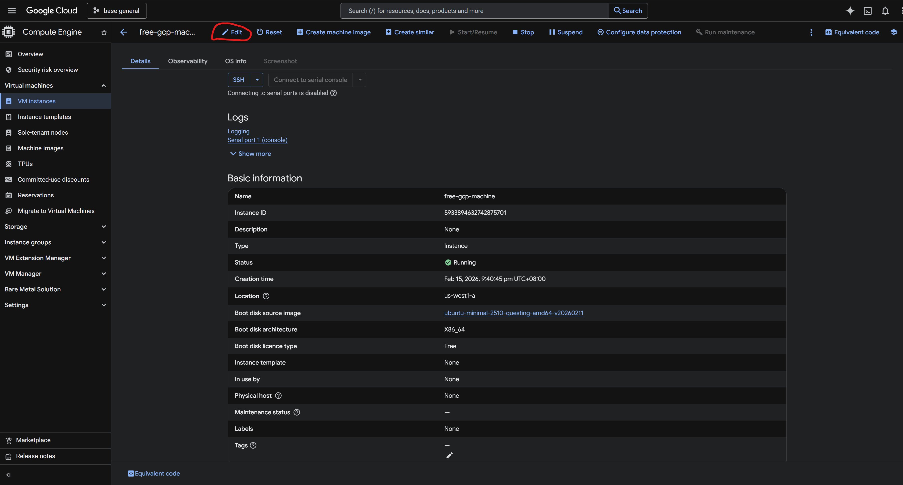

```
BriefIntroduction: 
ssh 在客户端的配置
```

<!-- split -->


# Authentication

当我们使用 ssh 连接到一台远程服务器的时候，需要输出 username, passoword 来进行登录

但是这样子容易遇到一些安全问题，比如说一台 server(public ip) 可能会遇到，密码爆破攻击，为了安全考虑，我们可以使用 ssh key

# generate ssh key

```bash
ssh-keygen -t rsa -b 4096 -C "note" -f ~/.ssh/<key-filename>
```

`-t`: type，指定算法 rsa

`-b`: bits，指定安全位数，rsa 建议至少 2048

`-C`: comments，注释

`-f`: 指定输出文件名

这样就会生成 `~/.ssh/<key-filename>`（私钥） 和 `~/.ssh/<key-filename>.pub`（公钥）

生成过程中可以选择是否给私钥加 passphrase（密码短语）。如果加了，在登录时需要输入 passphrase

一般来说我们写的注释（note），通常记录在公钥文件的结尾处，可以直接打开 `.pub` 文件查看

对于文件名，我们最好起一个有意义的名字，例如 `Singapore-Linux-VM-SSH-Key` 

e.g.

```shell
➜ .ssh  ssh-keygen -t rsa -b 4096 -C "Singapore Linux VM" -f ./Singapore_Linux_VM_SSH_Key
Generating public/private rsa key pair.
Enter passphrase (empty for no passphrase):
Enter same passphrase again:
Your identification has been saved in ./Singapore_Linux_VM_SSH_Key
Your public key has been saved in ./Singapore_Linux_VM_SSH_Key.pub
The key fingerprint is:
SHA256:lcVNmuQlFiyBm6FMZfzL+0uhLVWzftlGcURFXz/t5w8 Singapore Linux VM
The key's randomart image is:
+---[RSA 4096]----+
|       oo..+*+ooB|
|      ..+ .*o=..=|
|     o . =o.+ oo=|
|      o o..  . ++|
|        S. .o . +|
|          o+ o o+|
|          o.o E.=|
|          .o   +.|
|           .o.  .|
+----[SHA256]-----+
```

> [!note]
>
> 如果在 windows powershell 环境中，这个命令会让你输入2次 passphrase 之后会失败并且报错
>
> ```powershell
> Generating public/private rsa key pair.
> Enter passphrase (empty for no passphrase):
> Enter same passphrase again:
> Saving key "~/.ssh/github-ssh-key" failed: No such file or directory
> ```
>
> 这是因为在某些版本的 powershell 中 `~` 符号没有被 PowerShell 解析后再传递给命令
>
> 例如  [Powershell does not expand '~' for external programs · Issue #20031 · PowerShell/PowerShell](https://github.com/PowerShell/PowerShell/issues/20031)

## add ssh key to remote server

既然已经生成了 ssh key, 我们就需要将 public key 添加到 remote server中去

使用命令

```shell
ssh-copy-id -p <ssh-port> -i ~/.ssh/Singapore_Linux_VM_SSH_Key.pub <username>@<remote-server-ip>
```

如果使用默认的 22 号端口，可以省略 `-p <ssh-port>` 参数

e.g.

```shell
$ ssh-copy-id -p <ssh-port> -i ./Singapore_Linux_VM_SSH_Key.pub <username>@<remote-server-ip>
/usr/bin/ssh-copy-id: INFO: Source of key(s) to be installed: "./Singapore_Linux_VM_SSH_Key.pub"
/usr/bin/ssh-copy-id: INFO: attempting to log in with the new key(s), to filter out any that are already installed
/usr/bin/ssh-copy-id: INFO: 1 key(s) remain to be installed -- if you are prompted now it is to install the new keys
Plain@<remote-server-ip>'s password:

Number of key(s) added: 1

Now try logging into the machine, with:   "ssh -p <ssh-port> 'Plain@<remote-server-ip>'"
and check to make sure that only the key(s) you wanted were added.
```

> [!note]
>
> 在 windows powershell 环境下无法使用 `ssh-copy-id` 命令，此时可以打开 git bash 去运行这个命令

## azure vm

如果用的是 azure linux vm 可以在 azure portal 中添加 ssh public key



## gcp vm

在 gcp 中则是需要进入 VM instance edit 这个位置：



进入 edit 之后往下滑动就能看见 ssh key


## ssh-key login

如果我们直接用 `ssh username@remote-server-ip`，SSH 默认会仅尝试 `id_rsa` 这样默认命名的密钥

所以我们需要在命令行临时指定：

```javascript
ssh -i ~/.ssh/id_rsa_remote_server username@remote-server-ip
```

当然为了方便起见，我们往往在 `~/.ssh/config` 中添加配置，让 SSH 自动知道该请求要用哪个 key，举例：

```javascript
Host remote-server
    HostName remote-server-ip
    User username
    IdentityFile ~/.ssh/id_rsa_remote_server
```

然后只要 `ssh remote-server` 即可自动使用该密钥。

# Key Management

SSH Agent 用于存储解密后的私钥（在内存中缓存已解密的私钥），使得只需要只输入一次 passparsh，就可以在会话期间重复使用

也就是说如果私钥没有密码，不需要 SSH Agent，因为 SSH 可以直接读取私钥文件。

如果私钥有密码，没有 SSH Agent 每次使用 SSH 连接时都需要输入密码，有 SSH Agent 只需在添加密钥到 Agent 时输入一次密码

## windows setting

查看 ssh agent 服务

```powershell
Get-Service ssh-agent
```

启动服务

```powershell
Start-Service ssh-agent
```

如果需要，设置为自动启动

```powershell
Set-Service -Name ssh-agent -StartupType Automatic
```

添加 ssh key 到 ssh agnet

```powershell
ssh-add C:\Users\<username>\.ssh\github-ssh-key
```

查看已经添加的 ssh key

```powershell
ssh-add -l
```

## linux setting

首先查看 ssh-agnet 是否已经启动

```shell
echo $SSH_AGENT_PID
```

如果 `ssh-agent` 运行中，会显示其进程 ID (PID)；如果没有运行，则输出为空。

如果显示为空，那么使用下面的命令启动 ssh-agent

```bash
eval "$(ssh-agent -s)"
```

添加 SSH 私钥：

```bash
ssh-add ~/.ssh/<ssh-key-filename> 
```

## 持久化

为了实现持久化，你可以将这些命令添加到你的 shell 配置文件中。根据你使用的 shell，可以是：

对于 Bash（~/.bashrc 或 ~/.bash_profile）：

```bash
if [ -z "$SSH_AUTH_SOCK" ] ; then
    eval "$(ssh-agent -s)"
    ssh-add ~/.ssh/<ssh-key-name>
fi
```

保存文件后，重新加载配置：

```bash
source ~/.bashrc  # 如果使用 bash
```

这样设置后，每次打开新的终端会话时，ssh-agent 都会自动启动，并且会添加你的 SSH 密钥。

# Configuration

ssh 配置文件一般默认路径是 `~/.ssh/config` 这个文件本质上是 SSH 客户端的全局配置文件，支持许多的功能。

不过我们先来看看他最基础，也是用的最多的功能：简化连接命令，将复杂的将复杂的 ssh 命令参数转化为一个 host

我们可以通过在 `~/.ssh.config` 中添加配置，使用 `ssh <hostname>` 命令快速登录，无需每次都输入一系列复杂的参数

一个经典的主机配置如下

```json
Host Azure-Linux-VM
    HostName <public-ip/private-ip>
    User <username>
    Port <ssh-port>
    IdentityFile ~/.ssh/id_rsa
```

> [!tip]
>
> 在 vscode 的 remote-ssh 插件中使用 `Remote-SSH: Open SSH Configuration File...` 同样编辑的就是这个文件

通过编辑这个文件，我们可以为不同主机指定私钥，例如为个人服务器和公司服务器使用不同密钥。GitHub 或 GitLab 配置不同密钥。

```
Host github.com
  User git
  IdentityFile ~/.ssh/github_key  # GitHub 专用密钥

Host company-server
  HostName example.com
  User dev
  IdentityFile ~/.ssh/work_key    # 公司服务器密钥
```

> [!important]
>
> 注意 ssh config 不支持直接配置密码

