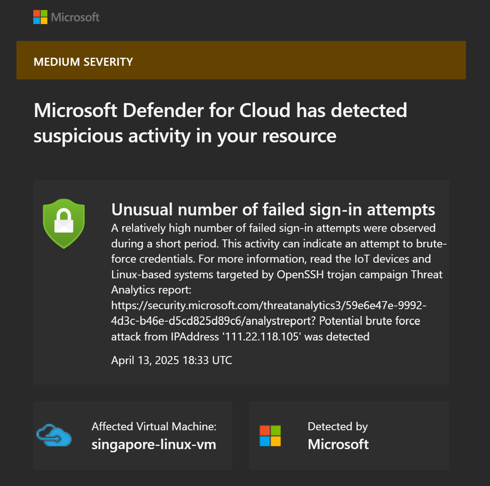
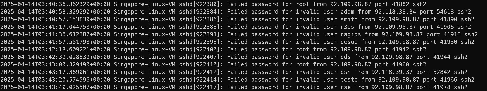

# background

今天查看邮件的时候发现，似乎有人尝试爆破我的 azure linux vm, 因为我的 azure linux vm 有一个 public ip, 所以其实我之前就考虑这个安全隐患



当然最好的方法是不要对公网开放相关的端口，但是没办法我需要开放端口，使得我自己连接上去

所以这篇文章就来解决一下这个问题

# check the brute-froce login

不过我们首先得做一些关于爆破登录的检查

## successed login record

查看有哪些 IP 成功登录了系统，是否有你不认识的登录记录。

```shell
$ last -a
```

一般来说你可以登录上，就代表对方还没有爆破成功，如果成功的话大概会直接劫持

## failed login check

```shell
grep "Failed password" /var/log/auth.log | tail -n 50
```



注意到可以看到甚至使用了 root 尝试来登录，不过对于 ubuntu 来说

默认情况下，root user 无法使用 ssh 登录，因为

- Ubuntu 安装完成后，不会为 root 用户设置密码，而是采用 `sudo` 机制让第一个创建的用户拥有管理员权限，因此即使你想通过 SSH 或 TTY 登录，也无法登录 root（系统禁止空密码登录）

- 即使你给 root 设置了密码，Ubuntu 通常仍然默认禁止 SSH 登录 root，Ubuntu 的 SSH 配置文件（`/etc/ssh/sshd_config`）中有这样一行：

  ```bash
  PermitRootLogin prohibit-password
  ```

  意思是即使 root 有密码，也不允许用密码直接登录 root

> [!tip]
>
> 可以使用下面的命令查看 root user 是否存在密码
>
> ```shell
> $ sudo grep root /etc/shadow
> root:*:20097:0:99999:7:::
> ```
>
> 如果输出类似 `root:!:` 或 `root:*:`，表示 root 无密码
>
> 如果输出包含加密密码（如 `root:$6$...`），表示 root 有密码

## user check

使用下面的命令检查是否存在陌生用户

```
cat /etc/passwd | grep "/home"
```

如果你是 azure linux vm 并且看到类似于下面的 user

```shell
mdatp:x:999:988::/home/mdatp:/usr/sbin/nologin
```

请不要担心，这个 `mdatp` 用户常见于 Azure Linux VM，是 Microsoft Defender Advanced Threat Protection（也称 Microsoft Defender for Endpoint）的系统用户。

它出现在你系统上的原因是：这台 VM 安装或启用了 Microsoft Defender for Linux（mdatp）客户端。

这个用户被创建出来是为了：

- 让 `mdatp` 相关的服务（如反病毒扫描器、监控 agent 等）运行；
- 具有独立权限、隔离于你的主用户，增强系统安全性。

各个字段解释如下：

| 字段                | 含义                                                         |
| ------------------- | ------------------------------------------------------------ |
| `mdatp`             | 用户名                                                       |
| `999`               | UID，通常用于系统用户                                        |
| `988`               | GID                                                          |
| `/home/mdatp`       | 用户的“主目录”                                               |
| `/usr/sbin/nologin` | 登录 shell 被禁用，说明该用户不能登录系统，只用于系统服务运行 |


# enhance ssh security

接着我们需要加强一下我们 ssh server 的安全等级，同样是配置 `/etc/ssh/sshd_config` 文件

### disable root user login

```
PermitRootLogin no
```

### disable password login

```
PasswordAuthentication no
```

记得之前要提前配置好 ssh key, 可以参考 [ssh authentication](./client-guide.md)

### allow key auth

```shell
PubkeyAuthentication yes
```

仅允许密钥登录

### change default ssh port

```
Port <non-22-port>
```

### allow specifical user

```shell
AllowUsers <username>
```

限制特定用户才能登录，也就是白名单。在原配中不存在，需要自己写

## restart ssh services

检查一下是否存在语法错误：
```shell
sudo sshd -t
```

无输出则一切正常，接着告知系统端口变更

```
sudo systemctl daemon-reload
```

这是因为现在的 Ubuntu 经常使用 `ssh.socket` 来管理端口，如果不进行这一步，可能会失败，详见 [server-guide](./server-gudie.md) 中的案例

修改后，重启 SSH：

```shell
sudo systemctl restart sshd/ssh
```

> [!note]
>
> 如果发现如下的报错
>
> ```shell
> $ sudo systemctl restart sshd
> Failed to restart sshd.service: Unit sshd.service not found.
> ```
>
> 那么请试试看 `ssh` 代替 `sshd`
>
> 原因是：虽然很多系统使用 `sshd`，但在某些发行版（尤其是 Ubuntu 或 Debian）中，服务的标准名称可能只是 `ssh`。
>
> 在大多数现代发行版中，即使输入 `sshd`，系统也会自动重定向到 `ssh`，但如果系统环境配置比较精简（比如某些 Docker 容器或轻量化固件），这种重定向可能不存在。

## failed example

如果这个时候发现，还是可以通过 password 登录，那么往往是因为有另一个配置项在偷偷给密码登录“放行”，或者配置并没有像你想象中那样真正生效。

首先我们使用下面的命令检查当前运行的ssh是怎么想的

```shell
sshd -T | grep -E "passwordauthentication|kbdinteractiveauthentication"
```

如果是这样子的输出

```shell
passwordauthentication yes
kbdinteractiveauthentication no
```

那就意味着配置覆盖

现代 Linux 发行版（如 Ubuntu 22.04+）默认启用了配置包含功能。

检查 sshd_config 文件顶部这一行： `Include /etc/ssh/sshd_config.d/*.conf`

如果 `/etc/ssh/sshd_config.d/` 目录下有任何文件（例如 `50-cloud-init.conf`），并且里面写了 `PasswordAuthentication yes`，那么它的优先级高于你直接在 `sshd_config` 里写的配置。

解决方案是，要么直接删除冲突的文件（例如 `50-cloud-init.conf`），要么干脆注释掉 Include 那一行

## fail2ban

fail2ban 是个非常实用的安全工具，特别适合这种在公网运行 Linux 服务器的场景（比如 Azure VM），来自动防止暴力破解登录（比如你前面提到的 SSH 爆破攻击）

它是一个开源的入侵防御系统，它通过监控日志文件（如 `/var/log/auth.log`），发现多次失败登录尝试后，就会自动封锁攻击者的 IP 地址（原理是通过给 `iptables` 或 `firewalld` 添加规则，短时间内禁止那个 IP 再尝试连接）

### 工作机制

它持续监控日志文件（如 `sshd` 的失败登录）一旦某个 IP 多次失败（如 5 次），就触发“ban”，把这个 IP 加入黑名单，添加防火墙规则屏蔽，经过一段时间（默认 10 分钟），自动解封（或者你也可以手动管理）。

### for example

假如某个 IP 不停尝试 SSH 登录失败，log 会长这样：

```
sshd[1234]: Failed password for root from 203.0.113.5 port 54321 ssh2
```

fail2ban 检测到类似的日志，就会封锁 203.0.113.5 这个 IP。

### install `fail2ban`

以 Ubuntu 为例：

```bash
sudo apt update
sudo apt install fail2ban
```

### config `fail2ban`

复制默认配置为自定义配置文件：

```bash
sudo cp /etc/fail2ban/jail.conf /etc/fail2ban/jail.local
```

编辑 `jail.local`：

```bash
sudo nano /etc/fail2ban/jail.local
```

找到 `[sshd]` 部分，修改为类似于下面的配置

```ini
[sshd]
enabled = true
port    = <ssh-port>   # 你自己改的 SSH 端口！
logpath = %(sshd_log)s
maxretry = 5
bantime  = 600     # 封锁时间：秒（600 秒 = 10 分钟）
findtime = 600     # 在这个时间窗口内达到 maxretry 次就 ban
```

启动并查看状态：

```bash
sudo systemctl enable fail2ban
sudo systemctl start fail2ban
sudo fail2ban-client status sshd
```

### 常用命令

| command                                      | usage              |
| -------------------------------------------- | ------------------ |
| `sudo fail2ban-client status`                | 查看所有监控 jail  |
| `sudo fail2ban-client status sshd`           | 查看 SSH 的被封 IP |
| `sudo fail2ban-client set sshd unbanip <IP>` | 手动解封一个 IP    |
| `sudo fail2ban-client set sshd banip <IP>`   | 手动封锁一个 IP    |

### apply changed config

只要你修改完 `/etc/fail2ban/jail.local` 文件，使其生效的方法很简单：

步骤一：检查配置是否有语法错误

```bash
sudo fail2ban-client -d
```

这个命令会显示所有 fail2ban 的加载配置，如果有语法错误，它会报错；这是一个很好的调试工具。

步骤二：重启 fail2ban 服务

```bash
sudo systemctl restart fail2ban
```

or

```bash
sudo service fail2ban restart
```

这个命令会重新加载你在 `jail.local` 中的配置，应用所有规则，启动或更新所有启用的 jail（例如 `sshd`）

步骤三：验证配置是否生效

你可以用这个命令来确认 `sshd` jail 正常运行，并查看是否应用了你修改的设置（如 port、bantime）：

```bash
sudo fail2ban-client status sshd
```

也可以检查日志文件来确认 fail2ban 的启动情况：

```bash
sudo tail -n 30 /var/log/fail2ban.log
```

