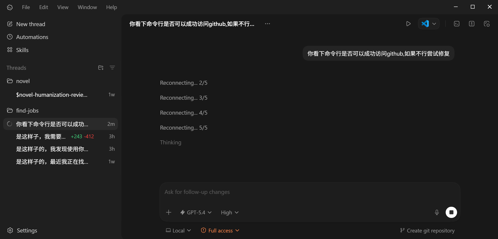

```
BriefIntroduction:
在 windows 10 环境下使用 codex app 的时候老是发现出现 reconnecting 的问题，失败5次之后才能 thinking，让 codex 自己分析了一下，下好了一半的 context windows(128k) 才修好。结论是 clash rule 没写好，走了 geo ip match 记录一下
```

<!-- split -->



# Issue Description

在 Windows 10 环境中使用 Codex 时，频繁出现 `reconnect` 之后才能成功 thinking

# Root Cause

当前使用的 Clash 订阅规则里，存在：

```yaml
- GEOIP,CN,DIRECT
- MATCH,⚓️其他流量
```

问题在于：

1. `chatgpt.com` 或 `chat.openai.com` 的某些解析结果会被错误识别到 `CN`
2. 一旦命中 `GEOIP,CN,DIRECT`，请求会被直连
3. 直连超时之后，Codex 就会表现成反复 `reconnect`

也就是说分流规则不够精确。

# Resolution

在当前活动订阅文件中，把 OpenAI 相关域名规则放到 `GEOIP,CN,DIRECT` 前面。核心规则如下：

```yaml
- DOMAIN-SUFFIX,chatgpt.com,⚓️其他流量
- DOMAIN-SUFFIX,openai.com,⚓️其他流量
- DOMAIN-SUFFIX,oaistatic.com,⚓️其他流量
- DOMAIN-SUFFIX,oaiusercontent.com,⚓️其他流量
```

这样可以确保：`chatgpt.com`, `chat.openai.com`, `ab.chatgpt.com`, `oaistatic.com`, `oaiusercontent.com` 都优先走代理，而不是落到 `GEOIP,CN,DIRECT`。

但是如果我们手动把订阅更新了，那么这些手工规则就会被覆盖。所以我们额外做了一个手动自动修复方案。

我们写了一个 ps scripts 放在：`C:\Users\Windows 10\.config\clash\codex-maintain-openai-rules.ps1`

作用：

1. 找到当前活动的 Clash profile
2. 自动检查 OpenAI 规则是否存在
3. 如果缺失，则在 `GEOIP,CN,DIRECT` 前重新插入
4. 生成当前运行用的 runtime 配置
5. 热重载 Clash

然后在 ps profile 中添加了这样子一条 powershell command

```powershell
# manually repair Clash OpenAI rules after updating subscriptions
function Fix-ClashOpenAIRules {
    powershell.exe -NoProfile -ExecutionPolicy Bypass -File "$env:USERPROFILE\.config\clash\codex-maintain-openai-rules.ps1"
}

Set-Alias -Name clash-fix-openai -Value Fix-ClashOpenAIRules
```

这样子我们，手动更新 clash 订阅之后，就可以使用命令 clash-fix-openai 把这些 rule 写进去了

# Troubleshoot

如果之后又出现 reconnect，如何判断 OpenAI 规则还在，以及脚本是否生效

按下面顺序检查：

1. Clash 是否已启动，且本地端口 `127.0.0.1:7890` 仍在监听
2. 当前 profile 中是否还保留 OpenAI 规则
3. 看 Clash 日志是否命中了 DomainSuffix 规则。

```powershell
$log = Get-ChildItem "$env:USERPROFILE\.config\clash\logs" |
  Sort-Object LastWriteTime -Descending |
  Select-Object -First 1

Select-String -Path $log.FullName -Pattern "chatgpt.com|chat.openai.com|DomainSuffix\(chatgpt.com\)|DomainSuffix\(openai.com\)|GeoIP\(CN\)"
```

如果看到的是：

```text
rule=DomainSuffix(chatgpt.com)
rule=DomainSuffix(openai.com)
```

说明 OpenAI 请求正在按我们加的规则走。

如果看到的是：

```text
rAddr=chatgpt.com:443 ... rule=GeoIP(CN) proxy=DIRECT
```

那就说明旧问题又回来了。

# powershell scripts

主维护脚本 ps 代码

文件：`C:\Users\Windows 10\.config\clash\codex-maintain-openai-rules.ps1`

```powershell
$ErrorActionPreference = "Stop"

$clashRoot = Join-Path $env:USERPROFILE ".config\clash"
$profilesDir = Join-Path $clashRoot "profiles"
$generalConfig = Join-Path $clashRoot "config.yaml"
$profilesList = Join-Path $profilesDir "list.yml"
$runtimeConfig = Join-Path $profilesDir "codex-active-runtime.yml"
$utf8 = [System.Text.UTF8Encoding]::new($false)

$startMarker = "  # codex-openai-rules-start"
$endMarker = "  # codex-openai-rules-end"

function Get-GeneralValue {
    param(
        [string[]]$Lines,
        [string]$Key
    )

    foreach ($line in $Lines) {
        if ($line -match "^\s*$([regex]::Escape($Key)):\s*(.+?)\s*$") {
            return $Matches[1]
        }
    }

    return $null
}

function Get-MatchProxyName {
    param(
        [System.Collections.Generic.List[string]]$Lines
    )

    foreach ($line in $Lines) {
        if ($line -match '^\s*-\s*MATCH,(.+?)\s*$') {
            return $Matches[1]
        }
    }

    throw "Could not determine fallback proxy name from MATCH rule"
}

function Read-Utf8Text {
    param(
        [string]$Path
    )

    return [System.IO.File]::ReadAllText($Path, $utf8)
}

function Read-Utf8Lines {
    param(
        [string]$Path
    )

    return [System.IO.File]::ReadAllLines($Path, $utf8)
}

function Write-Utf8Lines {
    param(
        [string]$Path,
        [string[]]$Lines
    )

    [System.IO.File]::WriteAllLines($Path, $Lines, $utf8)
}

function Update-ProfileRules {
    param(
        [string]$Path
    )

    $lines = [System.Collections.Generic.List[string]]::new()
    foreach ($line in Read-Utf8Lines -Path $Path) {
        [void]$lines.Add($line)
    }

    $geoIndex = -1
    for ($i = 0; $i -lt $lines.Count; $i++) {
        if ($lines[$i] -match '^\s*-\s*GEOIP,CN,DIRECT\s*$') {
            $geoIndex = $i
            break
        }
    }

    if ($geoIndex -lt 0) {
        return $false
    }

    $startIndex = $lines.IndexOf($startMarker)
    if ($startIndex -ge 0) {
        $endIndex = $lines.IndexOf($endMarker)
        if ($endIndex -ge $startIndex) {
            $lines.RemoveRange($startIndex, $endIndex - $startIndex + 1)
            if ($startIndex -lt $geoIndex) {
                $geoIndex -= ($endIndex - $startIndex + 1)
            }
        }
    }

    $proxyName = Get-MatchProxyName -Lines $lines
    $managedBlock = @(
        $startMarker,
        "  - DOMAIN-SUFFIX,chatgpt.com,$proxyName",
        "  - DOMAIN-SUFFIX,openai.com,$proxyName",
        "  - DOMAIN-SUFFIX,oaistatic.com,$proxyName",
        "  - DOMAIN-SUFFIX,oaiusercontent.com,$proxyName",
        $endMarker
    )

    for ($i = 0; $i -lt $managedBlock.Count; $i++) {
        $lines.Insert($geoIndex + $i, $managedBlock[$i])
    }

    Write-Utf8Lines -Path $Path -Lines $lines
    return $true
}

function Get-ActiveProfilePath {
    param(
        [string]$ListPath,
        [string]$ProfilesRoot
    )

    $raw = Read-Utf8Text -Path $ListPath
    $indexMatch = [regex]::Match($raw, '(?m)^index:\s*(\d+)\s*$')
    if (-not $indexMatch.Success) {
        throw "Could not find active profile index in $ListPath"
    }

    $selectedIndex = [int]$indexMatch.Groups[1].Value
    $entries = [regex]::Matches($raw, '(?m)^\s*(?:-\s*)?time:\s*(.+?)\s*$') |
        ForEach-Object { $_.Groups[1].Value }

    if ($selectedIndex -ge $entries.Count) {
        throw "Active profile index $selectedIndex is out of range"
    }

    return Join-Path $ProfilesRoot $entries[$selectedIndex]
}

function Build-RuntimeConfig {
    param(
        [string]$SourcePath,
        [string]$DestinationPath,
        [string]$Controller,
        [string]$Secret
    )

    $lines = Read-Utf8Lines -Path $SourcePath
    $updated = foreach ($line in $lines) {
        if ($line -match '^log-level:') {
            "log-level: info"
        }
        elseif ($line -match '^external-controller:') {
            "external-controller: $Controller"
        }
        elseif ($line -match '^secret:') {
            "secret: $Secret"
        }
        else {
            $line
        }
    }

    Write-Utf8Lines -Path $DestinationPath -Lines $updated
}

function Reload-ActiveConfig {
    param(
        [string]$Controller,
        [string]$Secret,
        [string]$ConfigPath
    )

    $body = @{ path = $ConfigPath } | ConvertTo-Json
    Invoke-RestMethod `
        -Headers @{ Authorization = "Bearer $Secret" } `
        -Uri "http://$Controller/configs?force=true" `
        -Method Put `
        -ContentType "application/json" `
        -Body $body | Out-Null
}

if (-not (Test-Path $generalConfig)) {
    throw "Missing Clash general config: $generalConfig"
}

if (-not (Test-Path $profilesList)) {
    throw "Missing Clash profile list: $profilesList"
}

$generalLines = Read-Utf8Lines -Path $generalConfig
$controller = Get-GeneralValue -Lines $generalLines -Key "external-controller"
$secret = Get-GeneralValue -Lines $generalLines -Key "secret"

if (-not $controller) {
    throw "Missing external-controller in $generalConfig"
}

if ($null -eq $secret) {
    $secret = ""
}

$profileFiles = Get-ChildItem $profilesDir -Filter *.yml |
    Where-Object {
        $_.Name -notin @("list.yml", "codex-active-runtime.yml") -and
        $_.Name -notlike "*.codex-merged.yml"
    }

foreach ($profile in $profileFiles) {
    $raw = Read-Utf8Text -Path $profile.FullName
    if ($raw -match '(?m)^rules:\s*$' -and $raw -match '(?m)^\s*-\s*GEOIP,CN,DIRECT\s*$') {
        Update-ProfileRules -Path $profile.FullName | Out-Null
    }
}

$activeProfile = Get-ActiveProfilePath -ListPath $profilesList -ProfilesRoot $profilesDir
Build-RuntimeConfig -SourcePath $activeProfile -DestinationPath $runtimeConfig -Controller $controller -Secret $secret
Reload-ActiveConfig -Controller $controller -Secret $secret -ConfigPath $runtimeConfig
```
