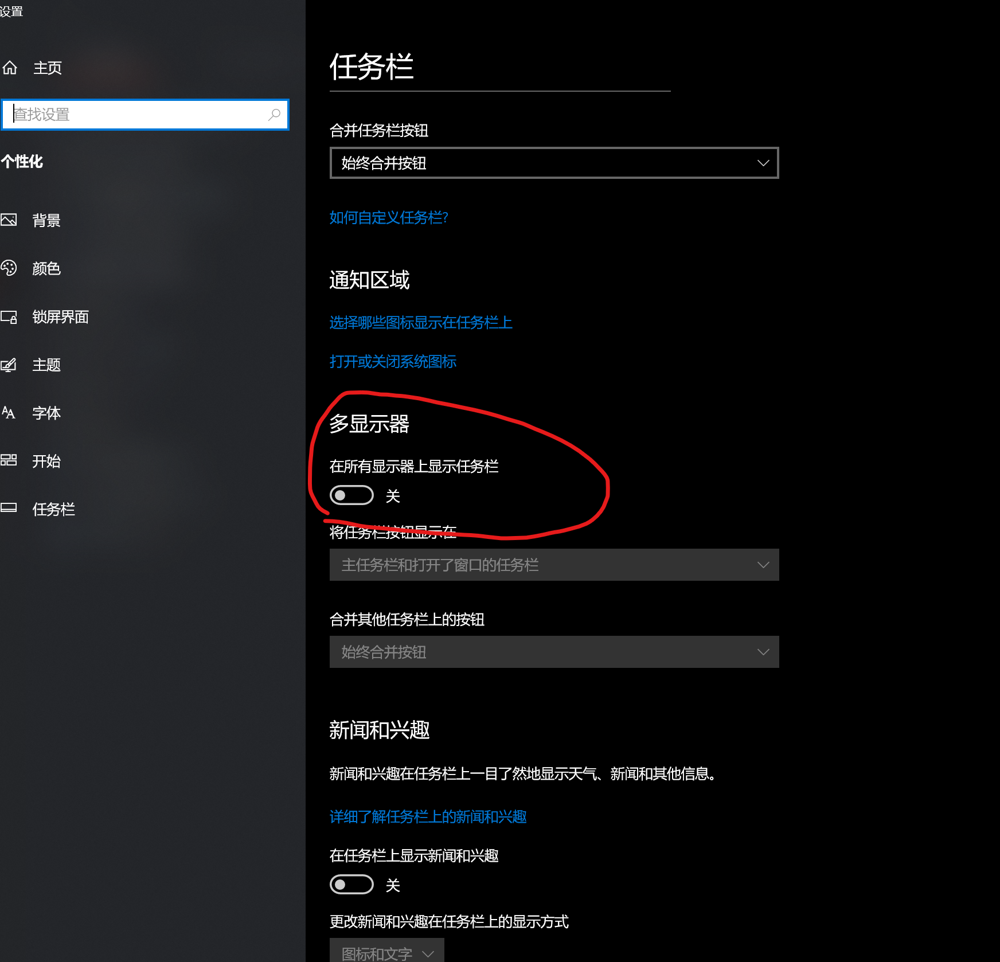

# 鼠标逻辑

有。你描述的其实是 Windows 的两套不同机制：

Windows 默认可以开启“**鼠标悬停时滚动非活动窗口**”，所以你把鼠标移到另一个屏幕上的窗口时，滚轮能直接生效；但**键盘输入仍然只发给当前活动窗口**。微软文档把另一套机制叫 **active window tracking**，也就是“鼠标停在哪个窗口，哪个窗口就变成活动窗口”。([微软支持](https://support.microsoft.com/en-us/windows/change-mouse-settings-e81356a4-0e74-fe38-7d01-9d79fbf8712b?utm_source=chatgpt.com))

所以答案是：**可以做到接近你要的效果，但对象是“窗口/程序”，不是“屏幕本身”**。也就是说，鼠标移到某个窗口上，那个窗口可以自动拿到键盘焦点；但 Windows 原生并不是“鼠标一跨到某块显示器，键盘就切到这块屏幕”。这是从微软对 active window tracking 的定义直接推出来的：它跟踪的是 **window**，不是 **monitor**。([微软学习](https://learn.microsoft.com/en-us/dotnet/api/system.windows.forms.systeminformation.isactivewindowtrackingenabled?view=windowsdesktop-10.0&utm_source=chatgpt.com))

在 Windows 里可以这样开：

1. 按 `Win + R`，输入 `control`
2. 打开 **Ease of Access Center**
3. 进入 **Make the mouse easier to use**
4. 勾选 **Activate a window by hovering over it with the mouse** ([Windows 11 Forum](https://www.elevenforum.com/t/turn-on-or-off-activate-window-by-hovering-over-with-mouse-pointer-in-windows-11.6104/?utm_source=chatgpt.com))

开了以后，通常就会变成你想要的这种感觉：**鼠标移到哪个窗口，键盘输入基本就跟到哪个窗口**，不必再点一下。这个功能在教程里通常也被叫做 **focus follows mouse / X-mouse**。默认还会有一个悬停延迟；Windows 也提供了“active window tracking delay”这类系统参数。([Windows 11 Forum](https://www.elevenforum.com/t/turn-on-or-off-activate-window-by-hovering-over-with-mouse-pointer-in-windows-11.6104/?utm_source=chatgpt.com))

要注意两点：

- 这是按**窗口**切焦点，不是按**屏幕区域**切焦点。
- 某些全屏程序、游戏、远程桌面、特殊输入框里，体验可能不完全一致；但日常多显示器办公、浏览器、编辑器、终端，一般是有帮助的。这个属于基于 Windows 焦点机制的合理推断。

你现在能滚轮滑动，多半已经开着这个：
`设置 > 蓝牙和设备 > 鼠标 > Scroll inactive windows when hovering over them`
但它**只管滚轮，不管键盘焦点**。

你要是愿意，我可以下一条直接给你写成 **Windows 11 中文界面的精确点击路径**，或者给你一个 **AutoHotkey 方案**，做成更激进的“鼠标到哪，焦点到哪”。

# Windows 10 双屏设置

## 任务栏副屏的设置

我更加倾向于设置为没有Task Bar，设置如下所示：

## 任务栏主屏幕设置

考虑在桌面模式下隐藏任务栏 或者贴合在右侧

