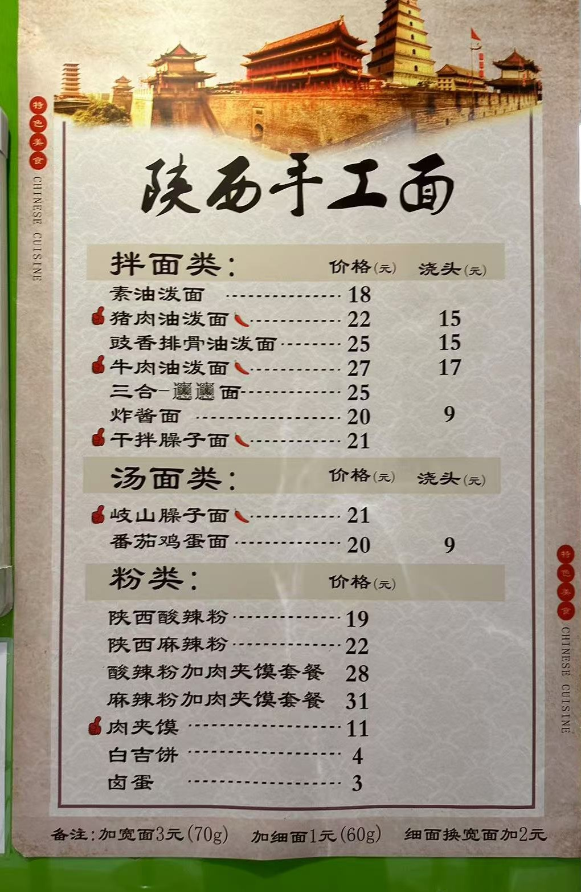
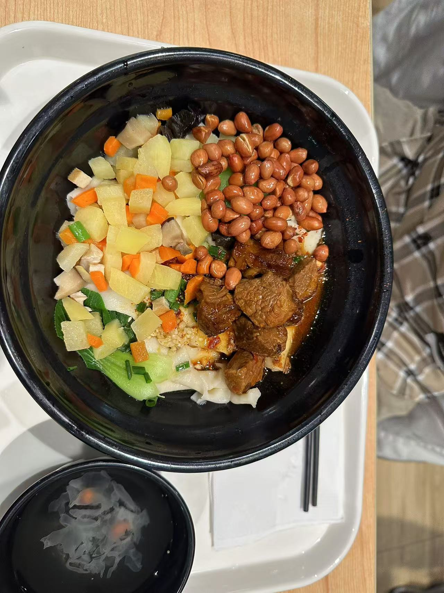
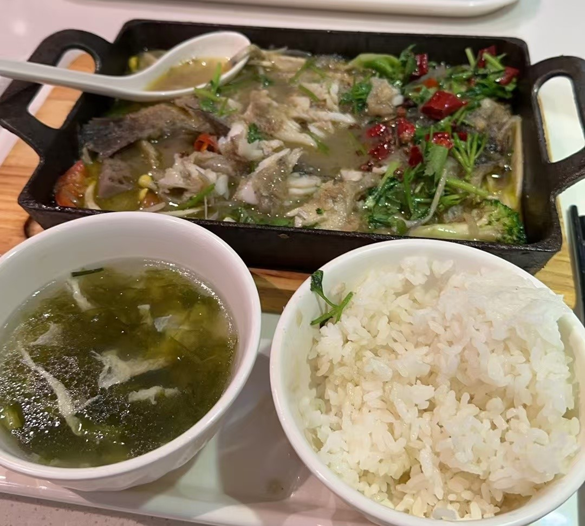
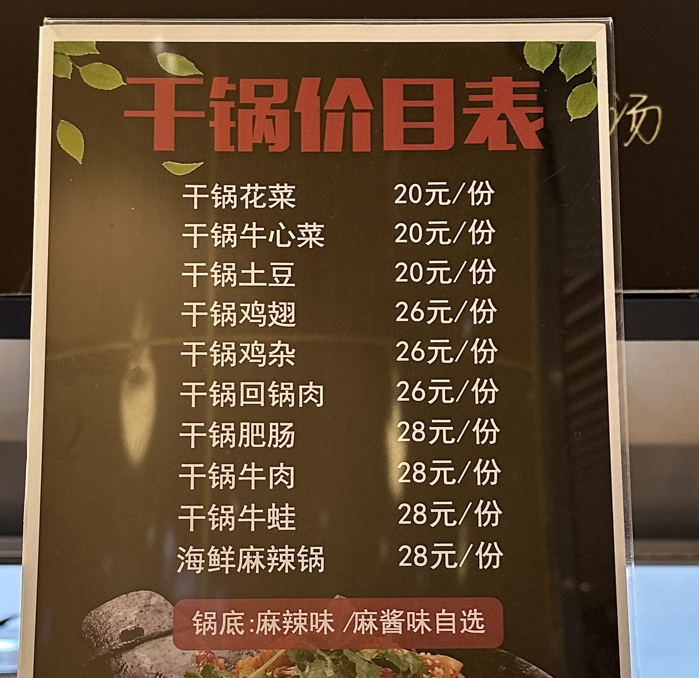
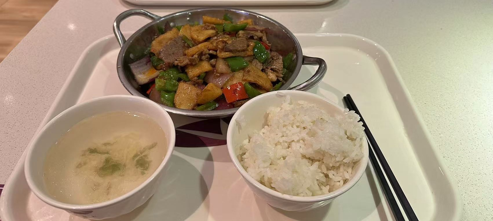
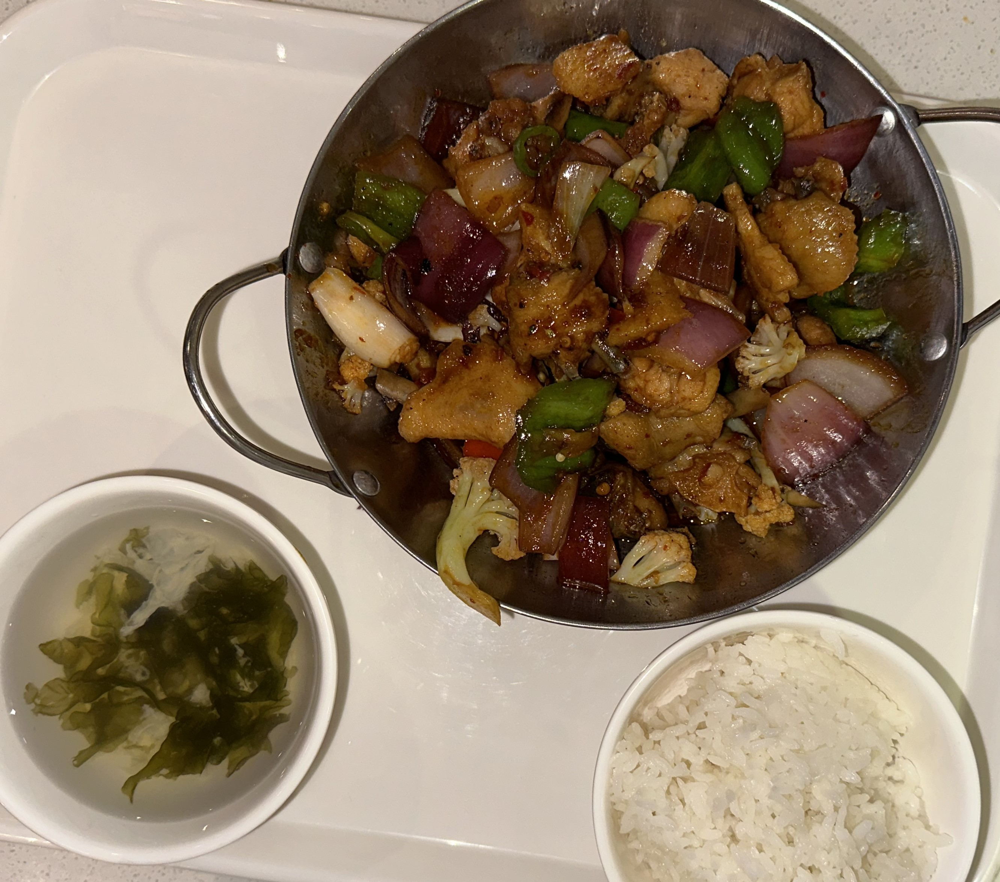
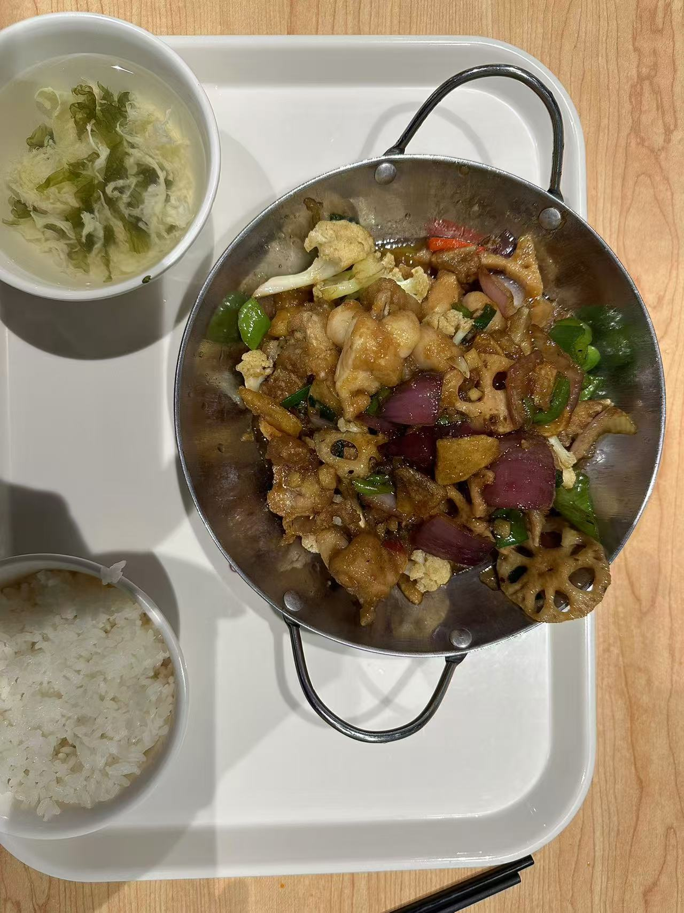
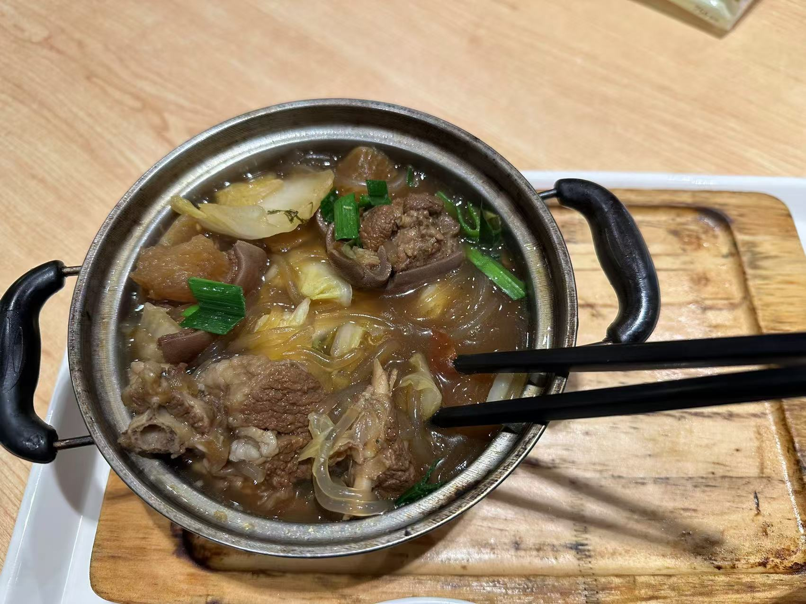
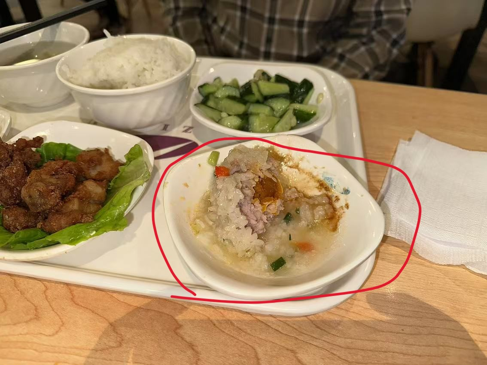

```
BriefIntroduction: 
这是我和同事jiuqi在紫竹第三餐厅吃饭总结出来的经验
```

<!-- split -->

# 紫竹第三餐厅必坑指南

详细地址：上海闵行区紫竹高新区——紫竹第三餐厅

笔者多次曾和同事jiuqi多次前往该餐厅吃饭，由此总结出的一些经验


# 面条

购买面条的具体位置如下：


面条菜单：



> [!note]
>
> 注意小黑板上会有额外的菜单


## 猪肉油泼面（宽面）


> [!note]
>
> 注意，宽面是由师傅现场拉面的，个人感觉味道更好
>
> 而细面则不是现场，而是现成的（感觉更像是在市场上面购买的）

## 牛肉油泼面

jiuqi 说味道还可以，但是相比于其价格 27 CNY， 还是猪肉油泼面更具性价比



> [!note]
>
> 注意其中的花生米是额外添加的，需要 2 CNY

## 臊子面（细面）

包括岐山臊子面和干拌臊子面，jiuqi老师和我吃过之后均不推荐

## 肉夹馍

jiuqi老师尝过之后不推荐：

肉馅是剁碎的猪肉肘子

# 盖浇饭

购买位置：


目前只推荐鸡排饭（18 CNY），实惠好吃，但是好吃的部分只有刚煎出来的鸡排

其他暂时没有尝试


# 烤鱼

烤鱼，强烈推荐，非常好吃

菜单


烤鱼分为3种：罗非鱼（28 CNY），黑鱼（32 CNY），鲈鱼（35 CNY）

青花椒烤鲈鱼



# 干锅

价目表：



## 牛肉干锅

有时候好吃，有时候不好吃吗，取决于配菜，有时候是蒜苔（我不喜欢），有时候是土豆洋葱青红椒，味道还可以的



## 鸡翅干锅

味道不错，鸡肉很新鲜，部位大多是鸡翅根，骨头比较多，比较咸



## 干锅牛蛙

感觉味道一般，不推荐，其中大块的牛蛙肉并不入味，相比于28 CNY的价格，还是不太划算的



# 砂锅

感觉味道都很一般，似乎都有粉丝？我是不太喜欢粉丝的。

## 羊肉砂锅

羊肉砂锅羊膻味太重，根本无法下嘴



# 快餐窗口

这个我也不知道叫做什么菜，jiuqi老师尝了之后大概是糯米包肉末包咸蛋黄，反正jiuqi老师给出的评价是不太好吃



