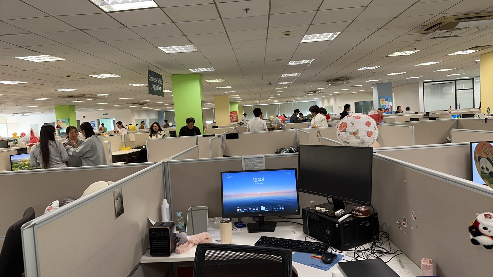
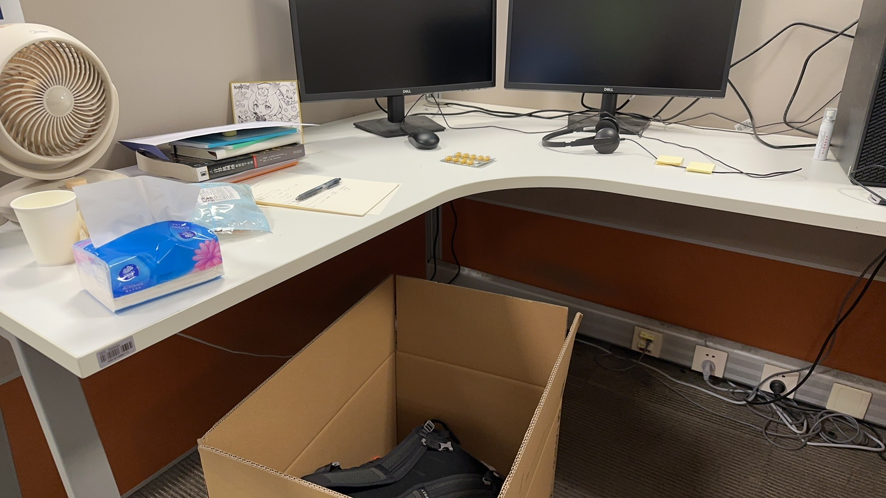

# 背景

2025-04-07 早上8:45 我比较要好的同事（后称sihao）还在拜托我让我帮忙打个卡，早上 9:30 我还作为 azure support egnineer 在内部的 case 系统按照上周公布的最新的 case 关闭流程，找 TA 确认关闭了一个 case，给我的客户发了 last email 关闭 case

早上9:40 我 leader 的 leader (至少在 teams 上的 organization 中是这样子显示的) 忽然让我们这一整层的所有人放下手上的工作，聚集起来宣布：项目解散了 … bababa (反正我只听到这个重点)

接着回到工位上的时候，我发现自己的账号已经无法在物理机上面登录了，报错显示账号过期

此时我还在我的工作还没有交接好，这电脑就登不上了，我还想要把我的傻逼客户骂一顿再走。

接着办公室就开始忙碌了起来，第一批开始谈赔偿的已经开始在 leader 的 leader 的办公室中了

而我也被这忽然的变化击中，不知道应该干什么？现在回想起来，其实当时我是不知所措，并且手在抖了

sihao 叫我下去拿杯咖啡冷静一下，物理机被锁，不知道该干什么的我，于是一起下去了，本来按照惯例，我会和 sihao 一遍等咖啡，一遍再公司门口聊会天，但是我告诉他可能 n+1 要谈到我了，于是急匆匆的回到办公室了。

此时第一批去谈 n+1 的同事已经有结果了，意外的没什么刁难的地方。稍微看了一眼他签的协议。

然后开始计算自己的 n+1 到底有多少，一开始算的还是税后的，后来经过别人提醒应该是算税前的，计算未休的年假可以换算多少钱，计算这个月未发的工资有多少，计算4月份干了几天，这几天有多少工资（公司发工资在下一月的10好，比如说 4.10 发 3 月份工资）

算完之后，就是等待了

等待轮到自己，找其他 team 的人聊天，因为我知道这是我和他们可以聊的最后一天了

。。。

被叫去谈 n+1，发现给的 n+1 仅仅比自己计算的少了600 CNY, 如果今天签字的话还可以多给2000 CNY 作为签字费，但是发现年假没有了，被告知我的年假是 -2 day, 我说我的年假还有3天，被告知今年的年假不能折现，只能折现去年未休完的年假（公司的年假是每年5天，1月1号，自动添加5天）4 月 22 号发放

个人感觉可以接受，于是就没有过多纠缠，就签字了

# 迷茫

当被告知项目取消，所有人都被干掉的那一刻，人是懵逼的，但是再知道大家都被干掉的那一刻，似乎也没有非常难过，因为这不仅仅是针对我，而是针对所有人

那一刻仿佛回到了上学的时候，放弃了思考，因为处于人群中，而且大家都是相同的处境。说实话当时就不应该放弃思考，将自己置身于人群重点。

一切奇怪的地方我都没有去置疑和思考

为什么这么突然？

为什么连平滑的业务交接都没有？

之前是否存在我没有注意的征兆？

# 割裂感

当收拾好东西，抱着箱子走在几乎无人的地铁上的时候，割裂感越发明显和强烈，仿佛这个世界是不真实的，真实的世界应该是我再工位上处理 case, 或者学习自己的东西，或者趴在桌子上睡觉

对面这种突如其来的割裂感，我只想要逃避现实。

但是逃避只能管用一段时间，到了晚上入睡的时候一直在回顾今天发生的事情，于是写下了之前的这些东西

## 4.8 找朋友回顾

找我的好朋友 sihao 做了关于昨天的回顾。

其实像这样子的事情，总结来说就是重大并且意料之外的。那么问题就变成了：如果发生了像这样子重大并且意料之外的事情，我应该如何应对呢？

像这样子的时间以后可能还会发生不止一次，比如说面对亲人的去世，等等

和 sihao 聊天的过程中，我渐渐发现自己的割裂感似乎没有那么的严重的，

- 去做令自己感到熟悉的事情，无论它是什么（就像我和 sihao 的讨论，因为在工作的时候，我也常常和 sihao 在空闲的时候会进行讨论和对话，比如说午饭时间和外出散步的时候）
- 之前的时间不要后悔
- 随着时间流逝，会慢慢的接受这一切

