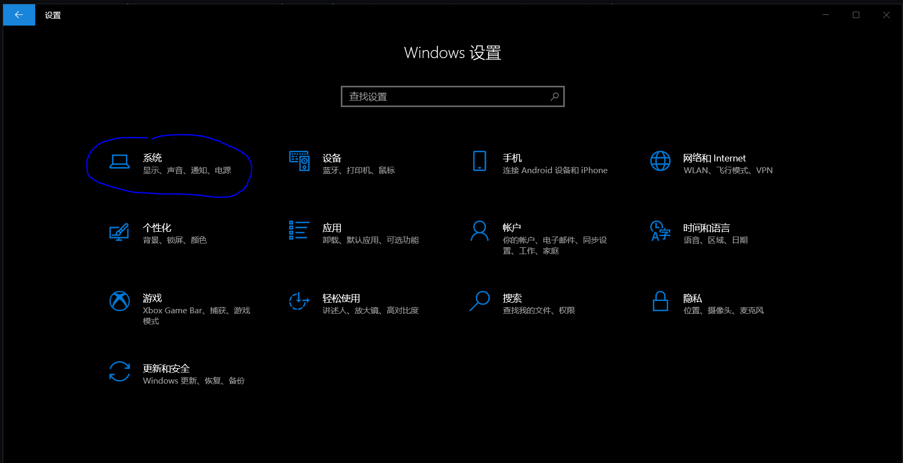
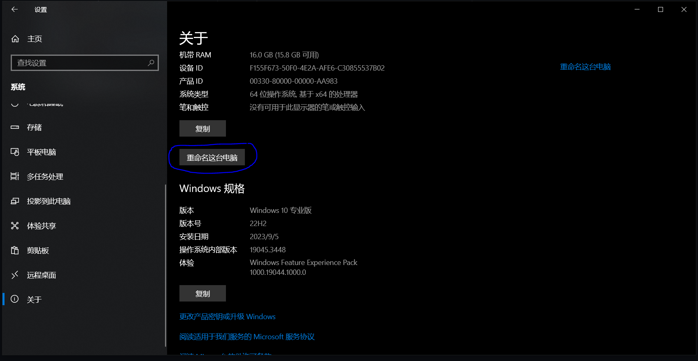
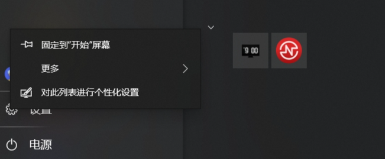
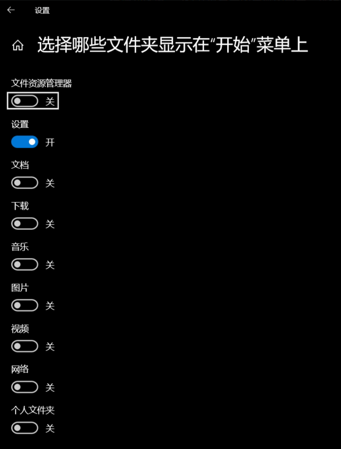
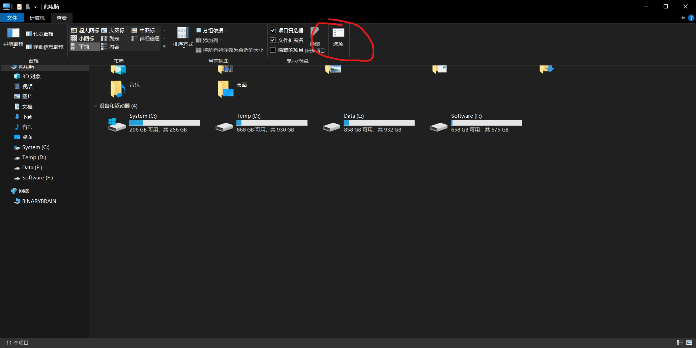
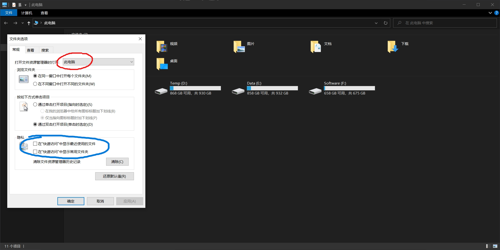

```
BriefIntroduction:
重装windows系统之后，需要进行的对原生态系统的一些设置。
```

<!-- split -->



# windows 10 setting

首先是系统的一些设定，这个参考B站视频[^Bilibili]

1. 修改主机名

   win+i快捷键打开系统设置，点击第一个系统，进入之后左边栏滑倒最下面的关于，可以看到有重命名这台电脑的选项

   

   

   重命名之后重启电脑即可

2. 重命名用户名

   参考这篇文章[windows - 更改用户账户名称（windows10）_windows改用户名_王佳斌的博客-CSDN博客](https://blog.csdn.net/weixin_44198965/article/details/115689689)

## 任务栏设置

找到windows最下面的任务栏，右键点击。取消显示你不想要的内容。我一般为下面这个样子


点击搜索(H)，我选择隐藏搜索图标（因为没什么用，我经常使用win+space来使用搜索的功能），点击资讯和兴趣(N)，我选择关闭. 点击最下面的任务栏设置(T)

在通知区域-->打开或者关闭系统图标中，选择自己想要保留的图标

在新闻和兴趣和人脉那一栏，选择关闭

关于左下角的应用，按照自己喜好来即可

## 系统设置

打开系统设置（win+I）

1. 删除应用

找到应用，删除自己不想要或者不喜欢的(一般来说，如果使用微软官方的的装机的话没有这么多额外的应用)

2. 隐私设置

进入隐私设置-->常规，关闭所有跟踪选项

关闭联系人，电话呼叫

在后台应用中关闭不常用的软件

3. 开始菜单设置

win键打开开始菜单，选择设置图标，右键设置个性化，可以选择那些图标在开始菜单上面



个人只保留设置选项



## 文件资源管理器设置

查看-->选项-->打开文件资源管理器时打开:此电脑



同时我会将快速访问中的显示常用文件夹和最近使用的文件给取消，同时取消在快速访问中的4个固定选项



左侧5个系统文件夹：视频，文档，下载，音乐，图片，修改他们的路径为E盘。

在E盘中创建5个同名的文件夹，然后选中左侧的视频，右键-->位置-->移动，选择刚才新建的同名文件夹

1. 关于快速访问

   我一般这样子使用，快速访问，在Data盘，创建1个常用的文件夹，比如“英语单词整理”，然后将其固定在快速访问中，然后在Data盘中隐藏掉，这样子可以保持简洁

   如上，我会将转移到Data盘的 下载、视频、图片、音乐给隐藏掉。这样子就可以通过侧边栏的此电脑直接访问，而不用进入Data盘查看。

# 默认应用

修改pdf文件默认为edge打开：[PDF默认用edge打开的修改方法_win10pdf老用edge打开-CSDN博客](https://blog.csdn.net/nofall_bird/article/details/138244710)

# 激活windows系统

[[微零微\]-Windows/Office全系列激活教程-KMS在线激活-KMS激活服务器-Windows11一句命令永久激活-Windows10一句命令永久激活 (jihuowin.com)](https://jihuowin.com/index.php)

参考这个链接

# 开机启动项

再这个路径中

```
C:\ProgramData\Microsoft\Windows\Start Menu\Programs\Startup
```

可以放置 windows 10 开机启动程序，可以自己写一些程序，并且创建快捷方式放到这里

# Reference

[^Bilibili]: [电脑到手后你应该立刻修改的设置！_哔哩哔哩_bilibili](https://www.bilibili.com/video/BV1am4y1R7pi/?spm_id_from=333.880.my_history.page.click&vd_source=617c4a2b4e326fc6b6269aada0d25986)
