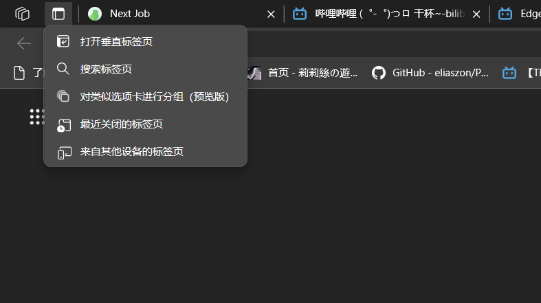
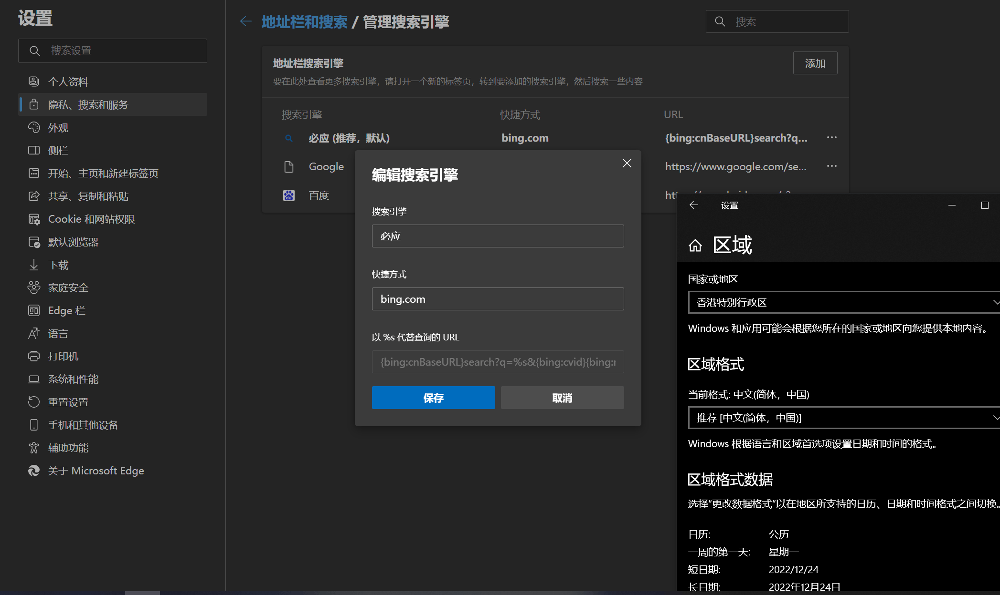
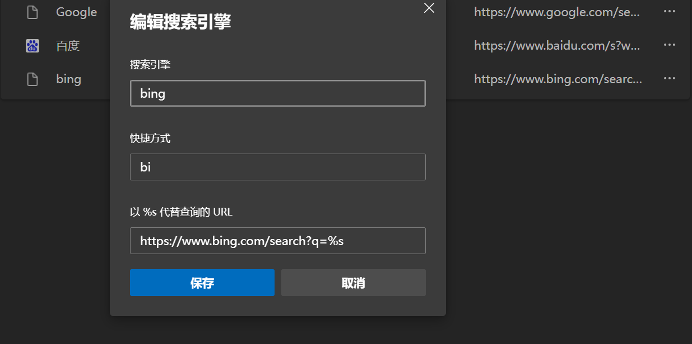
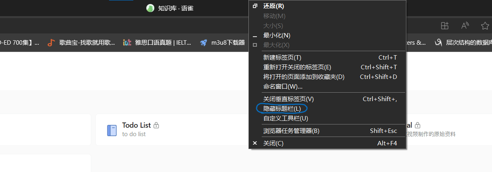
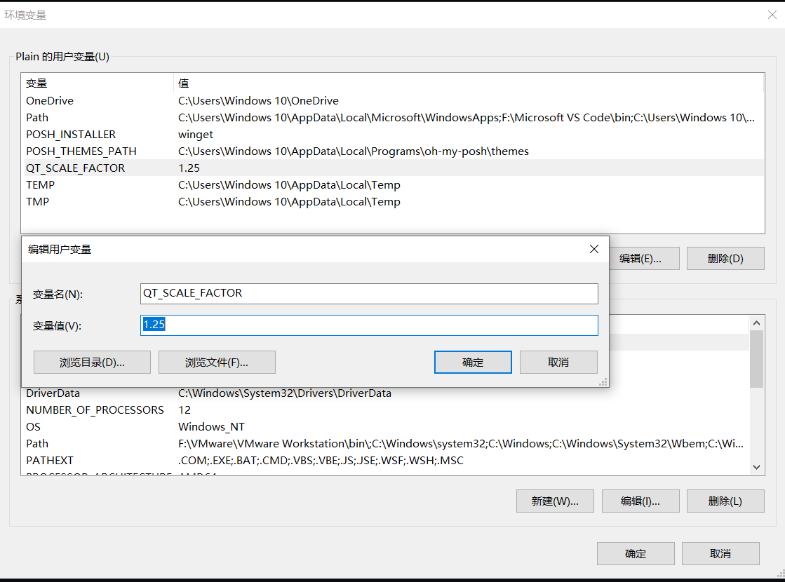
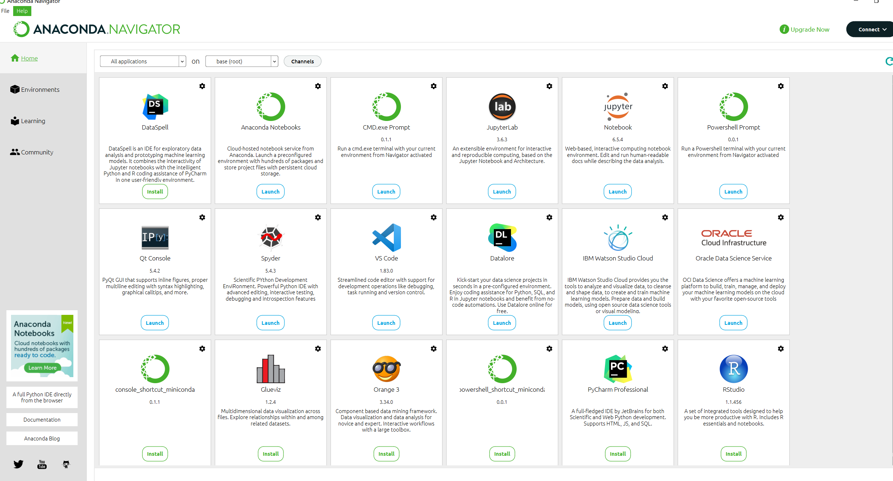

```
BriefIntroduction:
重装windows系统之后，在弄好了原生系统的设置之后，需要额外下载的一些软件，让系统使用起来更加的丝滑。个人更加的倾向于开源的软件。
```

<!-- split -->



# 写在前面

作者最近组装了一台电脑，为了使得电脑更好用，所以额外下载了一些软件。本文用于当作者需要重装系统之后，依然可以将电脑设置为自己原来喜欢的和熟悉的风格。同时也为一些同样有着相同需求的人，供参考。

# Windows Extra Software

本人目前正在使用的一些软件，使得windows系统更加的好用。

| Software name                | Description                                                  |
| ---------------------------- | ------------------------------------------------------------ |
| Clash-for-window             | 没有这个连chrome都下载不了                                   |
| Chrome Brower                | 蓝星最强浏览器，用于下载其他的软件                           |
| 7-zip                        | windows开源压缩，解压缩软件                                  |
| everything                   | 查找文件必备                                                 |
| Vmware-workstation           | 虚拟机软件 需要一台windows 10用玩galgame 一台Linux用于开发   |
| PotPlayer                    | 视频播放器                                                   |
| Foobar-2000                  | 音乐播放器                                                   |
| Motrix                       | 下载神器用于下载东西 资源做种 我为人人，人人为我             |
| Typora                       | markdown语法写作神器 我从免费的0.7版本开始使用 一路成为付费用户 |
| YACReader                    | 本地漫画查看神器 还可以创建本地漫画资料库                    |
| Visual Studio code (VS code) | 轻量级代码编辑器 无论是windows还是macos都非常的好用          |
| Anaconda 3                   | Python管理神器                                               |
| Steam                        | 娱乐神器                                                     |
| Windows terminal             | windows端优秀的终端工具，结合oh-my-posh以获得最佳体验        |
| Fliqlo                       | 桌面屏幕保护程序                                             |
| Mircosoft Todo List          | 设置每日任务                                                 |
| Koodo Reader                 | windows开源阅读软件                                          |

# Software Setting

## Edge Settings

设置目的：防止搜索内容跳转cn.bing.com，而是使用new bing

作为windows自带的浏览器，虽然有些时候不如Chrome，但是对平时的一些日常使用还是够了的.

首先是bing在搜索的时候，区域强制设置为中国，这样子就无法使用new bing等好用的AI工具了。

原因在于搜索栏的搜索引擎设置问题。进入edge 设置-->隐私、搜索和服务-->地址栏和搜索-->管理搜索引擎，如下图所示



修改查询URL即可（重新添加1个，并且设置为默认）



这样子就OK了，参考了这篇文章[^1]

1. 垂直标签页

   

2. 隐藏标题栏

   

3. 其他设置

   主页可以自己摸索其他的设置

## Fliqlo Setting

设置目的：使用全局快捷键启动桌面屏幕保护程序（注意无法在软件全屏模式生效）

### 方法一：将Fliqlo快捷方式固定在开始菜单上

1. 创建Fliqlo快捷方式，放到桌面
2. 打开开始菜单的文件夹。这个文件夹通常位于“C:\ProgramData\Microsoft\Windows\Start Menu\Programs”。将快捷方式拖入（需要管理权限）
3. 打开开始菜单栏，找到Fliqlo快捷方式，右键点击，固定到开始

### 方法二：直接创建桌面快捷方式，然后设置快捷键

1. 注意，这个方法不能隐藏桌面快捷方式，否则下次启动，快捷键将无法使用。这种方式会在桌面留下快捷方式，我更加喜欢简洁的桌面，于是这个方案就被我弃用了

## Anaconda 3 Settings

设置目的：解决anaconda 3 navigator 界面文字过小的问题

方法：在环境变量中添加QT_SCALE_FACTOR=1.25意味着，放大1.25倍。如下图所示。



最终显示效果如下 可以按照自己的喜好放大



注意，anaconda3 只会帮你注册一个python的环境变量，而不会注册python3环境变量

相比于直接安装python 3, 会同时帮助注册python, python3环境变量

可以在CMD（Administrator）创建一个符号链接来达到类似的效果

```cmd
mklink "F:\anaconda3\python3.exe" "F:\anaconda3\python.exe"
```

个人感觉这个而已经没有什么用了，自从使用了docker之后

## Windows Terminal优化

设置目的：美化终端，开启终端自带管理员权限

主要使用[oh-my-posh](https://ohmyposh.dev/)主题来优化windows terminal

然后的就是一些windows temrminal的美化和命令行补全[^2]

```josn
        "defaults": {
          // start transparent effect, set the transparency to 0.9
          "useAcrylic": true, 
          "acrylicOpacity": 0.9,
          "fontFace": "MesloLGM Nerd Font Mono",
          "fontSize": 14
        },
```

具体可以查看参考文献视频

然后是默认开启管理员权限，使用elevate属性，使其打开自动为管理员[^3]还有就是启动时默认从项目文件夹启动`E:\\Personal_Project`

json代码如下

```json
            {
                "commandline": "%SystemRoot%\\System32\\WindowsPowerShell\\v1.0\\powershell.exe",
                "guid": "{61c54bbd-c2c6-5271-96e7-009a87ff44bf}",
                "hidden": false,
                "name": "Windows PowerShell",
                // open the wt default as the administer
                "elevate": true,
                // set the default start directory
                "startingDirectory": "E://Personal_Project"
            }
```

## PotPlayer Setting

设置目的：使得播放器更加的好用。

这个软件能够设置的东西太多了，最重要的就是硬件解码（H/W，GPU解码）和软件解码（CPU解码）

具体看参考视频[^4]

# Visio

下载和激活：[Microsoft Visio 专业版 2019_visio 2019-CSDN博客](https://blog.csdn.net/milkhq/article/details/105714076)

# Reference

[^1]: [how to setting the edge search bar](https://answers.microsoft.com/zh-hans/microsoftedge/forum/all/edge使用必应搜/6637cc55-5366-4a01-adc3-fd5db4b666fd)
[^2]: [【教程】终端美化 Windows Terminal+oh-my-posh美化_哔哩哔哩_bilibili](https://www.bilibili.com/video/BV1Qa411T7Au/?spm_id_from=333.337.search-card.all.click&vd_source=617c4a2b4e326fc6b6269aada0d25986)
[^3]: [Windows Terminal打开管理员权限的PowerShell - Cyber-Cynic - 博客园 (cnblogs.com)](https://www.cnblogs.com/talentzemin/p/15930400.html)
[^4]:[能看电视，能摸鱼！超强播放器 PotPlayer 使用指南&技巧分享_哔哩哔哩_bilibili](https://www.bilibili.com/video/BV1Tx4y1X7Fh/?spm_id_from=333.337.search-card.all.click&vd_source=617c4a2b4e326fc6b6269aada0d25986)
