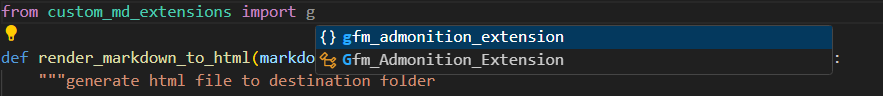

对于一个python package来说，必须要由 `__init__.py` 将一个目录识别为一个 python package

这个文件可以为空，但是这个样子的话呢，就得通过下面的方式来引入自己写的 class 或者  fucntion了 

比如说有这样子的包

```perl
custom_md_extensions/
├── __init__.py
└── gfm_admonition_extension.py
```

那么在和 custom_md_extensions 的同级别 py 文件就是

```python
from custom_md_extensions.gfm_admonition_extension import Gfm_Admonition_Extension
```

如果只有一个文件，那还好，一旦存在多个文件，这样子就非常的丑陋，比如说

```perl
custom_md_extensions/
├── __init__.py
├── gfm_admonition_extension.py
└── image_path_extension.py
```

就会使这样子

```python
from custom_md_extensions.gfm_admonition_extension import Gfm_Admonition_Extension
from custom_md_extensions.image_path_extension import Image_Path_Extension
```

为了更加优雅的解决这个问题，我么可以在 `__init__.py` 中这样子写

```python
# custom_md_extensions/__init__.py

from custom_md_extensions.gfm_admonition_extension import Gfm_Admonition_Extension
from custom_md_extensions.image_path_extension import Image_Path_Extension

__all__ = [
    "Gfm_Admonition_Extension",
    "Image_Path_Extension",
]
```

这里的 `__all__` 列表用于声明当使用 `from custom_md_extensions import *` 时导出的名称。当然，在实际项目中，通常直接使用明确导入更加推荐

然后就可以优雅的

```python
from custom_md_extensions import Gfm_Admonition_Extension, Image_Path_Extension
```


# 相对导入和绝对导入

关于导入方式的区别：

## 相对导入

```python
from ._gfm_admonition_extension import Gfm_Admonition_Extension
```

使用相对导入时，模块路径是相对于当前包而言的。这种方式更加简洁，而且当包的名称或位置改变时，不需要修改内部导入路径。因此，对于包内部模块之间的引用，推荐使用相对导入。

## 绝对导入

```python
from custom_md_extensions._gfm_admonition_extension import Gfm_Admonition_Extension
```

绝对导入需要写出完整的包名，这在包作为顶级模块使用时也可以工作。但如果包名发生变化，或者在不同的部署环境中，可能需要做更多的修改。


总的来说，在你开发自己的 Python 包时，建议在内部模块之间使用相对导入，这样代码更具可维护性和灵活性。


# 关于隐藏模块名称

会出现一个问题，那就是会同时显示 class 名称和模块名称



这样子容易造成混淆，解决方案是：

加上下划线（例如将文件名改为 **_gfm_admonition_extension.py**）是一种约定俗成的做法，用来表示该模块是私有的，不推荐直接导入使用。大多数 IDE（包括 VSCode）在自动补全时会优先展示公开的 API（也就是 **init**.py 中导出的名称），从而减少干扰。

## 模块名称

Python 中，每个 `.py` 文件都会被视为一个模块，而模块的默认名称就是该文件的名称（去掉 `.py` 后缀）。例如，文件 `gfm_admonition_extension.py` 的模块名称就是 `gfm_admonition_extension`。

不过需要注意以下几点：

- 包中的模块命名：如果模块位于一个包中，那么完整的模块名称通常会包括包名。例如，如果包名为 `custom_md_extensions`，则模块的完整名称是 `custom_md_extensions.gfm_admonition_extension`。这意味着在导入时可以用绝对导入的方式：

  ```python
  from custom_md_extensions.gfm_admonition_extension import Gfm_Admonition_Extension
  ```

- init.py 的特殊性：包中的 `__init__.py` 文件并不直接以 `__init__` 作为模块名称，而是用来初始化包本身。换句话说，包的名称就等于文件夹名称，`__init__.py` 中的内容会直接构成包的命名空间。

- 命名约定：如果你希望某些模块仅用于包的内部实现，而不希望用户直接引用，可以在文件名前加下划线（例如 `_gfm_admonition_extension.py`）。这是一种约定俗成的做法，表明该模块是私有的，同时大多数 IDE（如 VSCode）在自动补全时会优先展示公开的接口。

总的来说，模块名称默认确实就是包里对应的文件名（去掉 `.py`），但在实际使用中你需要考虑包的层次结构以及如何更好地隐藏内部实现。
