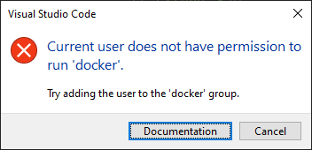
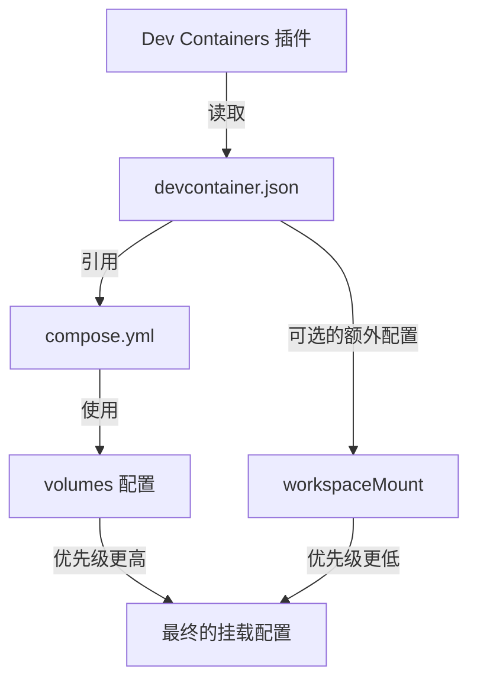

reference: [Get started with development Containers in Visual Studio Code](https://code.visualstudio.com/docs/devcontainers/tutorial)

首先需要创建一个 `.devcontainer` 文件夹，然后再这个文件夹下创建一个 `devcontainer.json` 文件

然后按下 `Ctrl+Shift+P`（或 `Cmd+Shift+P`），选择 **"Dev Containers: Reopen in Container"**

但是这会遇到一个VScode 报错：



这是点击 Document 来到这个文档 [Post-installation steps | Docker Docs](https://docs.docker.com/engine/install/linux-postinstall/) 包含解决方案

这是一个常见的 Docker 权限问题。在 Linux 系统中，Docker 守护进程默认绑定到一个 Unix socket，该 socket 归属于 root 用户和 docker 组。因此，要在不使用 sudo 的情况下运行 docker 命令，需要将用户添加到 docker 组。

按照文档的步骤，您需要执行以下操作：

1. 首先，创建 docker 组（如果还没有的话）：
```bash
sudo groupadd docker
```

2. 将您的用户添加到 docker 组：
```bash
sudo usermod -aG docker $USER
```

3. 注销并重新登录以使更改生效。如果您是通过 SSH 连接的：
```bash
exit
```
然后重新 SSH 登录。

4. 验证您可以不使用 sudo 运行 docker 命令：
```bash
docker run hello-world
```

如果您不想立即注销重新登录，可以运行以下命令来立即应用组更改：
```bash
newgrp docker
```

注意事项：
1. 将用户添加到 docker 组本质上是授予该用户 root 权限，因为他们可以使用 docker 命令来挂载任何目录并修改系统文件。
2. 如果您是在生产环境中，请确保了解这样做的安全影响。
3. 如果您是在共享服务器上，最好先咨询系统管理员。

完成这些步骤后，您应该就可以在 VS Code 中正常使用 Dev Containers 功能了，而不会遇到权限错误。


# 关于 `customizations`

让我详细解释这个配置文件的每个部分：

1. **竖线问题**：
你看到的两条竖线是由 `"editor.rulers": [80, 100]` 这行配置造成的。这些竖线是代码长度标尺，用于提示代码行长度：
- 在第80列显示一条竖线
- 在第100列显示另一条竖线
这是一种编码规范辅助工具，帮助开发者控制代码行长度。如果你觉得不需要，可以删除这行配置。

2. **详细配置解释**：

```jsonc
"customizations": {
    "vscode": {
        // 扩展部分
        "extensions": [
            "ms-python.python",          // Python 语言的基础支持，提供运行、调试等功能
            "ms-python.vscode-pylance",  // Python 的高级语言服务器，提供更好的代码补全和类型检查
            "ms-python.black-formatter", // Black 代码格式化工具的 VSCode 插件
            "ms-azuretools.vscode-docker" // Docker 相关功能支持
        ],

        // VSCode 设置
        "settings": {
            // 指定 Python 解释器路径
            "python.defaultInterpreterPath": "/usr/local/bin/python",
            
            // 启用代码检查
            "python.linting.enabled": true,
            
            // 启用 Flake8 检查器
            "python.linting.flake8Enabled": true,
            
            // 设置默认的代码格式化工具为 Black
            "python.formatting.provider": "black",
            
            // 保存文件时自动格式化
            "editor.formatOnSave": true,
            
            // 在第 80 和 100 列显示垂直标尺线
            "editor.rulers": [80, 100],
            
            // Python 文件特定设置
            "[python]": {
                // 设置 Python 文件的默认格式化工具
                "editor.defaultFormatter": "ms-python.python",
                // 保存 Python 文件时自动格式化
                "editor.formatOnSave": true
            }
        }
    }
}
```

3. **效果说明**：

这些设置会产生以下效果：
- 自动安装所有列出的 VSCode 扩展
- 在编辑器中显示两条垂直标尺线（80和100列）
- 当你保存 Python 文件时：
  - 代码会被 Black 自动格式化
  - 文件会被 Flake8 检查代码质量
- Python 语言支持：
  - 智能代码补全
  - 类型检查
  - 代码导航
  - 实时错误检测

如果你想移除竖线，只需要删除或注释掉这行：
```jsonc
// "editor.rulers": [80, 100],
```

然后使用 `Dev Containers: Rebuild Container` 命令重建容器即可。

这些配置主要目的是提供一个标准化的 Python 开发环境，确保代码质量和一致性。但是你可以根据个人喜好调整这些设置。

# 关于 dev container 自动挂载

Dev Containers 会自动将工作区目录挂载到容器中，默认挂载点是 `/workspaces/${workspaceFolderBasename}`

即使有自动挂载，建议还是在 compose.yml 中显式定义挂载，原因是：

1. **清晰性**：明确的配置更容易理解和维护
2. **一致性**：确保开发和生产环境的行为一致
3. **可控性**：可以精确控制哪些文件/目录被挂载
4. **避免混淆**：防止自动挂载和手动配置的冲突

Dev Containers 会自动识别并使用 compose.yml 中定义的挂载配置！

1. **配置优先级**：
   - 当你在 devcontainer.json 中指定了 `dockerComposeFile`，Dev Containers 会优先使用 compose.yml 的配置
   - compose.yml 中的挂载配置会被自动继承和使用
   - 如果同时在 devcontainer.json 和 compose.yml 中定义了挂载，compose.yml 的配置会优先生效

2. **工作流程**：


3. **为什么推荐在 compose.yml 中配置挂载**：
   - **可移植性**：compose.yml 是标准的 Docker Compose 配置，可以在不使用 VS Code 的情况下使用
   - **一致性**：确保无论是通过 Dev Containers 还是直接使用 docker-compose 都有相同的行为
   - **清晰性**：所有 Docker 相关的配置都集中在 Docker 相关的文件中
   - **团队协作**：其他开发者即使不使用 VS Code，也能正确运行项目

4. **配置示例**：
```yaml
# compose.yml
services:
  web:
    build:
      context: .
      dockerfile: Dockerfile
    volumes:
      - ./src:/app/src
      - ./static:/app/static
```

```json
// devcontainer.json
{
    "name": "Flask-Container",
    "dockerComposeFile": "../compose.yml",
    "service": "web",
    "workspaceFolder": "/app"
    // 不需要额外的 workspaceMount 配置
}
```

5. **验证方法**：
你可以通过以下步骤验证配置是否生效：
```bash
# 在容器内运行
ls -la /app/src    # 应该能看到你的源代码
ls -la /app/static # 应该能看到静态文件

# 或者使用 docker compose 命令查看挂载
docker compose ps
docker compose exec web mount | grep "/app"
```

所以总结一下：

在 compose.yml 中配置挂载是推荐的做法

Dev Containers 会自动识别并使用这些配置

不需要在 devcontainer.json 中重复配置挂载

这种方式不仅使配置更加清晰，而且能确保在不同环境下（VS Code、命令行、CI/CD）都有一致的行为。