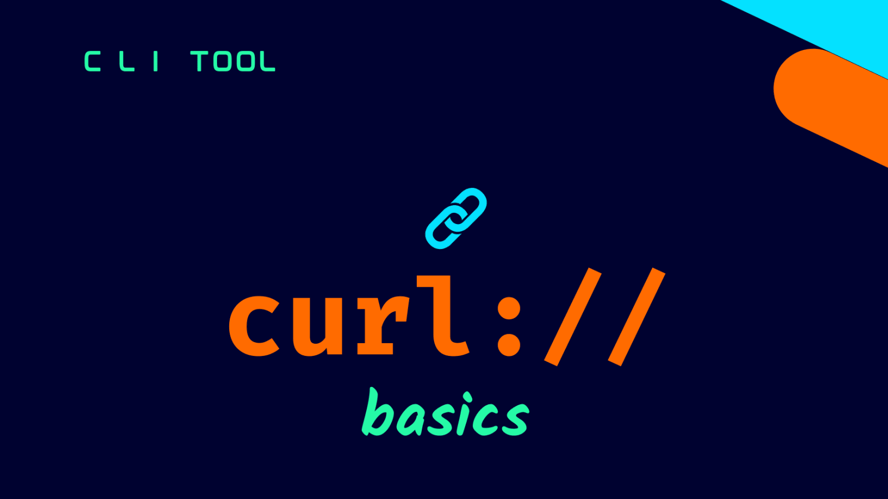

```
BriefIntroduction: 
curl 命令详解
```

<!-- split -->



# Before we begin

在当 Azure support enginner 的时候，会遇到 Azure Applicaiton Gateway (APG), Azure Front Door (AFD) 等产品，当然主要是这2个，总是会使用到 curl 命令来测试网站连通性等，于是专门研究了一下 curl 命令，在此记录

# curl 命令

我最常用的方式和参数是 `-i -v` 因为这样子可以看到所有的重要信息 for example

```bash
curl -i -v https://www.google.com:443
```

```bash
* Trying 209.85.203.104:443...
* TCP_NODELAY set
* Connected to www.google.com (209.85.203.104) port 443 (#0)
* ALPN, offering h2
* ALPN, offering http/1.1
* successfully set certificate verify locations:
*   CAfile: /etc/ssl/certs/ca-certificates.crt
  CApath: /etc/ssl/certs
* TLSv1.3 (OUT), TLS handshake, Client hello (1):
* TLSv1.3 (IN), TLS handshake, Server hello (2):
* TLSv1.3 (IN), TLS handshake, Encrypted Extensions (8):
* TLSv1.3 (IN), TLS handshake, Certificate (11):
* TLSv1.3 (IN), TLS handshake, CERT verify (15):
* TLSv1.3 (IN), TLS handshake, Finished (20):
* TLSv1.3 (OUT), TLS change cipher, Change cipher spec (1):
* TLSv1.3 (OUT), TLS handshake, Finished (20):
* SSL connection using TLSv1.3 / TLS_AES_256_GCM_SHA384
* ALPN, server accepted to use h2
* Server certificate:
*  subject: CN=www.google.com
*  start date: Oct 21 08:38:45 2024 GMT
*  expire date: Jan 13 08:38:44 2025 GMT
*  subjectAltName: host "www.google.com" matched cert's "www.google.com"
*  issuer: C=US; O=Google Trust Services; CN=WR2
*  SSL certificate verify ok.
* Using HTTP2, server supports multi-use
* Connection state changed (HTTP/2 confirmed)
* Copying HTTP/2 data in stream buffer to connection buffer after upgrade: len=0
* Using Stream ID: 1 (easy handle 0x564c4348b0e0)
> GET / HTTP/2
> Host: www.google.com
> user-agent: curl/7.68.0
> accept: */*
>
* TLSv1.3 (IN), TLS handshake, Newsession Ticket (4):
* TLSv1.3 (IN), TLS handshake, Newsession Ticket (4):
* old SSL session ID is stale, removing
* Connection state changed (MAX_CONCURRENT_STREAMS == 100)!
< HTTP/2 200
HTTP/2 200
```

# Output输出分析

## 初始链接

### 1. 初始连接阶段
```bash
* Trying 209.85.203.104:443...
* TCP_NODELAY set
* Connected to www.google.com (209.85.203.104) port 443 (#0)
```
- 首先尝试连接Google的IP地址（209.85.203.104）的443端口（HTTPS默认端口）
- TCP_NODELAY被设置，这是一个TCP选项，用于禁用Nagle算法
- 成功建立TCP连接

### 2. ALPN（应用层协议协商）
```bash
* ALPN, offering h2
* ALPN, offering http/1.1
```
- 客户端告诉服务器它支持的协议：HTTP/2 (h2)和HTTP/1.1
- ALPN是TLS的扩展，允许客户端和服务器在握手期间协商应用层协议

### 3. SSL证书配置
```bash
* successfully set certificate verify locations:
*   CAfile: /etc/ssl/certs/ca-certificates.crt
  CApath: /etc/ssl/certs
```
- curl使用系统的CA证书存储来验证服务器证书
- 指定了证书文件和证书目录的位置

## TLS握手过程
```bash
* TLSv1.3 (OUT), TLS handshake, Client hello (1):
* TLSv1.3 (IN), TLS handshake, Server hello (2):
* TLSv1.3 (IN), TLS handshake, Encrypted Extensions (8):
* TLSv1.3 (IN), TLS handshake, Certificate (11):
* TLSv1.3 (IN), TLS handshake, CERT verify (15):
* TLSv1.3 (IN), TLS handshake, Finished (20):
* TLSv1.3 (OUT), TLS change cipher, Change cipher spec (1):
* TLSv1.3 (OUT), TLS handshake, Finished (20):
```

### `(OUT)` 和 `(IN)` 

- `OUT`：表示数据从客户端发出（outgoing）
- `IN`：表示数据从服务器接收（incoming）

### Message Type

括号中的数字是TLS协议中定义的 Message Type 在TLS协议中，消息被分为不同的协议类型（Content Type），每种类型下又有各自的消息类型（Message Type）。主要有以下几种协议类型：

```
TLS Protocol
├── Handshake Protocol (22)
│   ├── Client Hello (1)
│   ├── Server Hello (2)
│   ├── Certificate (11)
│   ├── Certificate Verify (15)
│   ├── Finished (20)
│   └── ...
├── Change Cipher Spec Protocol (20)
│   └── Change Cipher Spec (1)
├── Alert Protocol (21)
└── Application Data Protocol (23)
```

所以在输出中看到的，这里的 (1) 是在 Handshake Protocol 下的消息类型
```bash
* TLSv1.3 (OUT), TLS handshake, Client hello (1):
```
而下面的 (1) 是在 Change Cipher Spec Protocol 下的消息类型

```bash
* TLSv1.3 (OUT), TLS change cipher, Change cipher spec (1):
```
这就像在不同的命名空间中，可以使用相同的编号，因为它们属于不同的上下文。就像在不同的文件夹中可以有相同名称的文件一样。

> [!note]
>
> 在TLS 1.3中，Change Cipher Spec消息实际上已经成为了一个历史遗留消息，它在新版本中不再具有实际的密码学意义，但为了兼容性仍然保留着。这也是为什么在TLS 1.3的握手过程中，你仍然可以看到这个消息，尽管它在技术上已经不是必需的了。

### 完整握手流程解析

```
客户端 (Client)                                服务器 (Server)
   |                                                |
   |-------(OUT) Client Hello (1)------------------>|
   |                                               	|
   |<------(IN) Server Hello (2)--------------------|
   |<------(IN) Encrypted Extensions (8)------------|
   |<------(IN) Certificate (11)--------------------|
   |<------(IN) Certificate Verify (15)-------------|
   |<------(IN) Finished (20)-----------------------|
   |                                               	|
   |-------(OUT) Change Cipher Spec (1)------------>|
   |-------(OUT) Finished (20)--------------------->|

```

每个步骤的详细说明：
- `Client Hello (1)`：客户端发起握手，发送支持的TLS版本、加密套件、随机数等
- `Server Hello (2)`：服务器响应，选择TLS版本和加密套件
- `Encrypted Extensions (8)`：服务器发送加密的扩展信息
- `Certificate (11)`：服务器发送其数字证书
- `Certificate Verify (15)`：服务器证明它拥有证书对应的私钥
- `Finished (20)`：双方都发送Finished消息，确认握手完成
- `Change Cipher Spec (1)`：通知对方后续将使用协商好的加密参数

这个过程确保了：
1. 双方协商使用的加密算法
2. 验证服务器身份
3. 建立安全的会话密钥
4. 保护后续通信的安全

> [!note]
>
> 在TLS 1.3中，相比早期版本，握手过程被优化，减少了往返次数，提高了性能和安全性。整个过程中的大部分消息都是从服务器发往客户端（IN），客户端主要发送开始和结束的消息（OUT）

### SSL连接信息
```bash
* SSL connection using TLSv1.3 / TLS_AES_256_GCM_SHA384
* ALPN, server accepted to use h2
```
- 使用TLS 1.3协议
- 使用TLS_AES_256_GCM_SHA384加密套件
- 服务器同意使用HTTP/2(h2)协议

## server certificate
```bash
* Server certificate:
*  subject: CN=www.google.com
*  start date: Oct 21 08:38:45 2024 GMT
*  expire date: Jan 13 08:38:44 2025 GMT
*  subjectAltName: host "www.google.com" matched cert's "www.google.com"
*  issuer: C=US; O=Google Trust Services; CN=WR2
*  SSL certificate verify ok.
```
### Subject（证书主体）

Subject 表示证书所有者的身份信息，使用DN（Distinguished Name）格式，可以包含以下字段：
- `CN`（Common Name）：通用名称，通常是网站域名或服务器名称
- `O`（Organization）：组织名称
- `OU`（Organizational Unit）：组织单位
- `L`（Locality）：城市或地区
- `ST`（State）：州或省份
- `C`（Country）：国家代码（两字母）
- `E`（Email）：电子邮件地址

所以这里的 `CN=www.google.com` 中，表示这个证书是颁发给 www.google.com 这个域名的
### Subject Alternative Name
```bash
subjectAltName: host "www.google.com" matched cert's "www.google.com"
```
- `host "www.google.com"`：表示我们正在访问的主机名
- `matched cert's "www.google.com"`：表示这个主机名匹配了证书中 SAN 列表中的某个值

现代浏览器主要使用 SAN 而不是 CN 来验证域名，可以包含：

- DNS 名称
- IP 地址
- 电子邮件地址
- URI

例如，一个证书的 SAN 可能包含：
```
DNS:www.google.com
DNS:*.google.com
DNS:google.com
```

### Issuer
```bash
issuer: C=US; O=Google Trust Services; CN=WR2
```
这里每个字段的含义是：
- `C=US`：Country（国家）= 美国
- `O=Google Trust Services`：Organization（组织）= Google Trust Services
- `CN=WR2`：Common Name（通用名称）= WR2（这是证书颁发机构的系统名称）

所以这表示：
- 证书是由位于美国的
- 组织是 Google Trust Services
- 具体的颁发系统是 WR2

这种层级结构帮助建立了信任链：
```
Root CA（根证书颁发机构）
    ↓
Intermediate CA（中间证书颁发机构：Google Trust Services）
    ↓
End-entity Certificate（终端证书：www.google.com）
```

一个更完整的证书主体示例可能是这样的：
```
Subject: 
    CN = www.example.com
    O = Example Corporation
    OU = IT Department
    L = San Francisco
    ST = California
    C = US
    E = admin@example.com
```

这种层级化的命名结构确保了证书信息的完整性和唯一性，使得证书能够准确地标识其所有者和颁发者。

### HTTP/2协议建立
```bash
* Using HTTP2, server supports multi-use
* Connection state changed (HTTP/2 confirmed)
* Copying HTTP/2 data in stream buffer to connection buffer after upgrade: len=0
* Using Stream ID: 1 (easy handle 0x564c4348b0e0)
```
- 确认使用HTTP/2协议
- 建立HTTP/2流
- 分配流ID为1

### HTTP请求头
```bash
> GET / HTTP/2
> Host: www.google.com
> user-agent: curl/7.68.0
> accept: */*
```
- 发送GET请求
- 包含基本的HTTP头信息

### 会话票证和响应
```bash
* TLSv1.3 (IN), TLS handshake, Newsession Ticket (4):
* TLSv1.3 (IN), TLS handshake, Newsession Ticket (4):
* old SSL session ID is stale, removing
* Connection state changed (MAX_CONCURRENT_STREAMS == 100)!
< HTTP/2 200
HTTP/2 200
```
- 接收新的会话票证（用于TLS会话恢复）
- 设置最大并发流为100
- 服务器返回200状态码，表示请求成功

这个输出展示了一个完整的HTTPS请求过程，包括：
1. TCP连接建立
2. TLS握手
3. 证书验证
4. HTTP/2协议协商
5. 请求发送和响应接收

通过`-v`参数，我们可以看到所有这些底层细节，这对于调试HTTPS连接问题特别有用。