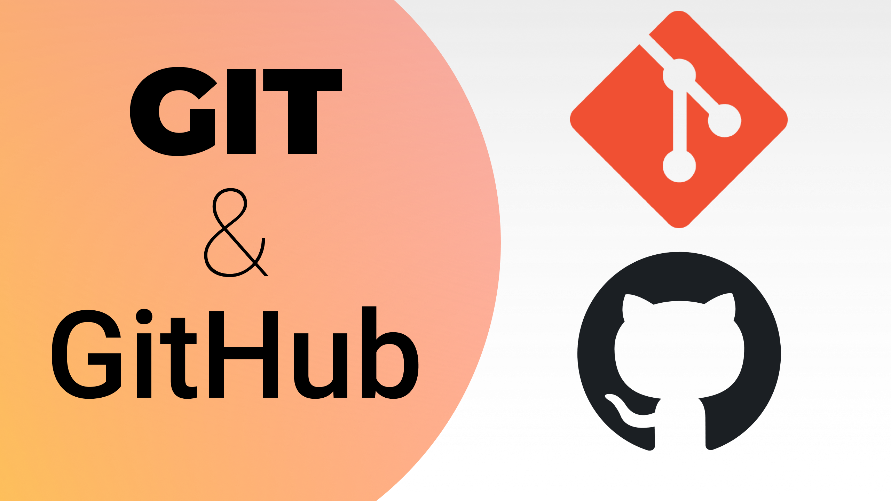
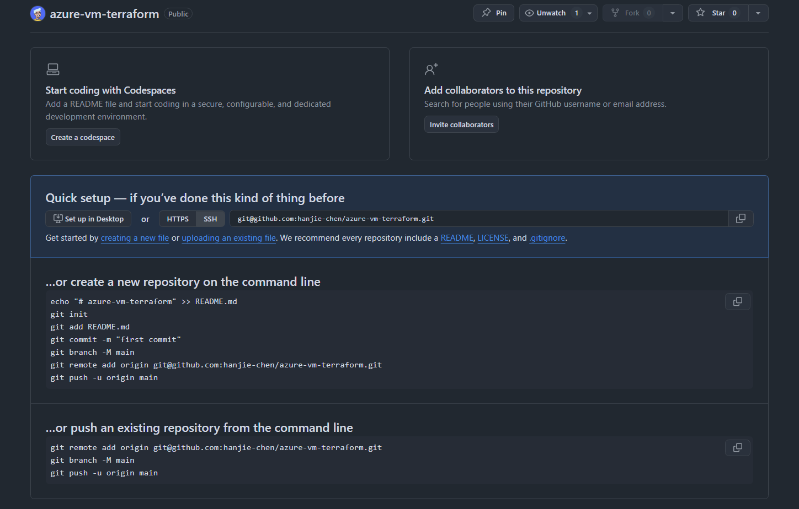

```
BriefIntroduction: 
本人总结的git速查指南，一般来说是遇到问题 --> 问Sonnet3.5 --> 解决问题 --> 记录在这里
虽然有很多其他的 git 资料，但是自从LLM出现之后，我遇到问题一般直接提问LLM，爽的一批
```

<!-- split -->



# Title: Git 速查指南

当在 github 上面新建完成一个仓库之后，github 会提示你如何进行下一步操作。而我们需要做的部分就是根据仓库给出的提示，初始化本地仓库，并且完成第一次推送



# Basic Command

## `git add`

当然我一般直接使用 `git add .` 全都提交，这个命令的作用是将修改过的文件添加到暂存区（staging area）。

## `git commit`

```shell
git commit -m "add your specification of this commit"
```

完整的 `git commit` 命令，必须要填写这次提交的信息

每次提交都会记录下谁在什么时间做了什么更改，并允许你回到这个状态或者比较不同提交之间的差异。`git commit` 命令实际上创建了一个快照，它包含了暂存区中所有文件的一个特定状态。

配置提交者的名字和 email

```shell
git config --global user.name "Your Name"
git config --global user.email "your.email@example.com"
```

## `git push`

将本地内容推送到 github 上面同步

### new branch push

如果是新建了一个分支（远程仓库上也没有这个分支），并且是第一次推送这个分支到远程仓库，需要带上参数

```shell
git push -u origin <branch_name>
```

这种情况下如果不带参数直接 git push 那么通常会失败，这是因为 Git 不知道你要怎么处理远程分支：

- 本地分支刚刚创建，没有对应的远程同名分支
- Git 不清楚应将此本地分支关联到哪个远程分支

之后的推送，就可以简单地用 `git push` 就行。

## `git pull`

和git push对应的命令，就是 git pull, 这个命令从github remote repository上面拉取最新的仓库情况同步到本地仓库。

比如说我在多台机器上面同时进行开发，在Azure VM上面，在本地机器上面，在Macbook Pro笔记本上面进行开发，如果在一台机器上git push了最新的情况，其他机器就需要git pull以保持最新的情况

需要注意的是，在Git中,每个分支都有自己独立的提交历史。当你在一个分支上执行 `git pull` 命令时,只会更新当前所在的分支,其他分支不会受到影响。因此,如果你想让每个分支都保持最新状态,需要在每个分支上分别执行 `git pull` 命令。

## `git add + git commit`

对于已被跟踪的文件: 如果这些文件只是进行了修改，而没有新文件需要添加，那么可以直接使用 `git commit -a -m "message"` 来提交这些更改。这个命令会自动将所有已被跟踪文件的修改提交，而不需要先手动 `git add` 它们。

对于新文件: 需要使用 `git add` 将它们添加到暂存区，因为 Git 默认只跟踪已经添加到版本控制中的文件。新文件在被跟踪之前，必须先通过 `git add` 命令添加。这种情况我们可以使用下面的命令

```bash
git add . && git commit -m "message"
```

## `git status`

可以查看目前仓库的状态

# git branch manage

当你想要基于当前的版本开发下一个版本，或者存粹是希望不想要污染现在已经开发好的版本，可以基于现在已有的代码开启一条新的分支，继续开发

比如说我现在以及把前端开发好了，想要开发后端，可以创建一条新的分支，并且切换到这个分支。可以使用命令

```shell
git checkout -b <branch-name>
```

或者，你已经做了一大堆修改了，但是意识到你需要对这些修改新开一个分支，幸运的是你还没有对修改进行 `git add` 这个时候同样也可以使用这个命令，而这些未提交的修改跟随工作目录一起切换到新分支


## `git checkout` 命令详解

`git checkout` 这是 Git 的一个子命令, 通常用于切换分支

### `git checkout <branch-name>`

这个命令会首先查找名为 `branch-name` 的本地分支, 如果找到了, 就切换到这个分支。

如果没有找到本地分支, 它会查找名为 `branch-name` 的远程分支, 如果找到了, 就创建一个同名的本地分支并建立跟踪关系, 然后切换到这个新的本地分支。

e.g.

```shell
➜ git branch
* main
➜ git branch -r
  origin/HEAD -> origin/main
  origin/backend-development
  origin/main
➜ git checkout backend-development
Switched to a new branch 'backend-development'
branch 'backend-development' set up to track 'origin/backend-development'.
```

### `git checkout -b <branch-name>`

创建新分支, 然后立即切换到这个新创建的分支（如果该分支已经存在, Git 会报错）

这个命令实际上是 `git branch branch-name` 和 `git checkout branch-name` 的简写。

新创建的分支会基于当前所在的分支。例如, 如果你当前在 `main` 分支, 那么新分支 `branch-name` 就会基于 `main` 分支创建。

> [!note]
>
> 当你使用 `git clone` 命令克隆一个远程仓库时, Git 会将远程仓库的所有数据都复制到你的本地机器上, 包括所有的分支和提交历史。这意味着, 在克隆完成后, 你的本地仓库将包含与远程仓库完全相同的数据
>
> 然而, 虽然所有的分支都被克隆到了本地, 但 Git 默认只会 "检出(checkout)" 远程仓库的默认分支(通常是 `main` 或 `master`)。"检出" 的意思是, Git 会将这个分支的文件放到你的工作目录中, 让你可以直接在这些文件上工作
>
> 所以, 当你在克隆后运行 `git branch` 命令时, 你只会看到 `main` 分支, 因为这是唯一被 "检出" 的分支。但是, 如果你运行 `git branch -r`, 你会看到所有的远程分支, 因为它们都已经被克隆到本地了

## check branch - `git branch`

`git branch` 查看本地分支

```shell
➜ git branch
* main
```

`git branch -r` 查看远程分支

```shell
➜ git branch -r
  origin/HEAD -> origin/main
  origin/backend-development
  origin/main
```

`git branch -a` 查看所有分支（本地和远程）

```shell
➜ git branch -a
* main
  remotes/origin/HEAD -> origin/main
  remotes/origin/backend-development
  remotes/origin/main
```

## merge branch - `git merge`

当我们在一个分支上开发，并且开发的差不多了之后，比如说一个功能开发完成了，或者开发到了某个阶段，那么我们就可以把这个分支上面开发的内容同步到 main 上面去。然后我们接着回到这个分支上继续开发。

这是我们需要进行的具体的步骤

首先切换到 main 分支：

```bash
git checkout main
```

将分支的内容合并到 main：

```bash
git merge <branch-name> -m "merge message"
```

推送更新后的 main 分支到远程仓库（如果有远程仓库的话）：

```bash
git push origin main
```

切换回分支继续开发：

```bash
git checkout <branch-name>
```

### example

```bash
# 1. 确保当前分支的修改已经提交
git status

# 2. 切换到 main 分支
git checkout main

# 3. 合并 backend-development 分支
git merge backend-development -m "feature xxx successed apply"

# 4. 如果有远程仓库，推送更新
git push origin main

# 5. 切换回 backend-development 继续开发
git checkout backend-development
```


## delete branch

当某个分支完成开发并合并到 main 分支后，为了保持仓库的整洁，我们可以选择将其删除

以下是删除 Git 分支的方法：

### delete local branch

使用 `-d` 选项（小写的 d）可以安全地删除已经合并到当前分支的分支：

```
git branch -d <branch-name>
```

例如：`git branch -d checkend-development`

如果分支还没有被合并，Git 会给出警告并阻止删除。

强制删除本地分支：

如果你确定要删除一个未合并的分支，可以使用 `-D` 选项（大写的 D）强制删除：

```
git branch -D <branch-name>
```


### delete remote branch

如果你想删除远程仓库中的分支，可以使用以下命令：

```bash
git push origin --delete <branch-name>
```

或者使用这种替代语法：

```bash
git push origin :<branch-name>
```


> [!note]
>
> 在删除分支之前，请确保你已经切换到其他分支（通常是主分支）


# `git fetch`

`git fetch` vs `git pull`

`git fetch`: 

- 只从远程仓库下载最新内容到本地
- 不会自动合并到你的工作分支
- 更新 `origin/main` 的引用

`git pull`:

- 相当于 `git fetch` + `git merge`
- 不仅下载最新内容，还会尝试自动合并到你的当前分支
- 如果有冲突可能会失败

所以，如果你之前用过 `git pull` 但是失败了（比如你展示的错误），那么还是需要先执行 `git fetch`。因为 `git pull` 失败的话，可能没有更新本地的 `origin/main` 引用。

# `git reset`

如果你想要删除本地的所有修改，仅仅接受来自 remote repository 的最新情况，可以使用 git reset 强制删除所有你在本地的修改。比如说你 git clone 了一个 repository, 并且做了一些实验性的修改，并且 git commit 了，然后又不想要这些修改，想要把本地的 repository 变成 github reposotory 上面的状态

可以使用如下的命令

```bash
git fetch origin  # 确保获取最新的远程状态
git reset --hard origin/main  # 重置到远程状态
```

`git fetch origin`

从远程仓库获取最新的代码和分支信息（仅下载），不会自动合并到本地分支

`git reset --hard origin/main`

- `origin/main` 指向远程仓库 main 分支的最新位置
- 将本地当前分支强制重置到远程 main 分支的状态，包括：清除工作区的修改，清除暂存区的修改，清除本地的提交记录

## git file status

为了理解这些命令的作用，需要先了解了一下 git 文件状态，在 Git 中，文件的状态可以分为三个阶段：

```
Working Directory 	  Staging Area 	 local repository
   (edit file) ------> (git add) ----> (git commit)
```

## `git reset` basic

### reset to last commit

`git reset --hard HEAD` 只能清除工作区和暂存区的修改

`HEAD` 指向当前分支的最新提交

`--hard` 表示同时重置工作区和暂存区

### reset to remote branch

`git reset --hard origin/main` 可以清除 Working Directory, Staging Area & local repository 的修改

### in a picture

```
Working Directory 	  Staging Area 	 local repository     remote repository
   (edit file) ------> (git add) ----> (git commit) -------> (git push)    
|_________________|________________|
        git reset --hard HEAD
|_________________|________________|___________________|
                git reset --hard origin/main               
```

# `git remote`

可以使用以下命令查看当前 Git 仓库关联的远程地址：

```bash
git remote -v
```

执行这个命令后，你会看到类似于以下的输出：

```
origin  https://github.com/username/repository.git (fetch)
origin  https://github.com/username/repository.git (push)
```

其中，`origin` 是默认的远程名称，后面跟着的就是远程仓库的 URL。如果你有多个远程仓库，都会在这里列出。

# `git clone`

如果我们想要下载某个 remote repository 我们可以使用 `git clone` 命令，e.g.

```shell
git clone https://github.com/hanjie-chen/PersonalArticles.git
```

但是这样子就会造成一个问题，那就是这个 remote repository 下载到本地会使用 remote repository 的名称，建立一个文件夹，把 repository 放到里面

```shell
~ # git clone https://github.com/hanjie-chen/PersonalArticles.git
Cloning into 'PersonalArticles'...
remote: Enumerating objects: 1329, done.
remote: Counting objects: 100% (478/478), done.
remote: Compressing objects: 100% (357/357), done.
remote: Total 1329 (delta 166), reused 401 (delta 101), pack-reused 851 (from 1)
Receiving objects: 100% (1329/1329), 110.04 MiB | 39.59 MiB/s, done.
Resolving deltas: 100% (416/416), done.
~ # ls
PersonalArticles
```

如果我们想要指定这个文件夹名称，我们可以直接在 `git clone` 命令末尾加上文件夹路径 e.g.

```bash
git clone https://github.com/hanjie-chen/PersonalArticles.git ./articles-data
```
> [!note]
>
> 目标目录必须是空的，这样操作之后，git 仓库的所有内容（包括.git 文件夹）都会直接存放在指定目录下

## `https://` VS. `git@`

存在2中  git clone 的方式， 一种是使用 https, 另一种是使用 git

例如

```bash
git clone https://github.com/hanjie-chen/PersonalArticles.git
git clone git@github.com:hanjie-chen/PersonalArticles.git
```

这 2 种方式的不同在于认证方式的不同，对于

- https: 当你需要 git push的时候，会打开一个界面，需要浏览器登录
- git: 本质上是 ssh, 需要你在github 和 本地配置好 ssh key, config

一般来说我么选择第二种，也就是配置 ssh-key, 使用 git 的方式

# `git resotre`

如果修改了文件，但是没有进行 git add && git commit 例如这面这种状态

```bash
Plain@Linux-VM:~/Personal_Project/getting-started-todo-app$ git status
On branch main
Your branch is up to date with 'origin/main'.

Changes not staged for commit:
  (use "git add <file>..." to update what will be committed)
  (use "git restore <file>..." to discard changes in working directory)
        modified:   compose.yml

no changes added to commit (use "git add" and/or "git commit -a")
```

这种情况下回撤修改非常简单，可以直接使用 git 提示中显示的命令：

```bash
git restore compose.yml
```

需要注意的是：
1. 这个操作会直接丢弃你对 compose.yml 的所有修改
2. 这个操作无法撤销，所以在执行之前请确认你真的要放弃这些修改

如果你想在回撤之前查看具体修改了什么内容，可以使用：
```bash
git diff compose.yml
```

这样可以看到具体的修改内容，再决定是否要回撤修改。

# `.gitignore` file

当 python 程序运行的时候，会产生一些临时的文件，存放在本地路径的 `__pycache__` 文件夹中，但是当我们提交的时候并不希望这些临时文件被提交，这个时候，我们可以写一个 `.gitignore` 文件来忽略某些特定的文件

## Global ignore

为了方便，我一般使用全局的，这样子就不用每个 repository 都配置过去了，只需要进入 `~`(user home directory)

然后创建一个 `.gitignore` 文件，并且配置 git 使用这个全局文件

```shell
cd ~
git config --global core.excludesfile ~/.gitignore
```

参考了经典 `.gitignore` 方案，来自 [Some common .gitignore configurations](https://gist.github.com/octocat/9257657)

```python
# Compiled source #
###################
*.com
*.class
*.dll
*.exe
*.o
*.so

# Packages #
############
# it's better to unpack these files and commit the raw source
# git has its own built in compression methods
*.7z
*.dmg
*.gz
*.iso
*.jar
*.rar
*.tar
*.zip

# Logs and databases #
######################
*.log
*.sql
*.sqlite
*.db

# OS generated files #
######################
.DS_Store
.DS_Store?
._*
.Spotlight-V100
.Trashes
ehthumbs.db
Thumbs.db

## python auto generated file
__pycache__/
*.pyc
```

# case sensitivity

在 windows 操作系统中，大小写不敏感，也就是说对于文件 `apg-multi-waf.md` 和 `apg-multi-waf.MD` 会被认为是同一个文件

但是在 Linux, 则是大小写敏感的，我个人也倾向于大小写敏感的，虽然无法修改整个 windows 操作系统为大小写敏感，但是对于 windows git, 我们可以设置

首先我们使用使用下面的命令查看目前仓库是否为大小写敏感

```powershell
PS C:\Users\Plain\PersonalArticles> git config core.ignorecase
true
```

如果为 true 那么就意味着大小写不敏感，需要设置为 false

```powershell
PS C:\Users\Plain\PersonalArticles> git config core.ignorecase false
PS C:\Users\Plain\PersonalArticles> git config core.ignorecase
false
```

然后就可以准确识别了

```powershell
PS C:\Users\Plain\PersonalArticles\azure> ls

    Directory: C:\Users\Plain\PersonalArticles\azure

Mode                 LastWriteTime         Length Name
----                 -------------         ------ ----
-a---            1/9/2025  1:04 AM           1108 apg-multi-waf.md

PS C:\Users\Plain\PersonalArticles\azure> mv .\apg-multi-waf.md .\apg-multi-waf.MD
PS C:\Users\Plain\PersonalArticles\azure> git status
On branch main
Your branch is up to date with 'origin/main'.

Changes not staged for commit:
  (use "git add/rm <file>..." to update what will be committed)
  (use "git restore <file>..." to discard changes in working directory)
        deleted:    apg-multi-waf.md

Untracked files:
  (use "git add <file>..." to include in what will be committed)
        apg-multi-waf.MD

no changes added to commit (use "git add" and/or "git commit -a")
```


# Furture consider

尝试理解 Git 原理 [自己动手写 Git](https://wyag-zh.hanyujie.xyz/)
