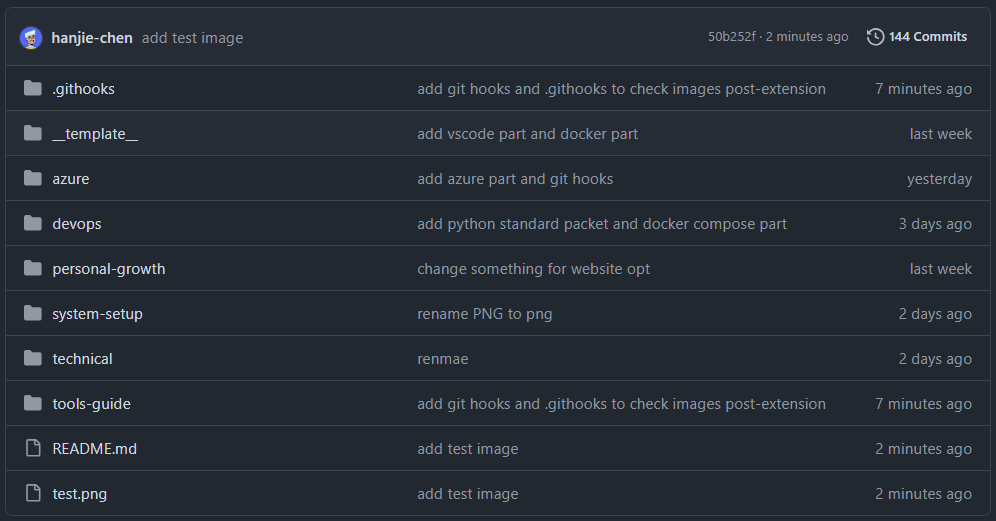

```
BriefIntroduction: 
git hooks 检查图片文件后缀名，并且将其转换为小写
因为我的web site running 在一个 Linux 上面所以，实际上是大小写敏感的，但是我经常在 windows 上面编辑 makrdown，但是windows 是大小写不敏感的，所以会存在windows上面可以显示的图片，导致我的web site没有显示404 not found
```

<!-- split -->



# Before we begin

如果遇到这样子一个问题，在 windows 环境中，我们有一个 git repository，其中包含图片，这些图片的后缀名称包含大写和小写，比如说 `.PNG, .png` 

而我们需要将图片大写后缀名从修改为小写的后缀名称，并且以后的每次提交都要保证图片的后缀名称都要小写，我们应该怎么办？

可以想到的是，首先我们需要扫描已经存在的图片文件，然后将大写的后缀名修改为小写的后缀名，然后提交这个修改，git push 到 github 上面

这首先会遇到一个问题，那就是 windows 系统中文件名称大小写是不敏感的，不过 git 倒是存在解决方案，那就是专门在 git repository 中 [启用大小写敏感](./Git使用指南#Git between different OS)

但是我们如何保证以后的提交的图片都要小写呢？我们可以尝试使用 git hooks 自动触发我们自己写的脚本

# Git Hooks

Git Hooks 是 Git 中的脚本机制，允许您在 Git 仓库中某些事件发生前后自动执行自定义脚本。它们可以帮助您自动化工作流程、执行代码质量检查、强制执行提交规范等。

Git Hooks 分为两类：

1. **Client-side Hooks**：在本地仓库中执行，响应诸如提交、合并、推送等操作。常用于代码格式化、代码检查、提交信息验证等。
2. **Server-side Hooks**：在远程仓库（服务器）上执行，响应诸如接收推送、更新引用等操作。常用于强制执行提交策略、触发持续集成等。

> [!note]
>
> server-side hooks:
>
> 如果您管理自己的 Git 服务器，可以使用服务器端钩子来强制执行更严格的策略。例如，禁止提交包含特定关键字的代码，或在接收到推送后自动部署代码
>
> **注意**：如果您使用的是托管的 Git 平台（如 GitHub、GitLab 等），通常无法自定义服务器端钩子。但这些平台提供了 Webhooks、CI/CD 集成等功能，可以达到类似的目的。

## `./git/hooks` dir

Git Hooks 存储在每个仓库的 `.git/hooks` 目录中。默认情况下，这个目录包含一些示例脚本，以 `.sample` 结尾

```powershell
PS C:\Users\Plain\PersonalArticles\.git\hooks> ls

    Directory: C:\Users\Plain\PersonalArticles\.git\hooks

Mode                 LastWriteTime         Length Name
----                 -------------         ------ ----
-a---            1/8/2025  2:33 AM            478 applypatch-msg.sample
-a---            1/8/2025  2:33 AM            896 commit-msg.sample
-a---            1/8/2025  2:33 AM           4726 fsmonitor-watchman.sample
-a---            1/8/2025  2:33 AM            189 post-update.sample
-a---            1/8/2025  2:33 AM            424 pre-applypatch.sample
-a---            1/8/2025  2:33 AM           1649 pre-commit.sample
-a---            1/8/2025  2:33 AM            416 pre-merge-commit.sample
-a---            1/8/2025  2:33 AM           1374 pre-push.sample
-a---            1/8/2025  2:33 AM           4898 pre-rebase.sample
-a---            1/8/2025  2:33 AM            544 pre-receive.sample
-a---            1/8/2025  2:33 AM           1492 prepare-commit-msg.sample
-a---            1/8/2025  2:33 AM           2783 push-to-checkout.sample
-a---            1/8/2025  2:33 AM           2308 sendemail-validate.sample
-a---            1/8/2025  2:33 AM           3650 update.sample
```

这些示例脚本都是可供参考的模板。如果您想要启用某个钩子，只需移除 `.sample` 扩展名，编写自己的脚本，并确保脚本具有可执行权限

## 在项目中共享 Git Hooks

默认情况下，Git Hooks 不会被添加到版本控制中，即其他克隆该仓库的用户不会自动获得您的钩子脚本。为了解决这个问题，我们可以将钩子脚本存储在仓库中并设置 hooksPath

在仓库中创建一个目录存放钩子脚本

```bash
mkdir .githooks
```

将您的钩子脚本移动到该目录：

```bash
mv .git/hooks/pre-commit .githooks/pre-commit
```

告诉 Git 使用自定义的 hooks 目录：

```bash
git config core.hooksPath .githooks
```

将钩子目录添加到版本控制：

```bash
git add .githooks
git commit -m "Add git hooks"
```

这样一来，其他开发者在克隆仓库后，也会获得钩子脚本。

# check image upper case extension

我们使用 `pre-commit` 钩子，在 `git commit` 命令之前自动执行脚本，使用 python 因为在我的 windows 和 Linux 环境中都存在 python 环境

主要功能：提交代码之前，自动将暂存区（staging area）中所有扩展名包含大写字母的图片文件的扩展名转换为小写。

pre-commit

```python
#!/usr/bin/env python3
# -*- coding: utf-8 -*-

import os
import sys
import subprocess

def get_staged_files():
    """获取暂存区中的文件列表"""
    result = subprocess.run(['git', 'diff', '--cached', '--name-only'], stdout=subprocess.PIPE, text=True)
    files = result.stdout.strip().split('\n')
    return files

def rename_image_extensions(files):
    """将大写图片后缀名转换为小写"""
    image_extensions = ['.PNG', '.JPG', '.JPEG', '.GIF', '.BMP', '.TIFF', '.SVG']
    renamed = False

    for file in files:
        if not os.path.isfile(file):
            continue
        _, ext = os.path.splitext(file)
        if ext.upper() in image_extensions and ext != ext.lower():
            new_file = file[:-len(ext)] + ext.lower()
            os.rename(file, new_file)
            # 更新暂存区的文件
            subprocess.run(['git', 'add', new_file])
            subprocess.run(['git', 'rm', '--cached', file])
            renamed = True
            print(f"rename file: {file} -> {new_file}")

    return renamed

def main():
    files = get_staged_files()
    if not files or files == ['']:
        sys.exit(0)

    renamed = rename_image_extensions(files)

    if renamed:
        print("image extension name lowercased, staging area updated")
        print("please confirm change, and run git commit again to commit")
        sys.exit(1)  # 终止提交，让用户检查更改
    else:
        sys.exit(0)  # 正常结束，允许提交

if __name__ == '__main__':
    main()
```

test

```powershell
PS C:\Users\Plain\PersonalArticles> touch test.PNG
Created new file: test.PNG
PS C:\Users\Plain\PersonalArticles> ls

    Directory: C:\Users\Plain\PersonalArticles

Mode                 LastWriteTime         Length Name
----                 -------------         ------ ----
d----            1/8/2025  2:33 AM                __template__
d----            1/9/2025  6:59 AM                .githooks
d----            1/9/2025  3:46 AM                azure
d----            1/8/2025  2:33 AM                devops
d----            1/8/2025  2:33 AM                personal-growth
d----            1/8/2025  2:33 AM                system-setup
d----            1/8/2025  2:33 AM                technical
d----            1/8/2025  2:33 AM                tools-guide
-a---           1/10/2025  2:26 AM           1189 README.md
-a---           1/10/2025  2:27 AM              0 test.PNG

PS C:\Users\Plain\PersonalArticles> git status
On branch main
Your branch is up to date with 'origin/main'.

Changes not staged for commit:
  (use "git add <file>..." to update what will be committed)
  (use "git restore <file>..." to discard changes in working directory)
        modified:   README.md

Untracked files:
  (use "git add <file>..." to include in what will be committed)
        test.PNG

no changes added to commit (use "git add" and/or "git commit -a")
PS C:\Users\Plain\PersonalArticles> git add .
PS C:\Users\Plain\PersonalArticles> git status
On branch main
Your branch is up to date with 'origin/main'.

Changes to be committed:
  (use "git restore --staged <file>..." to unstage)
        modified:   README.md
        new file:   test.PNG

PS C:\Users\Plain\PersonalArticles> git commit -m "add test.PNG fiel to test pre-commit"
rm 'test.PNG'
rename file: test.PNG -> test.png
image extension name lowercased, staging area updated
please confirm change, and run git commit again to commit
PS C:\Users\Plain\PersonalArticles> git status
On branch main
Your branch is up to date with 'origin/main'.

Changes to be committed:
  (use "git restore --staged <file>..." to unstage)
        modified:   README.md
        new file:   test.png

Changes not staged for commit:
  (use "git add <file>..." to update what will be committed)
  (use "git restore <file>..." to discard changes in working directory)
        modified:   tools-guide/git-guide/git-hooks.md

PS C:\Users\Plain\PersonalArticles> git commit -m "add test image"
[main 50b252f] add test image
 2 files changed, 2 insertions(+), 2 deletions(-)
 create mode 100644 test.png
PS C:\Users\Plain\PersonalArticles> git push
Enumerating objects: 6, done.
Counting objects: 100% (6/6), done.
Delta compression using up to 4 threads
Compressing objects: 100% (3/3), done.
Writing objects: 100% (4/4), 399 bytes | 199.00 KiB/s, done.
Total 4 (delta 2), reused 1 (delta 0), pack-reused 0 (from 0)
remote: Resolving deltas: 100% (2/2), completed with 2 local objects.
To github.com:hanjie-chen/PersonalArticles.git
   d29a98c..50b252f  main -> main
```

result


## 代码详解

### 文件头部：

```python
#!/usr/bin/env python3
# -*- coding: utf-8 -*-
```

第一行 `#!/usr/bin/env python3` 是一个 Shebang，用于指定脚本的解释器为 `python3`。当在 Unix/Linux 系统中直接执行该脚本时，系统会使用指定的解释器来运行脚本。

> [!note]
>
> 特别注意，系统必须有 python3 的环境变量，而不是 python 的环境变量，下面的情况就无法运行该脚本
>
> ```shell
> ➜ articles git:(main) ✗ python3 --version
> ➜ articles git:(main) ✗ python --version
> Python 3.11.4
> ```
>
> 会报错，而且没有任何的错误提示

第二行 `# -*- coding: utf-8 -*-` 指定了脚本文件的编码方式为 UTF-8，这对于正确处理包含非 ASCII 字符的字符串非常重要。

### 导入必要的模块：

```python
import os
import sys
import subprocess
```

- `os` 模块提供了与操作系统进行交互的功能，如文件和目录的操作。
- `sys` 模块提供了与 Python 解释器进行交互的功能，如退出程序、获取命令行参数等。
- `subprocess` 模块允许我们启动新进程，连接它们的输入/输出/错误管道，并获取返回值。

### 获取暂存区中的文件列表：

```python
def get_staged_files():
    """获取暂存区中的文件列表"""
    result = subprocess.run(['git', 'diff', '--cached', '--name-only'], stdout=subprocess.PIPE, text=True)
    files = result.stdout.strip().split('\n')
    return files
```

- 使用 `subprocess.run` 执行 Git 命令 `git diff --cached --name-only` ，获取暂存区中已更改的文件列表。
  - `stdout=subprocess.PIPE` 表示将子进程的标准输出捕获到 `result.stdout` 中。
  - `text=True` 表示以字符串形式处理输出数据。
- 将输出结果按行分割，得到文件列表 `files`。

### 将大写图片扩展名转换为小写：

```python
def rename_image_extensions(files):
    """将大写图片后缀名转换为小写"""
    image_extensions = ['.PNG', '.JPG', '.JPEG', '.GIF', '.BMP', '.TIFF', '.SVG']
    renamed = False

    for file in files:
        if not os.path.isfile(file):
            continue
        _, ext = os.path.splitext(file)
        if ext.upper() in image_extensions and ext != ext.lower():
            new_file = file[:-len(ext)] + ext.lower()
            os.rename(file, new_file)
            # 更新暂存区的文件
            subprocess.run(['git', 'add', new_file])
            subprocess.run(['git', 'rm', '--cached', file])
            renamed = True
            print(f"rename file: {file} -> {new_file}")

    return renamed
```

- 定义了一个包含大写图片扩展名的列表 `image_extensions`。
- 遍历暂存区的文件列表：
  - 使用 `os.path.isfile(file)` 判断文件是否存在于工作区。
  - 使用 `os.path.splitext(file)` 分离文件名和扩展名。
  - 判断条件：
    - `ext.upper() in image_extensions`：文件的扩展名（转换为大写）是否在图片扩展名列表中。
    - `ext != ext.lower()`：扩展名是否包含大写字母。
  - 如果满足条件：
    - 使用 `ext.lower()` 将扩展名转换为小写，生成新的文件名 `new_file`。
    - 使用 `os.rename(file, new_file)` 重命名文件。
    - 更新 Git 暂存区：
      - `git add new_file`：将新文件添加到暂存区。
      - `git rm --cached file`：将旧文件从暂存区移除（仅移除索引，不删除工作区的文件）。
    - 设置 `renamed = True`，表示有文件被重命名。
    - 输出重命名信息。

### 主函数入口：

```python
def main():
    files = get_staged_files()
    if not files or files == ['']:
        sys.exit(0)

    renamed = rename_image_extensions(files)

    if renamed:
        print("image extension name lowercased, staging area updated")
        print("please confirm change, and run git commit again to commit")
        sys.exit(1)  # 终止提交，让用户检查更改
    else:
        sys.exit(0)  # 正常结束，允许提交

if __name__ == '__main__':
    main()
```

- 调用 `get_staged_files()` 获取暂存区中的文件列表。
- 如果暂存区没有文件，程序正常退出（允许提交继续进行）。
- 调用 `rename_image_extensions(files)` 对文件进行处理。
- 根据 `rename` 的值决定下一步操作：
  - 如果有文件被重命名，输出提示信息，终止提交（`sys.exit(1)`），让用户确认更改并重新提交。
  - 如果没有文件被重命名，程序正常退出（`sys.exit(0)`），允许提交继续进行。
