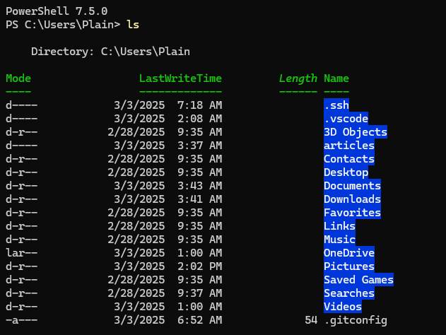

# Powershell 7 downlaod and setting

下载参考这篇文章[快速提高生产力——Power Shell也能命令提示并自动补全_安装最新的powershell,了解新功能和改进-CSDN博客](https://blog.csdn.net/m0_63230155/article/details/134685660)

简单来说就是

首先查看当前使用的 powershell 版本

```powershell
$PSVersionTable.PSVersion
```

接着使用 winget 搜索最新版本的 powershell

```powershell
PS C:\Users\Plain> winget search Microsoft.PowerShell
Name               Id                           Version Source
---------------------------------------------------------------
PowerShell         Microsoft.PowerShell         7.5.0.0 winget
PowerShell Preview Microsoft.PowerShell.Preview 7.6.0.3 winget
```

使用下面的命令安装稳定版本

```powershell
winget install --id Microsoft.Powershell --source winget
```

# windows terminal setting

如果使用 windows terminal, 可以将 powershell 7 设置为默认启动项

# 加载Python 环境

如果使用anaconda 3创建的python环境，还需要使用命令`conda init powershell`来激活一些设定，否则anaconda 3的某些路径无法正确的载入Powershell 7的环境变量中，可以使用`echo $env:PATH` 来查看powershell 7的环境变量。可以拿来和正常的windows powershell进行对比。

或许某些conda命令可以运行，比如说 `conda env list`，当然最重要的是能否运行激活python环境的命令`conda activate xxx`如果不行的话，那么就按照以上的步骤进行

# 颜色加载问题

当第一次使用 powershell 7 的时候，文件夹会有蓝色的背景颜色，有人已经提过了github issue: https://github.com/PowerShell/PowerShell/issues/18550



解决方案是自定义颜色在 `$PROFILE` 中

```powershell
# 基础系统文件
$PSStyle.FileInfo.Directory = "`e[34;1m"     # 蓝色加粗 - 目录
$PSStyle.FileInfo.SymbolicLink = "`e[36;1m"  # 青色加粗 - 符号链接
$PSStyle.FileInfo.Executable = "`e[32;1m"    # 绿色加粗 - 可执行文件

# 文件扩展名颜色配置
$colors = @{
    # 文本和文档
    ".txt" = "`e[33m"      # 黄色 - 普通文本
    ".md" = "`e[33m"       # 黄色 - Markdown
    ".log" = "`e[31m"      # 红色 - 日志文件
    ".pdf" = "`e[31;1m"    # 红色加粗 - PDF文档
    ".doc" = "`e[31;1m"    # 红色加粗 - Word文档
    ".docx" = "`e[31;1m"   # 红色加粗 - Word文档
    
    # 代码文件
    ".py" = "`e[36m"       # 青色 - Python
    ".ps1" = "`e[36m"      # 青色 - PowerShell
    ".sh" = "`e[32m"       # 绿色 - Shell脚本
    ".cpp" = "`e[32m"      # 绿色 - C++
    ".c" = "`e[32m"        # 绿色 - C
    ".h" = "`e[32m"        # 绿色 - 头文件
    ".java" = "`e[31m"     # 红色 - Java
    ".js" = "`e[33m"       # 黄色 - JavaScript
    ".css" = "`e[36m"      # 青色 - CSS
    ".html" = "`e[33m"     # 黄色 - HTML
    ".ipynb" = "`e[36m"    # 青色 - Jupyter Notebook
    
    # 配置文件
    ".json" = "`e[32m"     # 绿色 - JSON
    ".yml" = "`e[32m"      # 绿色 - YAML
    ".yaml" = "`e[32m"     # 绿色 - YAML
    ".xml" = "`e[32m"      # 绿色 - XML
    ".ini" = "`e[32m"      # 绿色 - INI配置
    ".conf" = "`e[32m"     # 绿色 - 配置文件
    
    # 图片文件
    ".jpg" = "`e[32;1m"    # 绿色加粗 - 图片
    ".jpeg" = "`e[32;1m"   # 绿色加粗 - 图片
    ".png" = "`e[32;1m"    # 绿色加粗 - 图片
    ".gif" = "`e[32;1m"    # 绿色加粗 - 图片
    ".bmp" = "`e[32;1m"    # 绿色加粗 - 图片
    ".webp" = "`e[32;1m"   # 绿色加粗 - 图片
    
    # 压缩文件
    ".zip" = "`e[31m"      # 红色 - 压缩文件
    ".tar" = "`e[31m"      # 红色 - 压缩文件
    ".gz" = "`e[31m"       # 红色 - 压缩文件
    ".7z" = "`e[31m"       # 红色 - 压缩文件
    ".rar" = "`e[31m"      # 红色 - 压缩文件
    
    # 系统和库文件
    ".dll" = "`e[32m"      # 绿色 - 动态链接库
    ".sys" = "`e[32m"      # 绿色 - 系统文件
    ".msi" = "`e[32m"      # 绿色 - 安装包
}
# apply it to color
foreach ($extension in $colors.Keys) {
    $PSStyle.FileInfo.Extension[$extension] = $colors[$extension]
}
```

效果如下：


