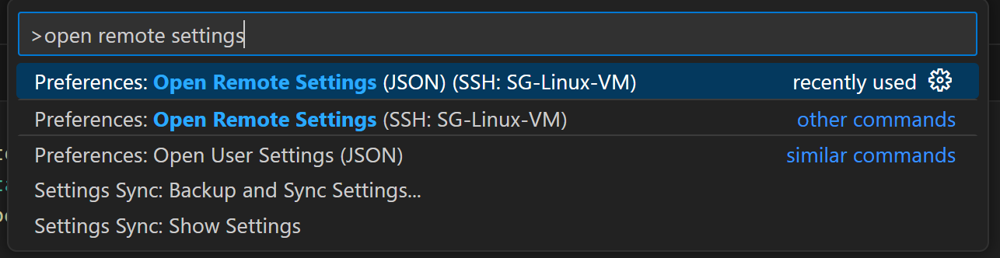

# Remote - SSH

链接远程主机的插件，例如一台linux server


我们可以直接在vscode中编辑 ssh config文件，从而设置我们remote host的一些配置

在 VS Code 中：

按下 `Ctrl/Cmd + Shift + P` 打开命令面板。

输入 `Remote-SSH: Open SSH Configuration File...`，选择默认的 `~/.ssh/config` 或自定义文件。


## remote 

如果你使用 remote ssh 连接到一台 remote server ， 并且下载了某些插件，那么这些插件实际上是下载到这台 remote server 上卖弄的，而不是本地机器

### VSCode Remote 模式的核心机制

当你通过 VSCode 的 Remote Development（例如 **Remote-SSH**）功能连接到远程服务器时，VSCode 会在远程宿主机上启动一个辅助的“VSCode 服务器”进程。这个“VSCode 服务器”是一个 Node.js 程序，它会为你的远程环境提供语言服务、插件管理等一系列功能。

### 插件安装位置

在连接远程服务器后，你所安装的插件会分为两种：

- **本地插件**: 安装在你自己电脑（本地）的 VSCode 中，仅适用于本地文件的开发。
- **远程插件**: 安装在远程服务器上的 VSCode 服务器进程（例如放在 `~/.vscode-server/extensions` 目录），仅在你连接到该远程服务器后生效。

因此，当你使用某一台电脑 SSH 到这台 Linux VM 并安装了 Terraform、Docker 等远程插件时，这些插件其实就部署在 远程 VM 的 `~/.vscode-server/extensions` 目录中（或类似路径）。当你换另外一台电脑，再次使用 VSCode 远程连接到同一台 VM，VSCode 会检测到远程服务器上已经安装了相关扩展（也就是 “VSCode 服务器” 的插件），因此这台新的电脑不需要本地再装一次，也可以直接使用这些插件。


## remote server vscode windows scale up

当我们连接到 remote server 的时候，往往发现窗口太小，需要使用 `ctrl +` 命令来将窗口放大一些，但是每次都需要手动放缩过于麻烦，所以我们可以将其写入 setting 中

在通过 Remote SSH 连接到远程服务器后，再次按下 `Ctrl + Shift + P`，输入 `Preferences: Open Remote Settings (JSON)`

然后在打开的远程设置文件中添加设置：

```json
"window.zoomLevel": 1
```

这里的数字 `1` 代表了你使用 `Ctrl +` 快捷键调整后的缩放级别，你可以根据需要调整为 `0.5`、`1`、`2` 等你觉得适合的数值


# HashiCorp Terraform

terrafrom 高亮和补全插件


# Python

python 语法高亮


# Docker

查看正在运行的 container

