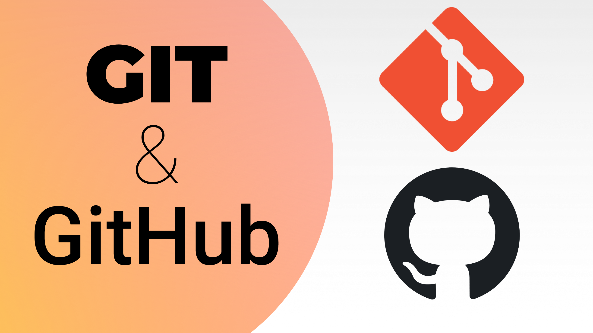
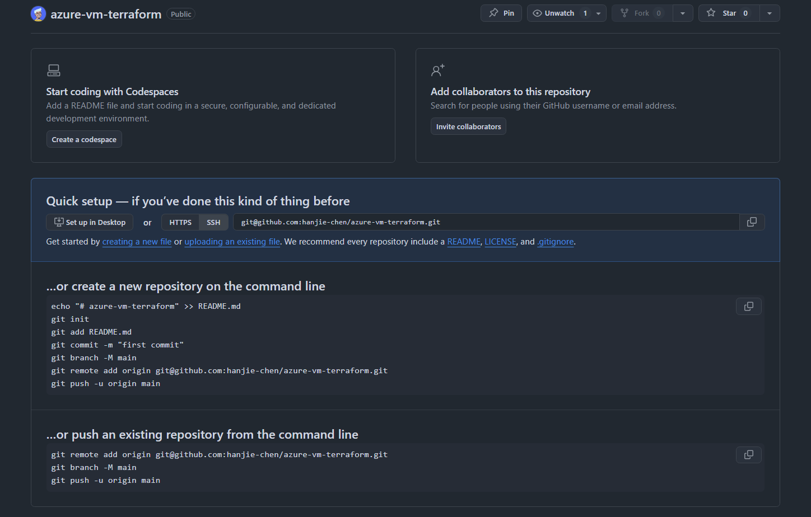

```
BriefIntroduction: 
按工作流组织的 Git 常用命令、典型场景与常见坑
```

<!-- split -->



当在 github 上面新建完成一个仓库之后，github 会提示你如何进行下一步操作。而我们需要做的部分就是根据仓库给出的提示，初始化本地仓库，并且完成第一次推送



# Local Workflow

## git status

可以查看目前仓库的状态

## git add

当然我一般直接使用 `git add .` 全都提交，这个命令的作用是将修改过的文件添加到暂存区（staging area）。

## git commit

```shell
git commit -m "add your specification of this commit"
```

每次提交都会记录下谁在什么时间做了什么更改，并允许你回到这个状态。

### commit id

- 每次 commit 成功后，Git 会生成一个唯一的 40 位十六进制字符串（称为 SHA-1 哈希值），作为这次提交的 ID。
- 哪怕只改动一个空格，SHA ID 都会完全改变。这保证了代码历史的不可篡改性。
- 在执行命令或 DevOps 回滚时，通常只需要输入 SHA 的前 7 位（例如 `a1b2c3d`）即可精准定位。

查看历史提交记录及其对应的 SHA ID：

``` shell
git log --oneline
```

如果忘记上一次 commit 的信息，可以使用

```shell
git show
```

这个命令默认显示的是 `HEAD`（当前分支最后一次提交）的内容。也可以在后面加上特定的 SHA ID 来查看历史记录：`git show <SHA>`

### git add + git commit

对于已被跟踪的文件: 如果这些文件只是进行了修改，而没有新文件需要添加，那么可以直接使用 `git commit -a -m "message"` 来提交这些更改。这个命令会自动将所有已被跟踪文件的修改提交，而不需要先手动 `git add` 它们。

对于新文件: 需要使用 `git add` 将它们添加到暂存区，因为 Git 默认只跟踪已经添加到版本控制中的文件。新文件在被跟踪之前，必须先通过 `git add` 命令添加。这种情况我们可以使用下面的命令

```bash
git add . && git commit -m "message"
```

# Remote Sync

## git push

将本地内容推送到 github 上面同步

### first push of a new branch

如果是本地新建的一个分支（即远程仓库上没有这个分支），并且是第一次推送这个分支到远程仓库，需要带上参数 `-u`

```shell
git push -u origin <branch-name>
```

这个命令会同时完成两件事：

1. 在远程创建分支：在远程仓库（如 GitHub）上创建一个同名的新分支，并将代码上传。
2. 建立关联（Upstream）：将本地分支与远程分支绑定

如果不带 `-u` 参数（仅使用 `git push origin <branch-name>` ），虽然也能在远程创建分支，但不会建立默认关联。这意味着以后的推送无法直接使用简短的 `git push`，Git 会因为不知道要把本地分支推送到远程的哪个分支而报错。

### push rejected

有时候当我们使用 `git push` 命令的时候会遇到如下的报错

```shell
➜ git push
To github.com:hanjie-chen/Test-Website.git
 ! [rejected]        backend-development -> backend-development (fetch first)
error: failed to push some refs to 'github.com:hanjie-chen/Test-Website.git'
hint: Updates were rejected because the remote contains work that you do not
hint: have locally. This is usually caused by another repository pushing to
hint: the same ref. If you want to integrate the remote changes, use
hint: 'git pull' before pushing again.
hint: See the 'Note about fast-forwards' in 'git push --help' for details.
```

这意味着 remote repository 上已经有了你本地还没有的提交，所以需要先执行 git pull 把最新变化同步下来。

## git pull

和 git push 对应，git pull 用来将 remote repo(github) 的最新变化同步到本地。

比如在多台机器上开发同一个项目：Azure VM、local machine(Windows 10)、MacBook Pro。

如果在其中一台机器上执行了 git push，其他机器就需要执行 git pull，让本地代码跟上远端最新状态。

默认情况下，在某个 branch 上执行 git pull，只会更新当前本地分支；而不会自动更新其他分支，但通常会刷新远端跟踪分支的信息。

### how git pull works

更准确地说：

git pull = git fetch + git merge

- git fetch：拿到当前 remote branch 上最新 commit
- git merge：尝试把 commit 合并到 current local branch 上

所以 current local branch 会被真正更新，other local branch 不会自动前进，但远端跟踪分支的信息通常会被刷新

### divergent branches

当我们在 remote(github) 上面最新的代码做了修改，而且在本地的代码也做了修改（git add + git commit）之后。

即使修改内容不冲突，当我们在 local git pull 的时候，就会出现下面的信息

```shell
$ git pull
remote: Enumerating objects: 20, done.
remote: Counting objects: 100% (20/20), done.
remote: Compressing objects: 100% (13/13), done.
remote: Total 13 (delta 7), reused 0 (delta 0), pack-reused 0 (from 0)
Unpacking objects: 100% (13/13), 4.71 KiB | 344.00 KiB/s, done.
From github.com:hanjie-chen/website
   0b18d4f..55d30e5  main       -> origin/main
 * [new tag]         v0.1.0     -> v0.1.0
hint: You have divergent branches and need to specify how to reconcile them.
hint: You can do so by running one of the following commands sometime before
hint: your next pull:
hint:
hint:   git config pull.rebase false  # merge
hint:   git config pull.rebase true   # rebase
hint:   git config pull.ff only       # fast-forward only
hint:
hint: You can replace "git config" with "git config --global" to set a default
hint: preference for all repositories. You can also pass --rebase, --no-rebase,
hint: or --ff-only on the command line to override the configured default per
hint: invocation.
fatal: Need to specify how to reconcile divergent branches.
```

这是 git 在“征求你的意见”：既然远程（GitHub）和本地都有了不同的新提交（divergent branches），你希望用哪种方式把它们合在一起？

我们可以使用 rebase，把你的本地提交“挪到”远端提交之后

在你的仓库目录里执行：

```shell
$ git pull --rebase
Successfully rebased and updated refs/heads/main.
```

这会做两件事：先拉远端更新，再把你本地的 commit **依次重放到** `origin/main` 最新提交之后。如果确实没冲突，它会直接成功。

成功后再 `git push`

# Git State Flow

为了理解前面这些命令的作用，可以先把 Git 看成几个不同的状态区域。

```text
Working Directory     Staging Area       Local Repository    Remote Repository
       |                    |                   |                   |
       +----- git add ----->+                   |                   |
                            +--- git commit --->+                   |
                                                +---- git push ---->+
```

- `Working Directory`：编辑文件时所在的位置
- `Staging Area`：执行 `git add` 之后，准备提交的区域
- `Local Repository`：执行 `git commit` 之后，本地仓库保存的内容
- `Remote Repository`：执行 `git push` 之后，remote 上保存的内容

从这个角度看，`git add`、`git commit`、`git push` 分别负责把内容往后推进一层，而 `git pull` 则是把 remote repository 上面的最新状态同步回来。

# Branch Management

## List Branches

`git branch` 查看本地分支

```shell
➜ git branch
* main
```

`git branch -r` 查看远程分支

```shell
➜ git branch -r
  origin/HEAD -> origin/main
  origin/backend-development
  origin/main
```

`git branch -a` 查看所有分支（本地和远程）

```shell
➜ git branch -a
* main
  remotes/origin/HEAD -> origin/main
  remotes/origin/backend-development
  remotes/origin/main
```

> [!note]
>
> `git clone` 之后，Git 会把远程仓库的分支信息一起带到本地，但默认只会检出(checkout)远程仓库的默认分支(通常是 `main` )。
>
> 所以运行 `git branch` 时通常只能看到 `main` 分支，而运行 `git branch -r` 时则可以看到远程分支。

## Switch Branch

`git checkout <branch-name>` 命令会先查找名为 `branch-name` 的本地分支, 如果找到了, 就切换到这个分支。

如果没有找到本地分支, 它会查找名为 `branch-name` 的远程分支, 如果找到了, 就创建一个同名的本地分支并建立跟踪关系, 然后切换到这个新的本地分支。

e.g.

```shell
➜ git branch
* main
➜ git branch -r
  origin/HEAD -> origin/main
  origin/backend-development
  origin/main
➜ git checkout backend-development
Switched to a new branch 'backend-development'
branch 'backend-development' set up to track 'origin/backend-development'.
```

## Create Branch

`git checkout -b <branch-name>` 命令会创建新分支, 然后立即切换到这个新创建的分支（如果该分支已经存在, Git 会报错）

实际上这个命令是 `git branch <branch-name>` 和 `git checkout <branch-name>` 的简写。

新创建的分支会基于当前所在的分支。例如, 如果你当前在 `main` 分支, 那么新分支 `branch-name` 就会基于 `main` 分支创建。

### First Push to Remote

当我们创建好一个 branch 之后，它仅仅是在 local 的，remote 上面还没有建立起他的分支，所以第一次需要使用这个命令，将其推送到 remote 上去

```shell
git push -u origin <branch-name>
```

如果你觉得每次都要写分支名太麻烦，可以设置 Git 的推送行为：

```bash
git config --global push.default current
```

设置后，只要你执行 `git push`，Git 会自动推送到远程同名的分支上（如果远程没有则创建）。

## Parallel Branch Work

如果我们遇到这样一个问题

在 main branch 上开发，并和 coding agent（如 Codex、Claude Code）对话。这个 agent 可能会运行很长时间，所以我们不需要一直盯着它。

但这时，如果我们还想去另外一个 k8s-lab branch 上查看或修改某些东西，该怎么办？

如果两个 session 共用同一个 Git 工作目录，那么直接在当前目录执行：

```shell
git checkout k8s-lab
```

就会把这个目录里的文件切换到 k8s-lab branch 的状态。这样一来，正在 main branch 上运行的那个 agent session 所依赖的工作目录也会被改变，可能导致它的上下文或运行环境被打乱。

> [!note]
>
> 这也解释了为什么 tmux 不能真正解决这个问题。
>
> tmux 只是多开 terminal session；如果这些 terminal 都操作同一个 Git 目录，那么只要在其中一个 terminal 里执行了 git checkout，其他 terminal 看到的目录状态也会一起变化，因为它们共享的是同一个 working directory。

这时，就可以使用 git worktree 命令

它会在同一个 Git repository 下，再创建一个独立的 working directory（工作目录），并通常让这个目录 checkout 到某个 branch

例如：

```text
repo
├── website/          -> main
└── website-k8s/      -> k8s-lab
```

这样：

- `website/` 这个 worktree 当前 checkout 在 `main`
- `website-k8s/` 这个 worktree 当前 checkout 在 `k8s-lab`

于是，一个 coding agent session 可以继续在 main branch 上运行；

而我们自己则可以进入另一个 worktree，在 k8s-lab branch 上查看或修改代码，而不会影响前者。

可以把 worktree 的理解为：把某一条 branch 展开为一个独立的 working directory.

在前面的 Git State Flow 里，Working Directory 表示“编辑文件时所在的位置”；git worktree 可以理解为让同一个 repository 同时拥有多个独立的 Working Directory。

> [!note]
>
> 同一个 branch 默认不能同时被 checkout 到两个 worktree 中。

使用方法

创建一个新的 worktree

```shell
git worktree add ../website-k8s k8s-lab
```

- 在 `../website-k8s` 创建一个新目录
- 这个目录 checkout 到 `k8s-lab`

也就是 `git worktree add <path> <branch>`。

查看 worktree 列表

```shell
git worktree list
```

删除 worktree

```shell
git worktree remove ../website-k8s
```

如果这个 worktree 里还有未提交改动，Git 默认可能会拒绝删除。

## Merge Branch

当我们在一个分支上开发，并且开发的差不多了之后，比如说一个功能开发完成了，或者开发到了某个阶段，那么我们就可以把这个分支上面开发的内容同步到 main 上面去。

步骤如下

首先切换到 main 分支：

```bash
git checkout main
```

将分支的内容合并到 main：

```bash
git merge <branch-name> -m "merge message"
```

推送更新后的 main 分支到远程仓库（如果有远程仓库的话）：

```bash
git push origin main
```

## Delete Branch

当某个分支完成开发并合并到 main 分支后，为了保持仓库的整洁，我们可以选择将其删除

首先，我们先删除本地分支

### Delete Local Branch

使用 `-d` 选项（小写的 d）可以安全地删除已经合并到当前分支的分支：

```bash
git branch -d <branch-name>
```

例如：`git branch -d backend-development`

如果分支还没有被合并，Git 会给出警告并阻止删除。

强制删除本地分支：

如果你确定要删除一个未合并的分支，可以使用 `-D` 选项（大写的 D）强制删除：

```bash
git branch -D <branch-name>
```

> [!note]
>
> 使用 `git branch -d <branch-name>` 仅仅只会删除本地分支，它完全不会影响远程仓库（Remote/GitHub）上的分支。

接着，我们删除远程分支

### Delete Remote Branch

使用以下命令：

```bash
git push origin --delete <branch-name>
```

# Rollback

## git restore

如果修改了文件，但是没有进行 git add e.g.

```bash
$ git status
On branch main
Your branch is up to date with 'origin/main'.

Changes not staged for commit:
  (use "git add <file>..." to update what will be committed)
  (use "git restore <file>..." to discard changes in working directory)
        modified:   compose.yml

no changes added to commit (use "git add" and/or "git commit -a")
```

这种情况下回撤修改非常简单，可以直接使用 git 提示中显示的命令：

```bash
git restore compose.yml
```

需要注意的是：

1. 这个操作会直接丢弃对 compose.yml 的所有修改
2. 这个操作无法撤销，所以在执行之前请确认真的要放弃这些修改

如果你想在回撤之前查看具体修改了什么内容，可以使用：

```bash
git diff compose.yml
```

这样可以看到具体的修改内容，再决定是否要回撤修改。

如果修改已经进入暂存区，`git restore <file>` 就不够了，需要使用其他方式处理 staged changes。

## git reset

git reset 用来把当前状态退回到某个位置

### reset to last commit

如果只是想放弃还没有 commit 的本地修改可以用：

```bash
git reset --hard HEAD
```

其中：

- `HEAD` 指向当前分支最新的一次提交
- `--hard` 表示同时重置 Working Directory 和 Staging Area

所以这个命令会清除工作区和暂存区的修改，但不会让本地分支回到更早的 commit。

### reset to remote branch

如果你想放弃本地的所有修改和本地提交，只保留 remote repository 上面的最新状态，可以使用：

```bash
git fetch origin
git reset --hard origin/main
```

其中：

- `git fetch origin` 用来获取 remote 的最新状态，但不会自动合并
- `origin/main` 指向远程仓库 `main` 分支的最新位置
- `git reset --hard origin/main` 会把当前分支强制重置到 remote 分支的状态

这意味着它会清除：

- Working Directory 的修改
- Staging Area 的修改
- Local Repository 中尚未推送的本地提交

### rollback scope

```text
Working Directory 	  Staging Area 	 local repository     remote repository
   (edit file) ------> (git add) ----> (git commit) -------> (git push)    
|_________________|________________|
        git reset --hard HEAD
|_________________|________________|___________________|
                git reset --hard origin/main               
```

# Remote Repository

## Clone Repository

如果我们想把某个 remote repository clone 到本地，可以使用 `git clone [url]` 命令。e.g.

```shell
git clone https://github.com/hanjie-chen/PersonalArticles.git
```

这个命令会在本地创建一个同名文件夹，然后将 remote repo 的内容下载进去

```shell
~ # git clone https://github.com/hanjie-chen/PersonalArticles.git
Cloning into 'PersonalArticles'...
remote: Enumerating objects: 1329, done.
remote: Counting objects: 100% (478/478), done.
remote: Compressing objects: 100% (357/357), done.
remote: Total 1329 (delta 166), reused 401 (delta 101), pack-reused 851 (from 1)
Receiving objects: 100% (1329/1329), 110.04 MiB | 39.59 MiB/s, done.
Resolving deltas: 100% (416/416), done.
~ # ls
PersonalArticles
```

> [!note]
>
> 现在可以先将其理解为把 remote repository 下载到本地，但它比普通下载更完整，因为它会连同 Git 历史和仓库信息一起带下来。

如果我们想要指定这个文件夹，我们可以直接在 `git clone` 命令末尾加上文件夹路径 e.g.

```bash
git clone https://github.com/hanjie-chen/PersonalArticles.git ./articles-data
```

> [!note]
>
> 如果目标目录已经存在，那么它通常必须是空目录

### Shallow Clone

有时候，我们只需要下载当前 repo 的代码（比如说对于一个 knowledge base repo）而不需要这个仓库的历史信息，我们可以使用这个命令只拿取当前内容

```shell
git clone --depth 1 [url]
```

默认的 `git clone` 会把仓库从“第一行代码”到“当前代码”的所有历史修改全部下载下来。

而 `--depth 1` 告诉 Git：“我只要最后一次提交（Commit）的状态，之前的历史记录我通通不要。”

可以减少因为历史修改带来的存储空间压力

### HTTPS vs. SSH

存在两种  git clone 的方式， 一种是使用 https, 另一种是使用 ssh, e.g.

```bash
git clone https://github.com/hanjie-chen/PersonalArticles.git
git clone git@github.com:hanjie-chen/PersonalArticles.git
```

这 2 种方式的不同在于认证方式的不同，对于

- HTTPS: 当你需要 git push 时，需要额外认证，比如说浏览器登录、token等
- SSH: 依赖本地 ssh key 和 github 公钥配置

一般来说选择第二种，也就是配置 ssh-key, 使用 git 的方式

## Manage Remote

### View Remote

可以使用以下命令查看当前 git 仓库关联的远程地址：

```bash
git remote -v
```

执行这个命令后，会看到类似于以下的输出：

```
origin  https://github.com/username/repository.git (fetch)
origin  https://github.com/username/repository.git (push)
```

其中，`origin` 是默认的远程名称，后面跟着的就是远程仓库的 URL。如果你有多个远程仓库，都会在这里列出。

### Change Remote URL

如果 GitHub 上的仓库名称改变了，或者你想把 remote 从 HTTPS 切换到 SSH，可以使用下面的命令修改远程仓库 URL：

```shell
git remote set-url origin https://github.com/username/new-repo-name.git
# or
git remote set-url origin git@github.com:username/new-repo-name.git
```

# Appendix

## .gitignore file

有时候我们并不需要所有的文件都提交到 remote repo 中去，比如说 python 程序运行时，产生的临时文件（ `__pycache__` ）我们并不希望这些临时文件被提交

这个时候，我们可以写一个 .gitignore 文件来忽略某些特定的文件

### Global ignore

为了方便，我一般使用全局的，这样子就不用每个 repository 都配置过去了，只需要进入 `~`(user home directory)

然后创建一个 `.gitignore` 文件，并且配置 git 使用这个全局文件

```shell
cd ~
git config --global core.excludesfile ~/.gitignore
```

### personal `.gitignore`

在我的个人配置仓库中: https://github.com/hanjie-chen/personal-config/blob/main/git/.gitignore

## case sensitivity(windows)

在 windows OS 中，大小写不敏感，也就是说对于文件 `apg-multi-waf.md` 和 `apg-multi-waf.MD` 会被认为是同一个文件

但是在 Linux, 则是大小写敏感的，我个人也倾向于大小写敏感的，虽然无法修改整个 windows 操作系统为大小写敏感，但是对于 windows git, 我们可以设置

首先我们使用下面的命令查看目前仓库是否为大小写敏感

```powershell
> git config core.ignorecase
true
```

如果为 true 那么就意味着大小写不敏感，需要设置为 false

```powershell
> git config core.ignorecase false
```

然后就可以准确识别了

```powershell
> ls

    Directory: C:\Users\Plain\PersonalArticles\azure

Mode                 LastWriteTime         Length Name
----                 -------------         ------ ----
-a---            1/9/2025  1:04 AM           1108 apg-multi-waf.md

> mv .\apg-multi-waf.md .\apg-multi-waf.MD
> git status
On branch main
Your branch is up to date with 'origin/main'.

Changes not staged for commit:
  (use "git add/rm <file>..." to update what will be committed)
  (use "git restore <file>..." to discard changes in working directory)
        deleted:    apg-multi-waf.md

Untracked files:
  (use "git add <file>..." to include in what will be committed)
        apg-multi-waf.MD

no changes added to commit (use "git add" and/or "git commit -a")
```
