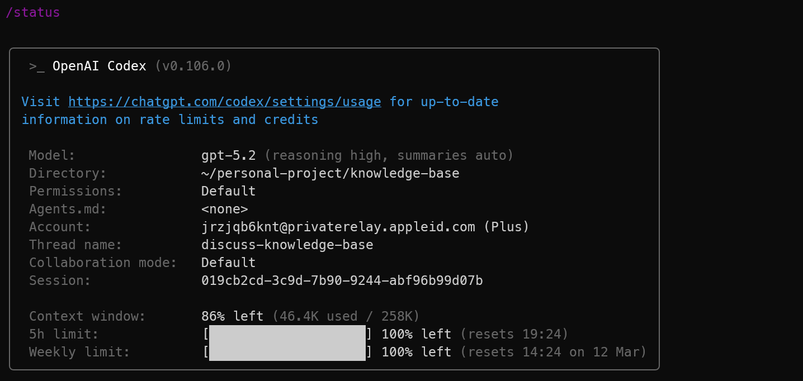

# codex cli使用指南

下载 codex cli

```shell
npm i -g @openai/codex
# macos download
brew install codex
```

> [!note]
>
> 在用 npm 命令安装时需要注意全局 prefix 最好放到用户目下，而不是系统目录下，详见 [npm-guide](../npm/npm.md)

验证

```shell
which codex
codex --version
```

登录

```shell
# 查看登录状态
codex login status
# 打开网页登录
codex login
```

## AGENTS.md

Codex 会在每次启动时自动读取并合并一条“指令链”：

- 全局：`~/.codex/AGENTS.md`
- 项目：从 repo root（通常是 Git root）一路走到当前工作目录，每层目录最多取一个 `AGENTS.md`，并按“root → leaf”顺序依次注入。 

作用：把你每次都要重复说的“工作协议/目录说明/输出格式”固化下来。

## interactive mode

使用命令 `codex` 直接进入交互模式


使用 `/` 可以设定和查看某些内容，比如说选择模型


实际上的命令不仅仅是上线显示的这些，比较常用的命令有

status



如果我们需要开启一段新对话，那么我们可以使用

- `/clear`：清屏 + 开新对话（从头开始聊）。

# control

我们可以通过 ~/.codex/config.toml 文件来控制 codex 的权限和行为。例如

```toml
approval_policy = "on-request"
sandbox_mode = "workspace-write"

[sandbox_workspace_write]
network_access = true

web_search = "live"
```

`approval_policy = "on-request"`

approval_policy 控制 Codex 什么时候在执行命令前停下来向你要批准。 

- `on-request`：交互式使用里比较常见。Codex 在需要额外批准时会停下来问你。
- `untrusted`：更严格一些。只会运行已知安全的只读操作；可能改状态或触发外部执行路径的命令会要求批准。
- `never`：不弹批准框，适合非交互场景；如果当前权限不够，它就不会再问你。

`sandbox_mode = "workspace-write"`

在 Codex 里，sandbox 就是命令执行时的“受限运行环境”。它决定 Codex 生成的 shell 命令能访问哪些目录、能不能写文件、能不能访问网络。

它的值是

- `read-only`：最保守。官方给出的“safe read-only browsing”组合里，这种模式下 Codex 可以读文件、回答问题；要改文件、跑命令或访问网络，都需要批准。
- `workspace-write`：常用默认档。Codex 可以在当前工作区里读写并运行命令，但超出工作区或涉及网络时仍会被限制或要求批准。
- `danger-full-access`：基本不做沙箱限制。官方明确说这是高风险模式，相当于关闭 sandbox。

`network_access = true`

这一段的意思是：
当 `sandbox_mode = "workspace-write"` 时，允许沙箱内的命令进行出站网络访问。 官方对这个键的定义非常直接：`Allow outbound network access inside the workspace-write sandbox.` ([OpenAI开发者平台](https://developers.openai.com/codex/config-reference/))

这也是为什么你会遇到这种情况：

- 可以在插件里看到 Codex “会搜网页”
- 但它替你跑的 `curl` 仍然失败

因为这两者不是同一个权限开关。官方专门说明了：
你可以单独控制 web search，而不必给 spawned commands 真正的网络访问权限。 本地 IDE Extension 默认启用的是 **web search cache**，它来自 OpenAI 维护的索引，不等于 shell 里的 `curl` 已经能直接访问公网。([OpenAI开发者平台](https://developers.openai.com/codex/security/?utm_source=chatgpt.com))

所以：

- `network_access = true` 管的是 **shell 命令能不能真正出网**
- `web_search = ...` 管的是 **Codex 自带网页搜索工具怎么工作** ([OpenAI开发者平台](https://developers.openai.com/codex/security/?utm_source=chatgpt.com))

------

### `web_search = "live"`

这个键控制的是 **Codex 内置 web search 工具** 的模式。官方给了 3 个模式：

- `"cached"`：默认。走 OpenAI 维护的 web search cache，返回预索引结果
- `"live"`：实时抓取最新网页数据
- `"disabled"`：禁用 web search ([OpenAI开发者平台](https://developers.openai.com/codex/config-basic/?utm_source=chatgpt.com))

所以 `web_search = "live"` 的意思不是“所有 shell 命令都能联网”，而是：

**当 Codex 使用它自己的网页搜索工具时，不走缓存索引，而是去抓最新网页。**([OpenAI开发者平台](https://developers.openai.com/codex/config-basic/?utm_source=chatgpt.com))

这一点非常关键，因为很多人会混淆：

- `curl https://...` 失败
- 不代表 Codex 的 `web_search` 一定不能用

反过来也是一样：

- Codex 可以做 `web_search`
- 不代表 shell 子进程就已经获得了公网权限。([OpenAI开发者平台](https://developers.openai.com/codex/security/?utm_source=chatgpt.com))


整体上可以理解为：

- **权限模型**：仍然是交互式、受控的，不是完全放飞
- **文件权限**：主要在当前 workspace 内工作
- **命令联网**：允许
- **Codex 自带网页搜索**：走实时网页而不是缓存索引 ([OpenAI开发者平台](https://developers.openai.com/codex/config-reference/))

它不是最保守的配置，但也**不是** `danger-full-access` 那种完全不设防。([OpenAI开发者平台](https://developers.openai.com/codex/config-advanced/?utm_source=chatgpt.com))

另外，官方明确给过一个接近的预设：
`--full-auto` 是 `--sandbox workspace-write --ask-for-approval on-request` 的别名。也就是说，`workspace-write + on-request` 本身就是官方认可的一种常见自动化组合。只是你这里又额外打开了 `network_access = true`，再把 `web_search` 改成了 `live`。([OpenAI开发者平台](https://developers.openai.com/codex/security/?utm_source=chatgpt.com))

------

## 5. 用最简单的话总结

你可以这样记：

- sandbox：限制 Codex 跑命令时能碰什么资源
- approval_policy：限制 Codex 什么时候必须先问你
- network_access = true：给 shell 命令真实公网权限
- web_search = "live"：给 Codex 自带搜索工具实时网页能力，不等于 curl 自动能用

# plan mode

Plan mode 会先让 Codex 做“方案设计 / 执行分解”，再进入真正的修改与实现，而不是一上来就直接改代码。

更适合复杂任务。比如重构、迁移、跨多个文件的大改动、需要分阶段验证的任务。因为它会更强调“步骤、里程碑、顺序、边界”，降低一上来改偏的概率。

可能会先问你问题，如果还需要补充信息，Codex 会先问你，而不是直接动手。

区分：

- 普通 Agent/直接实现模式：你说做什么，它尽快开始看文件、跑命令、改代码”。
- Plan mode：先出施工方案、拆步骤、确认方向，再继续”。


 
