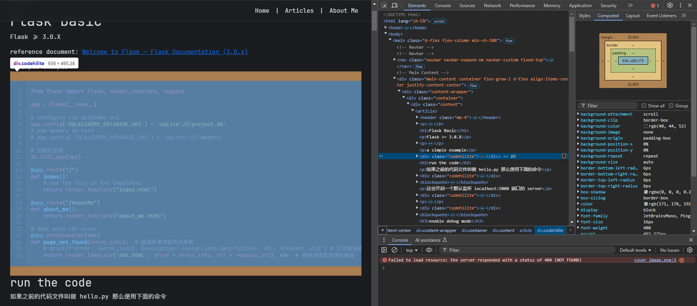
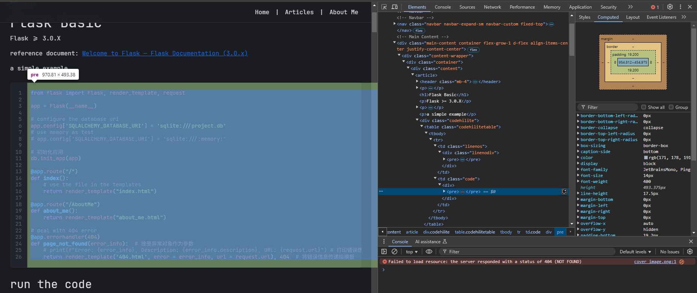

cover image


# CSS box model

在我们写 css 的时候，总是会遇到这 2 个属性需要我们设定 `padding`, `margin` 

为了更好的理解，让我们结合代码一起看

这是具体的 HTML 代码

```html
<div class="codehilite">
    <table class="codehilitetable">
        <tbody>
            <tr>
                <td class="linenos">
                    <div class="linenodiv">
                        <pre>
                            ...
                        </pre>
                    </div>
                </td>
                <td class="code">
                    <div>
                        <pre>
                            ...
                        </pre>
                    </div>
                </td>
            </tr>
        </tbody>
    </table>
</div>
```

这是我们的 css

```css
.codehilite {
    margin: 1.6rem 0;
}
.codehilite pre{
    margin: 0;
    padding: 1.2rem 0.5rem;
}
```

这是 `.codehilite` 具体的效果



我们可以看到上下是 margin 作为外边距，隔离了和其他文本（html 元素）的距离

接下来我们看看 `.codehilite pre`



我们可以看到 padding 作为内边距，隔离了这个box中文本和边缘的距离


还可以看看这个网站的演示 [padding - CSS：层叠样式表 | MDN](https://developer.mozilla.org/zh-CN/docs/Web/CSS/padding)
